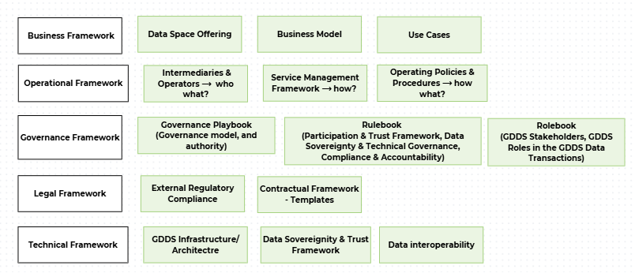

# Documentation Structure / Reader's Guide

The GDDS Frameworks are informed by and aligned with the[ building blocks defined in the ](https://dssc.eu/space/BVE2/1071251457/Data+Spaces+Blueprint+v2.0+-+Home)[Data Spaces Blueprint 3.0 by the Data Spaces Support Centre,](https://blueprint.dssc.eu/) which in turn is based on the[ Open DEI project.](https://design-principles-for-data-spaces.org/) &#x20;

Building on these foundations, the SAGE Consortium has developed a tailored framework structure that organises the core GDDS documentation in a way that better fits the content and the intended final output. Rather than the original two-tier division into Business & Organisational and Technical Building Blocks, the GDDS frameworks are organised into six complementary frameworks, described below.&#x20;

However, the original building blocks are still incorporated in the GDDS Frameworks, and they ensure modularity, scalability, and interoperability. Each building block represents a distinct set of capabilities required for the functioning of the data space, while allowing flexibility in implementation across different use cases and participants. This approach enables the GDDS to align with European data space standards while supporting incremental development and integration of additional functionalities over time.&#x20;

The remainder of this page serves as a reader’s guide to the GDDS Frameworks’ documentation: it introduces the Frameworks, explains what they cover, and points readers to where the related rules, policies, and specifications can be found. Readers new to the GDDS are encouraged to start here to understand how the different parts of the documentation fit together before consulting the detailed sections.&#x20;

&#x20;

The Figure below illustrates the GDDS Framework Structure: &#x20;

<figure><figcaption>
Figure 1: Documentation Structure Breakdown
</figcaption></figure>

1\. Business Frameworks: This framework sets out the economic and value-creation rationale of the GDDS – why the data space exists and how it delivers value to its participants. It covers the following: &#x20;

* Business Model (the value propositions, revenue logic, and sustainability of the data space), &#x20;
* the Use Cases (the concrete use cases that are piloted, where participants create value from data sharing), &#x20;
* and the Data Space Offering (the structured way in which data, services, and applications are made available to participants). &#x20;

Readers looking to understand the purpose, scope, and value drivers of the GDDS should start here.&#x20;

2\. Operational Frameworks: This framework describes how the GDDS runs in practice and who keeps it running. It covers the following: &#x20;

* Intermediaries & Operators (the roles and bodies that operate shared services and connect participants to the data space), &#x20;
* Service Management (how the data space’s enabling services are provisioned, maintained, and supported, including service levels), &#x20;
* and the Operating Policies and Procedures (the day-to-day rules and workflows that govern participation and operations). &#x20;

Readers concerned with the practical operation, service delivery, and operational responsibilities of the GDDS will find the relevant guidance here.&#x20;

3\. Governance Frameworks: This framework defines how the GDDS is governed, by whom, and under which rules. It comprises the following: &#x20;

* The Governance Playbook, which describes the governance model, decision-making bodies, and lines of authority across the data space, &#x20;
* and the Governance / GDDS Rulebook, which operationalises the governance framework. The Rulebook in turn covers Trust & Participant Governance (how participants are identified, admitted, onboarded, monitored, and, where necessary, suspended or withdrawn), the Conformity Framework & Governance Enforcement (the mechanisms for verifying compliance and enforcing the rules), Data Sovereignty (the governance of rights and control over data), and Technical Governance (the governance touchpoints for the technical components and standards of the data space). &#x20;

Readers seeking to understand participants’ rights and obligations, the governance bodies, and how the rules are maintained and enforced should consult this framework.&#x20;

4\. Legal Frameworks: This framework establishes the legal basis for participation in and operation of the GDDS. It comprises the following: &#x20;

* The Regulatory Compliance Framework, which maps the GDDS to the applicable EU legal regime (such as the GDPR, the Data Governance Act, the Data Act, and eIDAS) and sets out how compliance is ensured, &#x20;
* and the Contractual Frameworks, which provide the agreements, templates, and contractual instruments that bind participants and govern data transactions. &#x20;

Readers needing to understand the regulatory obligations and the contractual relationships underpinning the GDDS should refer to this framework.&#x20;

5\. Technical Frameworks: This framework specifies the technical means by which the GDDS operates and through which data is exchanged securely and meaningfully. This section covers the following: &#x20;

* The GDDS Infrastructure / Architecture, which describes the overall technical structure of the data space and its core components.&#x20;
* Data Interoperability: ensuring that data can be understood and exchanged consistently across participants. This covers Data Models (shared semantics and domain models), Data Exchange (the technical interfaces and protocols for transferring data), and Traceability & Provenance (the means of recording the origin and history of data). Data Sovereignty & Trust: Enabling the identification of participants, verifying compliance and specifying and enforcing data access and usage policies.&#x20;
* Data Sovereignty & Trust Framework: ensuring that participants can be trusted and that data is used only as permitted. This covers Identity and Attestation Management (how participants and their attributes are identified and verified), the Trust Framework (the technical trust anchors and credentials that underpin secure interactions), and Access & Usage Policies (how access and usage rights are expressed, negotiated, and technically enforced).&#x20;
* Data Value Creation Enablers: enabling data and services to be described, found, and turned into value. This covers Data, Services and Offerings Descriptions (how data products and services are described in a consistent way), Publication and Discovery (how offerings are published and made findable, for example through a catalogue), and Value Creation Services (the additional services that allow participants to derive value from shared data).&#x20;
