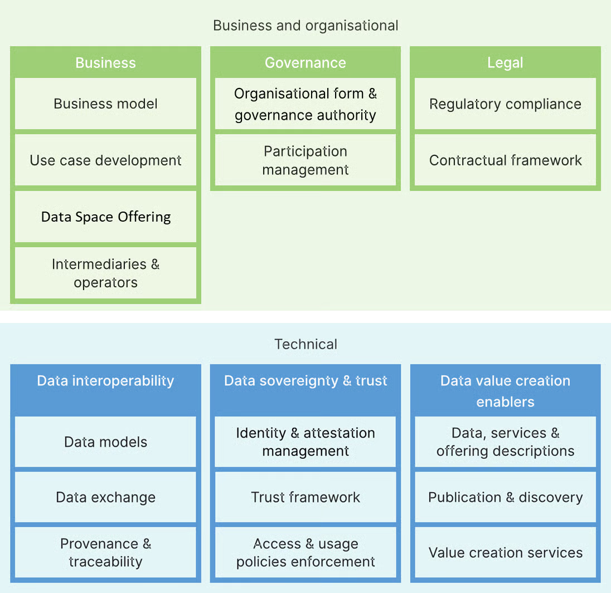

# Documentation structure

This dataspace template is structured based on the [building blocks as defined in the Data Spaces Blueprint 2.0 by Data Spaces Support Centre](https://dssc.eu/space/BVE2/1071251457/Data+Spaces+Blueprint+v2.0+-+Home), which are based on the [Open DEI project](https://design-principles-for-data-spaces.org/). Building blocks are basic units or components that can be implemented and combined with other building blocks to achieve the functionality of a data space.

<figure><figcaption>
Overview of DSSC Data Spaces Blueprint v2.0 Building Blocks
</figcaption></figure>

[Business and Organisational Building Blocks](https://dssc.eu/space/BVE2/1071252613): These address key capabilities needed in three sub-areas:

* [Business](https://dssc.eu/space/BVE2/1071252740): The business model of your data space and its participants, the development of use cases, the role of intermediaries and operators of services and the concept of a data space offering.
* [Governance](https://dssc.eu/space/BVE2/1071253634): The organisational form of your data space initiative, the governance processes and the management of participants.
* [Legal](https://dssc.eu/space/BVE2/1071253899): The required contractual framework between participants and regulatory compliance (e.g. with the new EU data legislation).

[Technical Building Blocks](https://dssc.eu/space/BVE2/1071254703): These address the key capabilities on a technical level. They are also subdivided into three categories:

* [Data Interoperability](https://dssc.eu/space/BVE2/1071255207): Specifying domain models/semantics, technical interfaces for data exchange and approaches for provenance & traceability.
* [Data Sovereignty & Trust](https://dssc.eu/space/BVE2/1071255699): Enabling the identification of participants, verifying compliance and specifying and enforcing data access and usage policies.
* [Data Value Creation Enablers](https://dssc.eu/space/BVE2/1071256290): Describing and publishing of data products and making them findable for others (e.g. in a catalogue), as well as introducing additional services for value-creation in your data space.\
