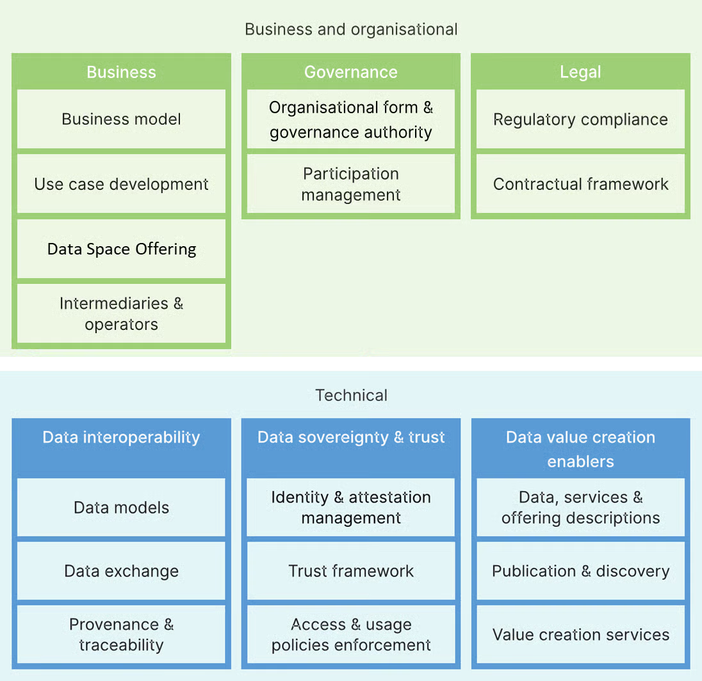

# Full Rulebook (Single Page)

_Editor’s note: This page is maintained during the project phase to ensure transparency and accountability of the Rulebook development process. It provides visibility on versioning, updates, and iterative progress. This section may be revised or removed in the final version of the GDDS Rulebook._

| Version Number      | 0.3                                                                                                                                                                                                                                                                                                                                                                                                                                 |
| ------------------- | ----------------------------------------------------------------------------------------------------------------------------------------------------------------------------------------------------------------------------------------------------------------------------------------------------------------------------------------------------------------------------------------------------------------------------------- |
| Latest Updated on   | 31/03/2026                                                                                                                                                                                                                                                                                                                                                                                                                          |
| Previous versions   | 0.2 (31/01/2026); 0.1 (30/09/2025)                                                                                                                                                                                                                                                                                                                                                                                                  |
| Latest Developments | 
<a href="full.md#glossary">Glossary</a>

<a href="full.md#introduction-to-the-green-deal-data-space-gdds">Introduction to the Green Deal Data Space</a>

<a href="full.md#intermediaries-and-operators">Intermediaries &#x26; Operators</a>

<a href="full.md#identity-and-access-management">Identity and Access Management.</a>

<a href="full.md#governance-building-blocks">Governance Framework</a>
 |

The Rulebook will be developed iteratively with consolidated quarterly releases:

| **Release** | **Target Date**                                 | **Description**                                  |
| ----------- | ----------------------------------------------- | ------------------------------------------------ |
| **0.1**     | **30****th****&#x20;September 2025** | **Initial Draft**                                |
| **0.2**     | **31****st****&#x20;January 2026**   | **Consolidated Inputs**                          |
| **0.3**     | **31****st****&#x20;March 2026**     | **Extended Components**                          |
| 0.4         | 30th June 2026                       | Pre-Final Version                                |
| 0.5 / 1.0   | 28th Aug 2026                        | Final GDDS Rulebook (Deliverable D4.1 on Github) |

## **Introduction to the Green Deal Data Space (GDDS)**

### GDDS: The Data Space for a Sustainable Green Europe

SAGE consortium will establish a fully operational Green Deal Data Space (GDDS) aimed at enhancing the accessibility, integration, and utilisation of green and environmental data across the EU to support key pillars of the European Green Deal—Zero Pollution, Climate Adaptation, Biodiversity and the Circular Economy Action Plan.

Building directly upon the [GREAT project](https://www.greatproject.eu/) community and results and aligning with the Digital Europe Programme's strategic focus on AI, cybersecurity, advanced computing, and data infrastructure, SAGE leverages outcomes from the European Strategy for Data and Research facilitated by [Horizon Europe](https://research-and-innovation.ec.europa.eu/funding/funding-opportunities/funding-programmes-and-open-calls/horizon-europe_en).

SAGE's outcomes include seamlessly integrating fragmented environmental data through federation, enriching data with consistent quality, validation, and interoperable metadata, and enhancing capabilities for data transformation, processing, analysis, forecasting, target setting, and performance monitoring. Targeting businesses seeking compliance with EGD regulations, government bodies optimising environmental impact, citizens and citizen scientists engaging in environmental stewardship, and researchers aiming to deepen our ecological understanding, SAGE aspires to foster informed decision-making and policy formulation based on robust data and evidence. SAGE’s sustainability will be ensured by establishing a standalone legal entity to manage the data space and scale operations throughout the project's lifetime and beyond.

### GDDS Mission, Vision, Values

_Editor’s note: This section has been developed by building on the original mission and vision defined in the GDDS GREAT project and further refined and agreed upon through co-creation sessions with SAGE consortium members._

#### **Mission**

To enable a trusted, interoperable, and sustainable Green Deal Data Space ecosystem that empowers all actors, within GDDS and beyond, to securely share and use environmental and sustainability data in support of the European Green Deal objectives.

GDDS facilitates secure and governed data access, connects fragmented infrastructures, and enhances data FAIRness. It supports regulatory implementation, enables advanced use cases such as digital twins, and drives data-driven value creation, while ensuring transparent, inclusive, and adaptable governance that evolves alongside EU priorities.

#### **Vision**

A globally connected and self-sustaining Green Deal Data Space in which public authorities, private organisations, research institutions, and communities seamlessly exchange high-quality, sovereign, and FAIR environmental data.

In this vision, data-driven insights actively inform environmental action, accelerate circular economy growth, and enable cross-sector collaboration. GDDS operates as part of an interoperable ecosystem of data spaces that collectively support a fair, green, and digital transition in Europe and beyond.

#### **Core Values**

**Transparency and Accountability**\
GDDS ensures open, traceable decision-making processes, clear participation rules, and accountable governance aligned with European values to foster trust among all participants.

**Inclusiveness and Openness**\
GDDS promotes broad participation across sectors, regions, and communities, respecting diversity and ensuring equitable access and representation.

**Scalability and Sustainability**\
The governance and technical framework of GDDS evolves with its maturity, supporting scalable operations, viable business models, and long-term continuity.

**Trust and Ethics**\
GDDS safeguards sensitive, personal, and commercial data, ensuring compliance with EU security, privacy, and “Do No Significant Harm” principles.

**Adaptability and Innovation**\
GDDS embraces continuous learning and innovation, aligning with evolving EU priorities and integrating emerging technologies such as digital twins and AI.

**FAIR & Sovereign Data Sharing**\
GDDS is committed to ensuring data is Findable, Accessible, Interoperable, and Reusable, while fully respecting data sovereignty and enabling ethical data use.

**Collaboration & Value Creation**\
GDDS fosters cross-sector collaboration, interoperability with other data spaces, and the creation of downstream economic and societal value from data-driven services.

_Editor’s note: These values will be aligned and validated with UNIBO from Ethical perspective, WP9._

### GDDS: Stakeholders

GDDS stakeholders encompass all entities that are involved in, contribute to, or are affected by the GDDS ecosystem.

For clarity, stakeholders are grouped into internal and external stakeholders.

#### Internal Stakeholders

Internal stakeholders are organisations or individuals formally engaged in the GDDS and operating under the GDDS Rulebook and its governance, legal, and contractual framework. These include GDDS Participants and GDDS Governance bodies.

A detailed description of these stakeholder categories, including their roles, responsibilities, and governance structures, is provided in the Governance Framework section of the Rulebook.

#### External Stakeholder

External stakeholders are organisations or groups that are not formally participating in the GDDS but may influence or be affected by its activities. These may include regulators, non-governmental organisations, sectoral actors, and end-user communities.

External stakeholders are not bound by the GDDS Rulebook; however, their perspectives and potential impact shall be considered to ensure transparency, trust, and responsible governance. They may engage with the GDDS through mechanisms such as a Community of Practice or other consultation frameworks.

## **Green Deal Data Space Rulebook**

### Purpose

The Green Deal Data Space (GDDS) Rulebook establishes the common framework governing the design, implementation, and operation of the GDDS. It defines the principles, rules, and reference models necessary to ensure that the data space operates in a trustworthy, interoperable, secure, and scalable manner, in alignment with the objectives of the European Green Deal and the European Strategy for Data.

The Rulebook provides the basis for aligning all participants on shared rules, operational practices, and governance mechanisms, thereby ensuring consistency, trust, and interoperability across the GDDS ecosystem. It translates European data space principles into actionable guidance, supporting the effective implementation of data sharing and service provision across organisational and sectoral boundaries.

Furthermore, the Rulebook serves as a key instrument for ensuring compliance with applicable European legal and regulatory frameworks, while enabling interoperability with other Common European Data Spaces. It contributes to reducing fragmentation and fostering a coherent and federated data space landscape.

The Rulebook is designed as a living document and will evolve over time to reflect technological developments, regulatory changes, and emerging ecosystem needs.

### Scope

This Rulebook applies to all activities related to the establishment, operation, and evolution of the GDDS. It covers the full lifecycle of data sharing and service provision within the data space, including onboarding, data exchange, service delivery, and governance processes.

The scope of the Rulebook encompasses governance, business, technical, and legal dimensions. It addresses the definition of roles, responsibilities, and decision-making processes required to ensure effective, transparent, and accountable management of the GDDS. It further defines the conditions for value creation, incentive structures, and sustainable operational models for all participants. In addition, it provides guidance on interoperability, architecture, standards, and the federation of infrastructures enabling secure and seamless data exchange. Finally, it establishes requirements to ensure adherence to applicable European legislation, including data protection, data governance, data sovereignty, and sector-specific regulatory obligations.

### Applicability

This Rulebook is applicable to all entities participating in, or interacting with, the GDDS ecosystem, including data rights holders, data providers, data recipients/users/consumers, data intermediaries, service providers, governance bodies, operators, and technology providers contributing to GDDS components or services.

Compliance with this Rulebook is mandatory for all organisations that participate in the GDDS ecosystem, exchange data within the GDDS, or provide services or infrastructure supporting GDDS operations.

### Foundations and Alignment

The GDDS Rulebook builds upon the outcomes of the GREAT project and the developments of the SAGE initiative, while leveraging the building blocks and recommendations provided by the Data Spaces Support Centre (DSSC). It aligns with the broader European policy framework, including the European Green Deal, and relevant Digital Europe Programme priorities.

##

## **Documentation structure**

This page outlines the Building Blocks of the Green Deal Data Space Rulebook.

This Rulebook is structured based on the [building blocks defined in the](https://dssc.eu/space/BVE2/1071251457/Data+Spaces+Blueprint+v2.0+-+Home) [Data Spaces Blueprint 3.0 by the Data Spaces Support Centre,](https://blueprint.dssc.eu/) which in turn is based on the [Open DEI project.](https://design-principles-for-data-spaces.org/)

The GDDS Rulebook adopts a building block approach to ensure modularity, scalability, and interoperability. Each building block represents a distinct set of capabilities required for the functioning of the data space, while allowing flexibility in implementation across different use cases and participants. This approach enables the GDDS to align with European data space standards while supporting incremental development and integration of additional functionalities over time.

The Figure below describes the following building blocks:\
1\. [Business and Organisational Building Blocks](https://dssc.eu/space/BVE2/1071252613): These address key capabilities needed in three sub-areas:

* > [Business](https://dssc.eu/space/BVE2/1071252740): The business model of the GDDS and its participants, the development of use cases, the role of intermediaries and operators of services and the concept of a data space offering.
* > [Governance](https://dssc.eu/space/BVE2/1071253634): The organisational form of the GDDS initiative, the governance processes and the management of participants.
* > [Legal](https://dssc.eu/space/BVE2/1071253899): The required contractual framework between participants and regulatory compliance.

2\. [Technical Building Blocks](https://dssc.eu/space/BVE2/1071254703): These address the key capabilities on a technical level. They are also subdivided into three categories:

* > [Data Interoperability](https://dssc.eu/space/BVE2/1071255207): Specifying domain models/semantics, technical interfaces for data exchange and approaches for provenance & traceability.
* > [Data Sovereignty & Trust](https://dssc.eu/space/BVE2/1071255699): Enabling the identification of participants, verifying compliance and specifying and enforcing data access and usage policies.
* > [Data Value Creation Enablers](https://dssc.eu/space/BVE2/1071256290): Describing and publishing of data products and making them findable for others (e.g. in a catalogue), as well as introducing additional services for value-creation in your data space.

Figure 1: Overview of DSSC Data Spaces Blueprint v3.0 Building Blocks

##

##

## **Glossary**

The glossary provided by the SAGE consortium members/initiative forms the basis of the glossary of this data space. The glossary is aligned with the relevant EU normative frameworks (e.g. GDPR, DGA, Data Act), considering the changes proposed in the Digital Omnibus, and the DSSC Blueprint v2.0.

| **Word**                                                              | **Definition**                                                                                                                                                                                                                                                                                                                                                                                                                                                                                                                                                                                                                                                                                                                                                                                                                                                                                                                                                                                                                                                                                                                                                                                                                                                                                                                                                                                                                                                                                                                                                                                                                                                                                    | **References (incl. normative references) and notes**                                                                                                                                                                                                                                                                                           |
| --------------------------------------------------------------------- | ------------------------------------------------------------------------------------------------------------------------------------------------------------------------------------------------------------------------------------------------------------------------------------------------------------------------------------------------------------------------------------------------------------------------------------------------------------------------------------------------------------------------------------------------------------------------------------------------------------------------------------------------------------------------------------------------------------------------------------------------------------------------------------------------------------------------------------------------------------------------------------------------------------------------------------------------------------------------------------------------------------------------------------------------------------------------------------------------------------------------------------------------------------------------------------------------------------------------------------------------------------------------------------------------------------------------------------------------------------------------------------------------------------------------------------------------------------------------------------------------------------------------------------------------------------------------------------------------------------------------------------------------------------------------------------------------- | ----------------------------------------------------------------------------------------------------------------------------------------------------------------------------------------------------------------------------------------------------------------------------------------------------------------------------------------------- |
| **Access**                                                            | Data use, in accordance with specific technical, legal or organisational requirements, without necessarily implying the transmission or downloading of data.                                                                                                                                                                                                                                                                                                                                                                                                                                                                                                                                                                                                                                                                                                                                                                                                                                                                                                                                                                                                                                                                                                                                                                                                                                                                                                                                                                                                                                                                                                                                      | 
Data Governance Act (DGA)

With the Digital Omnibus Regulation1🡪Data Act
                                                                                                                                                                                                                                                |
| **Value-added services**                                              | Services (such as aggregation, enrichment, or transformation) that go beyond pure data intermediation by enhancing, processing, or analysing data for the benefit of a specific user, while preserving the provider’s neutral and independent intermediation role.                                                                                                                                                                                                                                                                                                                                                                                                                                                                                                                                                                                                                                                                                                                                                                                                                                                                                                                                                                                                                                                                                                                                                                                                                                                                                                                                                                                                                                | Inferred from Digital Omnibus Regulation                                                                                                                                                                                                                                                                                                        |
| **Aggregation**                                                       | Any process of collecting data from multiple sources and combining it into a unified dataset for further analysis.                                                                                                                                                                                                                                                                                                                                                                                                                                                                                                                                                                                                                                                                                                                                                                                                                                                                                                                                                                                                                                                                                                                                                                                                                                                                                                                                                                                                                                                                                                                                                                                |                                                                                                                                                                                                                                                                                                                                                 |
| **Anonymisation**                                                     | The process of rendering personal data anonymous data.                                                                                                                                                                                                                                                                                                                                                                                                                                                                                                                                                                                                                                                                                                                                                                                                                                                                                                                                                                                                                                                                                                                                                                                                                                                                                                                                                                                                                                                                                                                                                                                                                                            | Negative definition of personal data under General Data Protection Regulation, Free Flow of non-personal data. Waiting for EDPB                                                                                                                                                                                                                 |
| **Anonymised data**                                                   | Data that has undergone an anonymisation process and is therefore rendered anonymous in such a manner that the data subject is not or no longer identifiable.                                                                                                                                                                                                                                                                                                                                                                                                                                                                                                                                                                                                                                                                                                                                                                                                                                                                                                                                                                                                                                                                                                                                                                                                                                                                                                                                                                                                                                                                                                                                     | Recital 26 General Data Protection Regulation                                                                                                                                                                                                                                                                                                   |
| **Anonymous data**                                                    | Data which does not relate directly or indirectly to a data subject.                                                                                                                                                                                                                                                                                                                                                                                                                                                                                                                                                                                                                                                                                                                                                                                                                                                                                                                                                                                                                                                                                                                                                                                                                                                                                                                                                                                                                                                                                                                                                                                                                              | Part of Recital 26 General Data Protection Regulation                                                                                                                                                                                                                                                                                           |
| **Agreement**                                                         | The written Agreement between Parties in respect of the provision of services, any amendment thereof or supplement thereto, as well as all acts related to the performance of the Agreement(s), including, in particular, its Appendixes                                                                                                                                                                                                                                                                                                                                                                                                                                                                                                                                                                                                                                                                                                                                                                                                                                                                                                                                                                                                                                                                                                                                                                                                                                                                                                                                                                                                                                                          | Commission’s Recommendation on SCCs                                                                                                                                                                                                                                                                                                             |
| **Appendix**                                                          | An appendix, schedule or exhibit explicitly referenced in the Agreement                                                                                                                                                                                                                                                                                                                                                                                                                                                                                                                                                                                                                                                                                                                                                                                                                                                                                                                                                                                                                                                                                                                                                                                                                                                                                                                                                                                                                                                                                                                                                                                                                           | Commission’s Recommendation on SCCs                                                                                                                                                                                                                                                                                                             |
| **Assurance**                                                         | An artefact that helps parties make trust decisions, such as certificates, commitments, contracts, warranties, etc.                                                                                                                                                                                                                                                                                                                                                                                                                                                                                                                                                                                                                                                                                                                                                                                                                                                                                                                                                                                                                                                                                                                                                                                                                                                                                                                                                                                                                                                                                                                                                                               | DSSC                                                                                                                                                                                                                                                                                                                                            |
| **Authentication**                                                    | An electronic process that enables the electronic identification of a natural or legal person, or the origin and integrity of data in electronic form to be confirmed.                                                                                                                                                                                                                                                                                                                                                                                                                                                                                                                                                                                                                                                                                                                                                                                                                                                                                                                                                                                                                                                                                                                                                                                                                                                                                                                                                                                                                                                                                                                            | eIDAS Regulation                                                                                                                                                                                                                                                                                                                                |
| **Certain categories of protected data**                              | Data and documents held by public sector bodies which are protected on the grounds of (a) commercial confidentiality, including business, professional and company secrets; (b) statistical confidentiality; (c) the protection of intellectual property rights of third parties; or (d) the protection of personal data, insofar as such data fall outside the scope of Section 2 of Chapter VIIc.                                                                                                                                                                                                                                                                                                                                                                                                                                                                                                                                                                                                                                                                                                                                                                                                                                                                                                                                                                                                                                                                                                                                                                                                                                                                                               | Digital Omnibus Regulation (in the Data Act)                                                                                                                                                                                                                                                                                                    |
| **Connection-providing intermediary**                                 | A data space intermediary that connects one or more participants to the data space, enabling them to establish relationships and execute data transactions with other participants.                                                                                                                                                                                                                                                                                                                                                                                                                                                                                                                                                                                                                                                                                                                                                                                                                                                                                                                                                                                                                                                                                                                                                                                                                                                                                                                                                                                                                                                                                                               | DSSC                                                                                                                                                                                                                                                                                                                                            |
| **Consent**                                                           | Any freely given specific, informed and unambiguous indication of the data subject's wishes by which he or she, by a statement or by a clear affirmative action, signifies agreement to the processing of personal data relating to him or her.                                                                                                                                                                                                                                                                                                                                                                                                                                                                                                                                                                                                                                                                                                                                                                                                                                                                                                                                                                                                                                                                                                                                                                                                                                                                                                                                                                                                                                                   | General Data Protection Regulation                                                                                                                                                                                                                                                                                                              |
| **Customer (of data processing services)**                            | A natural or legal person that has entered into a contractual relationship with a Provider of Data Processing Services with the objective of using one or more Data Processing Services                                                                                                                                                                                                                                                                                                                                                                                                                                                                                                                                                                                                                                                                                                                                                                                                                                                                                                                                                                                                                                                                                                                                                                                                                                                                                                                                                                                                                                                                                                           | Commission’s Recommendation on SCCs (reference to the Data Act)                                                                                                                                                                                                                                                                                 |
| **Data**                                                              | Any digital representation of acts, facts or information and any compilation of such acts, facts or information, including in the form of sound, visual or audiovisual recording, that can be either personal or non-personal.                                                                                                                                                                                                                                                                                                                                                                                                                                                                                                                                                                                                                                                                                                                                                                                                                                                                                                                                                                                                                                                                                                                                                                                                                                                                                                                                                                                                                                                                    | Data Governance Act, Data Act, Commission’s Recommendation on SCCs, but modified by adding “personal” and “non-personal” for further clarity                                                                                                                                                                                                    |
| **Dataset**                                                           | A resource, comprising a collection of data published or curated by a single party and available for access or download in one or more representations                                                                                                                                                                                                                                                                                                                                                                                                                                                                                                                                                                                                                                                                                                                                                                                                                                                                                                                                                                                                                                                                                                                                                                                                                                                                                                                                                                                                                                                                                                                                            | DSSC                                                                                                                                                                                                                                                                                                                                            |
| **Data access policy**                                                | A data policy defined by the data rights holder for granting access to their shared data in a data space.                                                                                                                                                                                                                                                                                                                                                                                                                                                                                                                                                                                                                                                                                                                                                                                                                                                                                                                                                                                                                                                                                                                                                                                                                                                                                                                                                                                                                                                                                                                                                                                         | DSSC                                                                                                                                                                                                                                                                                                                                            |
| **Data altruism**                                                     | The voluntary sharing of data on the basis of the consent of data subjects to process personal data pertaining to them, or permissions of data holders to allow the use of their non-personal data without seeking or receiving a reward that goes beyond compensation related to the costs\* that they incur where they make their data available for objectives of general interest as provided for in national law, where applicable, such as healthcare, combating climate change, improving mobility, facilitating the development, production and dissemination of official statistics, improving the provision of public services, public policy making or scientific research purposes in the general interest.                                                                                                                                                                                                                                                                                                                                                                                                                                                                                                                                                                                                                                                                                                                                                                                                                                                                                                                                                                           | 
Data Governance Act 

 With the Digital Omnibus Regulation🡪 Data Act

*Note: In the contracts, whenever we need to specify that one party cannot ask for a fee other than the actual costs occurred, we will need to use "Compensation" (for coherence) and "Reward" for the contrary. 
                                       |
| **Data controller**                                                   | The natural or legal person, public authority, agency or other body which, alone or jointly with others, determines the purposes and means of the processing of personal data; where the purposes and means of such processing are determined by Union or Member State law, the controller or the specific criteria for its nomination may be provided for by Union or Member State law.                                                                                                                                                                                                                                                                                                                                                                                                                                                                                                                                                                                                                                                                                                                                                                                                                                                                                                                                                                                                                                                                                                                                                                                                                                                                                                          | General Data Protection Regulation                                                                                                                                                                                                                                                                                                              |
| **Data egress charges**                                               | Data transfer fees charged to Customers for extracting their Data through the network from the ICT infrastructure of a Provider of Data Processing services to the system of a different provider or to on-premises ICT infrastructure                                                                                                                                                                                                                                                                                                                                                                                                                                                                                                                                                                                                                                                                                                                                                                                                                                                                                                                                                                                                                                                                                                                                                                                                                                                                                                                                                                                                                                                            | Commission’s Recommendation on SCCs (reference to the Data Act)                                                                                                                                                                                                                                                                                 |
| **Data governance**                                                   | The collection of practices, processes, policies, regulations, and standards established by multiple actors or organizations to use data.                                                                                                                                                                                                                                                                                                                                                                                                                                                                                                                                                                                                                                                                                                                                                                                                                                                                                                                                                                                                                                                                                                                                                                                                                                                                                                                                                                                                                                                                                                                                                         | Unlocking Green Deal Data Space                                                                                                                                                                                                                                                                                                                 |
| **Data holder**                                                       | A natural or legal person that has the right or obligation, in accordance with this Regulation, applicable Union law or national legislation adopted in accordance with Union law, to use or make available data, _including, where contractually agreed_, product data or related service data, which it has retrieved or generated during the provision of a related service.                                                                                                                                                                                                                                                                                                                                                                                                                                                                                                                                                                                                                                                                                                                                                                                                                                                                                                                                                                                                                                                                                                                                                                                                                                                                                                                   | Digital Omnibus Regulation (in the Data Act)2                                                                                                                                                                                                                                                                                                   |
| **Data intermediation service**                                       | 
A service which aims to establish relationships of an economic character for the purposes of data sharing between an undetermined number of data subjects or data holders and data users, through technical, legal or other means, including for the purpose of exercising the rights of data subjects in relation to personal data, and which :

(1) do not have as their main purpose the intermediation of copyright-protected content;

(2) are not jointly procured by several legal persons for exclusive use among them.
                                                                                                                                                                                                                                                                                                                                                                                                                                                                                                                                                                                                                                                                                                                                                                                                                                                                                                                                                                                                                                                                                                                                                  | Digital Omnibus Regulation (in the Data Act)3                                                                                                                                                                                                                                                                                        |
| **Data intermediation service provider**                              | A legal entity providing data intermediation services and that have submitted a notification to the national competent authority for data intermediation services.                                                                                                                                                                                                                                                                                                                                                                                                                                                                                                                                                                                                                                                                                                                                                                                                                                                                                                                                                                                                                                                                                                                                                                                                                                                                                                                                                                                                                                                                                                                                | Inferred from Art. 2(11) DGA                                                                                                                                                                                                                                                                                                                    |
| **Data policy**                                                       | A set of rules, working instructions, preferences and other guidance to ensure that data is obtained, stored, retrieved, and manipulated consistently with the standards set by the governance framework and/or data rights holders.                                                                                                                                                                                                                                                                                                                                                                                                                                                                                                                                                                                                                                                                                                                                                                                                                                                                                                                                                                                                                                                                                                                                                                                                                                                                                                                                                                                                                                                              | DSSC                                                                                                                                                                                                                                                                                                                                            |
| 
<strong>Data policy</strong>  <strong>enforcement</strong> 
 | A set of measures and mechanisms to monitor, control and compel obedience to established data policies.                                                                                                                                                                                                                                                                                                                                                                                                                                                                                                                                                                                                                                                                                                                                                                                                                                                                                                                                                                                                                                                                                                                                                                                                                                                                                                                                                                                                                                                                                                                                                                                           | DSSC                                                                                                                                                                                                                                                                                                                                            |
| **Data policy negotiation**                                           | The process of reaching agreements on data policies between a data rights holder, a data provider and a data recipient. The negotiation can be fully machine-processable and immediate or involve human activities as part of the workflow.                                                                                                                                                                                                                                                                                                                                                                                                                                                                                                                                                                                                                                                                                                                                                                                                                                                                                                                                                                                                                                                                                                                                                                                                                                                                                                                                                                                                                                                       | DSSC                                                                                                                                                                                                                                                                                                                                            |
| **Data processor**                                                    | A natural or legal person, public authority, agency or other body which processes personal data on behalf of the controller                                                                                                                                                                                                                                                                                                                                                                                                                                                                                                                                                                                                                                                                                                                                                                                                                                                                                                                                                                                                                                                                                                                                                                                                                                                                                                                                                                                                                                                                                                                                                                       | GDPR                                                                                                                                                                                                                                                                                                                                            |
| **Data processing service**                                           | A digital service that is provided to a Customer and that enables ubiquitous and on-demand network access to a shared pool of configurable, scalable and elastic computing resources of a centralised, distributed or highly distributed nature that can be rapidly provisioned and released with minimal management effort or service provider interaction. For purposes of this Agreement, the said Data Processing Services regard those provided or to be provided by the Provider to the Customer as agreed under the Agreement;                                                                                                                                                                                                                                                                                                                                                                                                                                                                                                                                                                                                                                                                                                                                                                                                                                                                                                                                                                                                                                                                                                                                                             | Commission’s Recommendation on SCCs (reference to the Data Act)                                                                                                                                                                                                                                                                                 |
| **Data product**                                                      | A set of resources that complies with a data product specification and for which a data product owner has created and published a data product offering.                                                                                                                                                                                                                                                                                                                                                                                                                                                                                                                                                                                                                                                                                                                                                                                                                                                                                                                                                                                                                                                                                                                                                                                                                                                                                                                                                                                                                                                                                                                                          | DSSC                                                                                                                                                                                                                                                                                                                                            |
| **Data product contract**                                             | A document that has been legally committed to by the data product contract parties, and that specifies the rights and duties of the parties concerning the provisioning and consumption of a data product.                                                                                                                                                                                                                                                                                                                                                                                                                                                                                                                                                                                                                                                                                                                                                                                                                                                                                                                                                                                                                                                                                                                                                                                                                                                                                                                                                                                                                                                                                        | DSSC                                                                                                                                                                                                                                                                                                                                            |
| **Data product contract template**                                    | 
A predefined template document that is part of a data product offering and that specifies a basic set of rights and duties for the respective parties that will perform the roles of the data product provider and data product customer,   and serves as the basis of the negotiation phase of a data transaction.  
                                                                                                                                                                                                                                                                                                                                                                                                                                                                                                                                                                                                                                                                                                                                                                                                                                                                                                                                                                                                                                                                                                                                                                                                                                                                                                                                                                   | DSSC                                                                                                                                                                                                                                                                                                                                            |
| **Data product customer**                                             | A party that has the right to obtain a data product, as well as other rights and obligations, as stated in a particular data product contract.                                                                                                                                                                                                                                                                                                                                                                                                                                                                                                                                                                                                                                                                                                                                                                                                                                                                                                                                                                                                                                                                                                                                                                                                                                                                                                                                                                                                                                                                                                                                                    | DSSC                                                                                                                                                                                                                                                                                                                                            |
| **Data product customer agent**                                       | 
An actor that operates on behalf of a data product customer, and that has been provided the means, policies, etc. for doing the operational work associated with the obtaining and using of a data product in accordance with   the corresponding data product contract. 
                                                                                                                                                                                                                                                                                                                                                                                                                                                                                                                                                                                                                                                                                                                                                                                                                                                                                                                                                                                                                                                                                                                                                                                                                                                                                                                                                                                                               | DSSC                                                                                                                                                                                                                                                                                                                                            |
| **Data product offering**                                             | A set of texts, created and maintained by a data product owner for one of its data products, that is constructed such that potential data product customers have all the information they need to (a) determine if they should  accept the data product owner's offer, and (b) make all practical arrangements for consuming that data product.                                                                                                                                                                                                                                                                                                                                                                                                                                                                                                                                                                                                                                                                                                                                                                                                                                                                                                                                                                                                                                                                                                                                                                                                                                                                                                                                                   | DSSC                                                                                                                                                                                                                                                                                                                                            |
| **Data product owner**                                                | A party that curates a data product, creates and maintains a data product offering for the data product, and a metadata record for describing the data product in a catalogue.                                                                                                                                                                                                                                                                                                                                                                                                                                                                                                                                                                                                                                                                                                                                                                                                                                                                                                                                                                                                                                                                                                                                                                                                                                                                                                                                                                                                                                                                                                                    | DSSC                                                                                                                                                                                                                                                                                                                                            |
| **Data product provider**                                             | A party that has the obligation to provide a data product, as well as other rights and obligations, as stated in a particular data product contract.                                                                                                                                                                                                                                                                                                                                                                                                                                                                                                                                                                                                                                                                                                                                                                                                                                                                                                                                                                                                                                                                                                                                                                                                                                                                                                                                                                                                                                                                                                                                              | DSSC                                                                                                                                                                                                                                                                                                                                            |
| **Data product provider agent**                                       | An actor that operates on behalf of a data product provider, and that has been provided the means, policies, etc. for doing the operational work associated with the provisioning of a data product in accordance with the corresponding data product contract.                                                                                                                                                                                                                                                                                                                                                                                                                                                                                                                                                                                                                                                                                                                                                                                                                                                                                                                                                                                                                                                                                                                                                                                                                                                                                                                                                                                                                                   | DSSC                                                                                                                                                                                                                                                                                                                                            |
| **Data product specification**                                        | A specification that every instance of a particular class of data products can, and are expected to comply with.                                                                                                                                                                                                                                                                                                                                                                                                                                                                                                                                                                                                                                                                                                                                                                                                                                                                                                                                                                                                                                                                                                                                                                                                                                                                                                                                                                                                                                                                                                                                                                                  | DSSC                                                                                                                                                                                                                                                                                                                                            |
| **Data provider**                                                     | A natural or legal person who discloses or grants access to data for sharing or re-use within the context of data space.                                                                                                                                                                                                                                                                                                                                                                                                                                                                                                                                                                                                                                                                                                                                                                                                                                                                                                                                                                                                                                                                                                                                                                                                                                                                                                                                                                                                                                                                                                                                                                          |                                                                                                                                                                                                                                                                                                                                                 |
| **Data recipient**                                                    | A natural or legal person to whom data are disclosed or who has access to the data within the context of the data space.                                                                                                                                                                                                                                                                                                                                                                                                                                                                                                                                                                                                                                                                                                                                                                                                                                                                                                                                                                                                                                                                                                                                                                                                                                                                                                                                                                                                                                                                                                                                                                          |  GDPR (with modifications).                                                                                                                                                                                                                                                                                                                     |
| **Data rights holder**                                                | A party that has legal rights and/or obligations to use, grant access to or share certain personal or non-personal data resources. Data rights holders may transfer such rights to others.                                                                                                                                                                                                                                                                                                                                                                                                                                                                                                                                                                                                                                                                                                                                                                                                                                                                                                                                                                                                                                                                                                                                                                                                                                                                                                                                                                                                                                                                                                        | DSSC                                                                                                                                                                                                                                                                                                                                            |
| **Data service**                                                      | A resource, comprising a collection of operations that provides access to one or more datasets or data processing functions.                                                                                                                                                                                                                                                                                                                                                                                                                                                                                                                                                                                                                                                                                                                                                                                                                                                                                                                                                                                                                                                                                                                                                                                                                                                                                                                                                                                                                                                                                                                                                                      | DSSC                                                                                                                                                                                                                                                                                                                                            |
| **Data sharing**                                                      | The provision of data by a data subject or a data holder to a data user for the purpose of the joint or individual use of such data, based on voluntary agreements or Union or national law, directly or through a data intermediation service provider, for example under open or commercial licences subject to a fee or free of charge.                                                                                                                                                                                                                                                                                                                                                                                                                                                                                                                                                                                                                                                                                                                                                                                                                                                                                                                                                                                                                                                                                                                                                                                                                                                                                                                                                        | 
Data Governance Act 

 
                                                                                                                                                                                                                                                                                                             |
| **Data Space**                                                        | A distributed system defined by a governance framework that enables secure and trustworthy data transactions between participants while supporting trust and data sovereignty. A data space is implemented by one or more infrastructures and enables one or more use cases.                                                                                                                                                                                                                                                                                                                                                                                                                                                                                                                                                                                                                                                                                                                                                                                                                                                                                                                                                                                                                                                                                                                                                                                                                                                                                                                                                                                                                      | DSSC                                                                                                                                                                                                                                                                                                                                            |
| **Data space building block**                                         | A description of related functionalities and/or capabilities that can be realised and combined with other building blocks to achieve the overall functionality of a data space.                                                                                                                                                                                                                                                                                                                                                                                                                                                                                                                                                                                                                                                                                                                                                                                                                                                                                                                                                                                                                                                                                                                                                                                                                                                                                                                                                                                                                                                                                                                   | DSSC                                                                                                                                                                                                                                                                                                                                            |
| **Data space component**                                              | A specification for a software or other artefact that realises a set of functionalities described by one or more building blocks.                                                                                                                                                                                                                                                                                                                                                                                                                                                                                                                                                                                                                                                                                                                                                                                                                                                                                                                                                                                                                                                                                                                                                                                                                                                                                                                                                                                                                                                                                                                                                                 | 
DSSC

Explanatory text: For technical components, that would typically be software, but for business components, this could consist of processes, templates or other artefacts. 
                                                                                                                                                    |
| **Data space component architecture**                                 | An overview of all the data space components and their interactions, providing a high-level structure of how these components are organised and interact within data spaces.                                                                                                                                                                                                                                                                                                                                                                                                                                                                                                                                                                                                                                                                                                                                                                                                                                                                                                                                                                                                                                                                                                                                                                                                                                                                                                                                                                                                                                                                                                                      | DSSC                                                                                                                                                                                                                                                                                                                                            |
| **Data space connector**                                              | A technical component that is run by (or on behalf of) a participant and that provides connectivity with similar components run by (or on behalf of) other participants.                                                                                                                                                                                                                                                                                                                                                                                                                                                                                                                                                                                                                                                                                                                                                                                                                                                                                                                                                                                                                                                                                                                                                                                                                                                                                                                                                                                                                                                                                                                          | 
DSSC

Explanatory text: A connector can provide more functionality than is strictly related to connectivity. The connector can offer technical modules that implement data interoperability functions, authentication interfacing with trust services and authorization, data product self-description, contract negotiation, etc. 
 |
| **Data space development processes**                                  | A set of essential processes the stakeholders of a data space initiative conduct to establish and continuously develop a data space throughout its development cycle.                                                                                                                                                                                                                                                                                                                                                                                                                                                                                                                                                                                                                                                                                                                                                                                                                                                                                                                                                                                                                                                                                                                                                                                                                                                                                                                                                                                                                                                                                                                             | DSSC                                                                                                                                                                                                                                                                                                                                            |
| **Data space enabling service**                                       | A service that implements a data space functionality that enables data transactions for the transaction participants and/or operational processes for the governance authority.                                                                                                                                                                                                                                                                                                                                                                                                                                                                                                                                                                                                                                                                                                                                                                                                                                                                                                                                                                                                                                                                                                                                                                                                                                                                                                                                                                                                                                                                                                                   | DSSC                                                                                                                                                                                                                                                                                                                                            |
| **Data space functionality**                                          | A specified set of tasks that are critical for operating a data space and that can be associated with one or more data space roles.                                                                                                                                                                                                                                                                                                                                                                                                                                                                                                                                                                                                                                                                                                                                                                                                                                                                                                                                                                                                                                                                                                                                                                                                                                                                                                                                                                                                                                                                                                                                                               | DSSC                                                                                                                                                                                                                                                                                                                                            |
| **Data space governance authority**                                   | The body of a particular data space, consisting of participants that is committed to the governance framework for the data space, and is responsible for developing, maintaining, operating and enforcing the governance framework.                                                                                                                                                                                                                                                                                                                                                                                                                                                                                                                                                                                                                                                                                                                                                                                                                                                                                                                                                                                                                                                                                                                                                                                                                                                                                                                                                                                                                                                               | DSSC                                                                                                                                                                                                                                                                                                                                            |
| **Data space governance framework**                                   | The structured set of principles, processes, and practices that guide and regulate the governance, management and operations within a data space to ensure effective and responsible leadership, control, and oversight. It defines the functionalities the data space provides and the associated data space roles, including the data space governance authority and participants.                                                                                                                                                                                                                                                                                                                                                                                                                                                                                                                                                                                                                                                                                                                                                                                                                                                                                                                                                                                                                                                                                                                                                                                                                                                                                                              | DSSC                                                                                                                                                                                                                                                                                                                                            |
| **Data space infrastructure**                                         | A technical, legal, procedural and organisational set of components and services that together enable data transactions to be performed in the context of one or more data spaces.                                                                                                                                                                                                                                                                                                                                                                                                                                                                                                                                                                                                                                                                                                                                                                                                                                                                                                                                                                                                                                                                                                                                                                                                                                                                                                                                                                                                                                                                                                                | DSSC                                                                                                                                                                                                                                                                                                                                            |
| **Data space initiative**                                             | A collaborative project of a consortium or network of committed partners to initiate, develop and maintain a data space.                                                                                                                                                                                                                                                                                                                                                                                                                                                                                                                                                                                                                                                                                                                                                                                                                                                                                                                                                                                                                                                                                                                                                                                                                                                                                                                                                                                                                                                                                                                                                                          | DSSC                                                                                                                                                                                                                                                                                                                                            |
| **Data space intermediary**                                           | A data space participant that provides one or more enabling services while not directly participating in the data transactions.                                                                                                                                                                                                                                                                                                                                                                                                                                                                                                                                                                                                                                                                                                                                                                                                                                                                                                                                                                                                                                                                                                                                                                                                                                                                                                                                                                                                                                                                                                                                                                   | DSSC                                                                                                                                                                                                                                                                                                                                            |
| **Data space interoperability**                                       | 
The ability of participants to seamlessly exchange and use data within a data space or between two or more data spaces. Interoperability generally refers to the ability of different systems to work in conjunction with each other and for devices, applications or products to connect and communicate in a coordinated way without effort from the users of the systems. On a high-level, there are four layers of interoperability: legal, organisational, semantic and technical (see the European Interoperability Framework [EIF]).  

- Legal interoperability: Ensuring that organisations operating under different legal frameworks, policies and strategies are able to work together.  

- Organisational interoperability: The alignment of processes, communications flows and policies that allow different organisations to use the exchanged data meaningfully in their processes to reach commonly agreed and mutually beneficial goals.  

- Semantic interoperability: The ability of different systems to have a common understanding of the data being exchanged.  

- Technical interoperability: The ability of different systems to communicate and exchange data. Data space interoperability refers to interoperability within, but also between data spaces.  

- Within data space interoperability addresses the governance, business and technical frameworks (including the data space protocol and the data models) for individual data space instances.  

- Between data spaces interoperability addresses the governance, business and technical frameworks to interconnect multiple data space instances seamlessly. 
 | DSSC                                                                                                                                                                                                                                                                                                                                            |
| **Data space maturity model**                                         | Set of indicators and a self-assessment tool allowing data space initiatives to understand their stage in the development cycle, their performance indicators and their technical, functional, operational, business and legal capabilities in absolute terms and in relation to peers.                                                                                                                                                                                                                                                                                                                                                                                                                                                                                                                                                                                                                                                                                                                                                                                                                                                                                                                                                                                                                                                                                                                                                                                                                                                                                                                                                                                                           | DSSC                                                                                                                                                                                                                                                                                                                                            |
| **Data space operational processes**                                  | A set of essential processes a potential or actual data space participant goes through when engaging with a functioning data space that is in the operational stage or scaling stage. The operational processes include attracting and onboarding participants, publishing and matching use cases, data products and data requests and eventually data transactions.                                                                                                                                                                                                                                                                                                                                                                                                                                                                                                                                                                                                                                                                                                                                                                                                                                                                                                                                                                                                                                                                                                                                                                                                                                                                                                                              | DSSC                                                                                                                                                                                                                                                                                                                                            |
| **Data space participant**                                            | A party committed to the governance framework of a particular data space and having a set of rights and obligations stemming from this framework.                                                                                                                                                                                                                                                                                                                                                                                                                                                                                                                                                                                                                                                                                                                                                                                                                                                                                                                                                                                                                                                                                                                                                                                                                                                                                                                                                                                                                                                                                                                                                 | DSSC                                                                                                                                                                                                                                                                                                                                            |
| **Data space participant registry**                                   | A federated registry of participants of a particular data space, managed by the data space governance authority.                                                                                                                                                                                                                                                                                                                                                                                                                                                                                                                                                                                                                                                                                                                                                                                                                                                                                                                                                                                                                                                                                                                                                                                                                                                                                                                                                                                                                                                                                                                                                                                  | DSSC                                                                                                                                                                                                                                                                                                                                            |
| **Data space rulebook**                                               | The documentation of the data space governance framework for operational use.                                                                                                                                                                                                                                                                                                                                                                                                                                                                                                                                                                                                                                                                                                                                                                                                                                                                                                                                                                                                                                                                                                                                                                                                                                                                                                                                                                                                                                                                                                                                                                                                                     | DSSC                                                                                                                                                                                                                                                                                                                                            |
| **Data space toolbox**                                                | A catalogue of data space component implementations curated by the Data Space Support Centre.                                                                                                                                                                                                                                                                                                                                                                                                                                                                                                                                                                                                                                                                                                                                                                                                                                                                                                                                                                                                                                                                                                                                                                                                                                                                                                                                                                                                                                                                                                                                                                                                     | DSSC                                                                                                                                                                                                                                                                                                                                            |
| **Data space pilot**                                                  | A planned and resourced implementation of one or more use cases within the context of a data space initiative. A data space pilot aims to validate the approach for a full data space deployment and showcase the benefits of participating in the data space.                                                                                                                                                                                                                                                                                                                                                                                                                                                                                                                                                                                                                                                                                                                                                                                                                                                                                                                                                                                                                                                                                                                                                                                                                                                                                                                                                                                                                                    | DSSC                                                                                                                                                                                                                                                                                                                                            |
| **Data space role**                                                   | A distinct and logically consistent set of rights and duties (responsibilities) within a data space, that are required to perform specific tasks related to a data space functionality, and that are designed to be performed by one or more participants.                                                                                                                                                                                                                                                                                                                                                                                                                                                                                                                                                                                                                                                                                                                                                                                                                                                                                                                                                                                                                                                                                                                                                                                                                                                                                                                                                                                                                                        | DSSC                                                                                                                                                                                                                                                                                                                                            |
| **Data space use case**                                               | A specific setting in which two or more participants use a data space to create value (business, societal or environmental) from data sharing.                                                                                                                                                                                                                                                                                                                                                                                                                                                                                                                                                                                                                                                                                                                                                                                                                                                                                                                                                                                                                                                                                                                                                                                                                                                                                                                                                                                                                                                                                                                                                    | DSSC                                                                                                                                                                                                                                                                                                                                            |
| **Data space value**                                                  | The cumulative value generated from all the data transactions and use cases within a data space as data space participants collaboratively use it.                                                                                                                                                                                                                                                                                                                                                                                                                                                                                                                                                                                                                                                                                                                                                                                                                                                                                                                                                                                                                                                                                                                                                                                                                                                                                                                                                                                                                                                                                                                                                | DSSC                                                                                                                                                                                                                                                                                                                                            |
| **Data spaces blueprint**                                             | 
A consistent, coherent and comprehensive set of guidelines to support the implementation, deployment and maintenance of data spaces.  

 Explanatory text:   

 The blueprint contains the conceptual model of data space, data space building blocks, and recommended selection of standards, specifications and reference implementations identified in the data spaces technology landscape. 
                                                                                                                                                                                                                                                                                                                                                                                                                                                                                                                                                                                                                                                                                                                                                                                                                                                                                                                                                                                                                                                                                                                                                                                                                                                                                 | DSSC                                                                                                                                                                                                                                                                                                                                            |
| **Data spaces information model**                                     | A classification scheme used to describe, analyse and organise a data space initiative according to a defined set of questions.                                                                                                                                                                                                                                                                                                                                                                                                                                                                                                                                                                                                                                                                                                                                                                                                                                                                                                                                                                                                                                                                                                                                                                                                                                                                                                                                                                                                                                                                                                                                                                   | DSSC                                                                                                                                                                                                                                                                                                                                            |
| **Data Spaces Support Centre**                                        | The virtual organisation and EU-funded project which supports the deployment of common European data spaces and promotes the reuse of data across sectors.                                                                                                                                                                                                                                                                                                                                                                                                                                                                                                                                                                                                                                                                                                                                                                                                                                                                                                                                                                                                                                                                                                                                                                                                                                                                                                                                                                                                                                                                                                                                        | DSSC                                                                                                                                                                                                                                                                                                                                            |
| **Data spaces radar**                                                 | A publicly accessible tool to provide an overview of the data space initiatives, their sectors, locations and approximate development stages.                                                                                                                                                                                                                                                                                                                                                                                                                                                                                                                                                                                                                                                                                                                                                                                                                                                                                                                                                                                                                                                                                                                                                                                                                                                                                                                                                                                                                                                                                                                                                     | DSSC                                                                                                                                                                                                                                                                                                                                            |
| **Data subject**                                                      | A natural person who can be identified, directly or indirectly, from personal data, in particular by reference to an identifier such as a name, an identification number, location data, an online identifier or to one or more factors specific to the physical, physiological, genetic, mental, economic, cultural or social identity of that natural person.                                                                                                                                                                                                                                                                                                                                                                                                                                                                                                                                                                                                                                                                                                                                                                                                                                                                                                                                                                                                                                                                                                                                                                                                                                                                                                                                   | General Data Protection Regulation                                                                                                                                                                                                                                                                                                              |
| **Data transaction**                                                  | A structured interaction between data space participants for the purpose of providing and obtaining/using a data product. An end-to-end data transaction consists of various phases, such as contract negotiation, execution, usage, etc.                                                                                                                                                                                                                                                                                                                                                                                                                                                                                                                                                                                                                                                                                                                                                                                                                                                                                                                                                                                                                                                                                                                                                                                                                                                                                                                                                                                                                                                         | DSSC                                                                                                                                                                                                                                                                                                                                            |
| **Data usage consent**                                                | A consent expressed within a data usage contract where the data rights holder is a natural person, and this consent constitutes the legal basis for processing data under the General Data Protection Regulation.                                                                                                                                                                                                                                                                                                                                                                                                                                                                                                                                                                                                                                                                                                                                                                                                                                                                                                                                                                                                                                                                                                                                                                                                                                                                                                                                                                                                                                                                                 | DSSC                                                                                                                                                                                                                                                                                                                                            |
| **Data usage contract**                                               | An agreement between a data rights holder and/or data provider and a data recipient specifying the terms and conditions that apply to the use of the data by the data recipient. The data usage contract may refer to specific data policies.                                                                                                                                                                                                                                                                                                                                                                                                                                                                                                                                                                                                                                                                                                                                                                                                                                                                                                                                                                                                                                                                                                                                                                                                                                                                                                                                                                                                                                                     | DSSC                                                                                                                                                                                                                                                                                                                                            |
| **Data usage policy**                                                 | A data policy defined by the data rights holder for the usage of their data shared in a data space.                                                                                                                                                                                                                                                                                                                                                                                                                                                                                                                                                                                                                                                                                                                                                                                                                                                                                                                                                                                                                                                                                                                                                                                                                                                                                                                                                                                                                                                                                                                                                                                               | DSSC                                                                                                                                                                                                                                                                                                                                            |
| **Data user**                                                         | A natural or legal person who has lawful access to certain personal or non-personal data and has the right, including under Regulation (EU) 2016/679 in the case of personal data, to use that data for commercial or non-commercial purposes.                                                                                                                                                                                                                                                                                                                                                                                                                                                                                                                                                                                                                                                                                                                                                                                                                                                                                                                                                                                                                                                                                                                                                                                                                                                                                                                                                                                                                                                    | Data Governance Act                                                                                                                                                                                                                                                                                                                             |
| **Destination provider**                                              | The destination provider of Data Processing Services to which the Customer of a Data Processing Services changes for the purpose of using another Data Processing Service of the same Service type, or other Services                                                                                                                                                                                                                                                                                                                                                                                                                                                                                                                                                                                                                                                                                                                                                                                                                                                                                                                                                                                                                                                                                                                                                                                                                                                                                                                                                                                                                                                                             | 
Commission’s Recommendation on SCC (reference to Data Act)

See also ‘Source Provider’
                                                                                                                                                                                                                                              |
| **Development cycle**                                                 | The sequence of stages that a data space initiative passes through during its progress and growth. In each stage, the initiative has different needs and challenges, and when progressing through the stages, it evolves regarding knowledge, skills and capabilities.                                                                                                                                                                                                                                                                                                                                                                                                                                                                                                                                                                                                                                                                                                                                                                                                                                                                                                                                                                                                                                                                                                                                                                                                                                                                                                                                                                                                                            | DSSC                                                                                                                                                                                                                                                                                                                                            |
| **Digital assets**                                                    | Elements in digital form, including applications, for which the Customer has the right of use, independently from the contractual relationship with the Data Processing Service it intends to switch from                                                                                                                                                                                                                                                                                                                                                                                                                                                                                                                                                                                                                                                                                                                                                                                                                                                                                                                                                                                                                                                                                                                                                                                                                                                                                                                                                                                                                                                                                         | Commission’s Recommendation on SCC (reference to Data Act)                                                                                                                                                                                                                                                                                      |
| **Enrichment**                                                        | Any process of enhancing existing data by adding relevant details, context, or value from additional sources.                                                                                                                                                                                                                                                                                                                                                                                                                                                                                                                                                                                                                                                                                                                                                                                                                                                                                                                                                                                                                                                                                                                                                                                                                                                                                                                                                                                                                                                                                                                                                                                     |                                                                                                                                                                                                                                                                                                                                                 |
| **Exploratory stage**                                                 | The stage in the development cycle in which a data space initiative starts. Typically, in this stage, a group of people or organisations starts to explore the potential and viability of a data space. The exploratory activities may include, among others, identifying and attracting interested stakeholders, collecting requirements, discussing use cases or reviewing existing conventions or standards.                                                                                                                                                                                                                                                                                                                                                                                                                                                                                                                                                                                                                                                                                                                                                                                                                                                                                                                                                                                                                                                                                                                                                                                                                                                                                   | DSSC                                                                                                                                                                                                                                                                                                                                            |
| **Exportable data**                                                   | The input and output Data, including metadata, directly or indirectly generated, or cogenerated, by the Customer’s use of the Data Processing Service, excluding any assets or Data protected by intellectual property rights, or constituting a trade secret, of Providers of Data Processing Services or third parties                                                                                                                                                                                                                                                                                                                                                                                                                                                                                                                                                                                                                                                                                                                                                                                                                                                                                                                                                                                                                                                                                                                                                                                                                                                                                                                                                                          | Commission’s Recommendation on SCC (reference to Data Act)                                                                                                                                                                                                                                                                                      |
| **FAIR data**                                                         | Data which meet the principles of findability, accessibility, interoperability, and reusability.                                                                                                                                                                                                                                                                                                                                                                                                                                                                                                                                                                                                                                                                                                                                                                                                                                                                                                                                                                                                                                                                                                                                                                                                                                                                                                                                                                                                                                                                                                                                                                                                  |                                                                                                                                                                                                                                                                                                                                                 |
| **High Value Dataset**                                                | Data and documents the re-use of which is associated with important benefits for society, the environment and the economy, in particular because of their suitability for the creation of value-added services, applications and new, high-quality and decent jobs, and because of the number of potential beneficiaries of the value-added services and applications based on those data and documents.                                                                                                                                                                                                                                                                                                                                                                                                                                                                                                                                                                                                                                                                                                                                                                                                                                                                                                                                                                                                                                                                                                                                                                                                                                                                                          | Digital Omnibus Regulation (new article in the Data Act)4                                                                                                                                                                                                                                                                            |
| **Identity broker**                                                   | A Data Space participant whose aim is to guarantee the connection of the Data Space participant                                                                                                                                                                                                                                                                                                                                                                                                                                                                                                                                                                                                                                                                                                                                                                                                                                                                                                                                                                                                                                                                                                                                                                                                                                                                                                                                                                                                                                                                                                                                                                                                   | Inferred from Art. 3(16) eIDAS Regulation                                                                                                                                                                                                                                                                                                       |
| **Identity provider**                                                 | A Data Space participant whose aim is to create, manage, and verify digital identities to enable secure access to applications, websites, or systems.                                                                                                                                                                                                                                                                                                                                                                                                                                                                                                                                                                                                                                                                                                                                                                                                                                                                                                                                                                                                                                                                                                                                                                                                                                                                                                                                                                                                                                                                                                                                             |                                                                                                                                                                                                                                                                                                                                                 |
| **Implementation stage**                                              | The stage in the development cycle that starts when a data space initiative has a sufficiently detailed project plan, milestones and resources (funding and other) for developing its governance framework and infrastructure in the context of a data space pilot. It is typical for this stage that the parties involved in the pilot and the value created for each are also clearly identified.                                                                                                                                                                                                                                                                                                                                                                                                                                                                                                                                                                                                                                                                                                                                                                                                                                                                                                                                                                                                                                                                                                                                                                                                                                                                                               | DSSC                                                                                                                                                                                                                                                                                                                                            |
| **Implementation of a data space component**                          | The result of translating/converting a data space component into a functional and usable artefact, such as executable code or other tool.                                                                                                                                                                                                                                                                                                                                                                                                                                                                                                                                                                                                                                                                                                                                                                                                                                                                                                                                                                                                                                                                                                                                                                                                                                                                                                                                                                                                                                                                                                                                                         | DSSC                                                                                                                                                                                                                                                                                                                                            |
| **Incident**                                                          | A physical, technical, or organisational security breach, incident or similar event that may have a significant impact in relation to security and business continuity as it has caused or is capable of causing severe disruption of any applicable IT systems and operations used between the Provider and the Customer during the switching process, or with respect to the Customer’s use of the Services, the Customer’s Exportable Data and Digital Assets. See SCCs Security and business continuity                                                                                                                                                                                                                                                                                                                                                                                                                                                                                                                                                                                                                                                                                                                                                                                                                                                                                                                                                                                                                                                                                                                                                                                       | Commission’s Recommendation on SCC                                                                                                                                                                                                                                                                                                              |
| **Interoperability**                                                  | The ability of Data Space participants to exchange and use data within the Data Space or between other data spaces. It can be guaranteed by different systems that are able to work in conjunction under a legal, organisational, semantic and technical perspective                                                                                                                                                                                                                                                                                                                                                                                                                                                                                                                                                                                                                                                                                                                                                                                                                                                                                                                                                                                                                                                                                                                                                                                                                                                                                                                                                                                                                              | 
Inferred from Data Act

See also: Commission’s Recommendation on SCC
                                                                                                                                                                                                                                                                |
| **Key Performance Indicator (KPI)**                                   | Key Performance Indicators (KPIs) are the critical (key) quantifiable indicators of progress toward an intended result. KPIs provide a focus for strategic and operational improvement, create an analytical basis for decision making and help focus attention on what matters most.                                                                                                                                                                                                                                                                                                                                                                                                                                                                                                                                                                                                                                                                                                                                                                                                                                                                                                                                                                                                                                                                                                                                                                                                                                                                                                                                                                                                             | GREAT Glossary                                                                                                                                                                                                                                                                                                                                  |
| **Licence**                                                           | The legal permission that regulates specific conditions under which data should be released. It also provides allowed and prohibited further activities on that data by the data recipient                                                                                                                                                                                                                                                                                                                                                                                                                                                                                                                                                                                                                                                                                                                                                                                                                                                                                                                                                                                                                                                                                                                                                                                                                                                                                                                                                                                                                                                                                                        |                                                                                                                                                                                                                                                                                                                                                 |
| **Marketplace**                                                       | A data space intermediary that enables functions such as catalogues and online transaction capabilities (e.g. ordering, billing, payment) for trading data products.                                                                                                                                                                                                                                                                                                                                                                                                                                                                                                                                                                                                                                                                                                                                                                                                                                                                                                                                                                                                                                                                                                                                                                                                                                                                                                                                                                                                                                                                                                                              | DSSC                                                                                                                                                                                                                                                                                                                                            |
| **Metadata**                                                          | A structured description of the contents or the use of data facilitating the discovery or use of that data                                                                                                                                                                                                                                                                                                                                                                                                                                                                                                                                                                                                                                                                                                                                                                                                                                                                                                                                                                                                                                                                                                                                                                                                                                                                                                                                                                                                                                                                                                                                                                                        | Commission’s Recommendation on SCC (reference to Data Act)                                                                                                                                                                                                                                                                                      |
| **Mixed dataset**                                                     | A dataset that includes both personal and non-personal data, which are inextricably linked                                                                                                                                                                                                                                                                                                                                                                                                                                                                                                                                                                                                                                                                                                                                                                                                                                                                                                                                                                                                                                                                                                                                                                                                                                                                                                                                                                                                                                                                                                                                                                                                        | Commission’s Recommendation on SCC (reference to Free flow of non-personal data Regulation)                                                                                                                                                                                                                                                     |
| **Non-personal data**                                                 | Data other than personal data                                                                                                                                                                                                                                                                                                                                                                                                                                                                                                                                                                                                                                                                                                                                                                                                                                                                                                                                                                                                                                                                                                                                                                                                                                                                                                                                                                                                                                                                                                                                                                                                                                                                     | Commission’s Recommendation on SCC (reference to Data Act)                                                                                                                                                                                                                                                                                      |
| **On-premises ICT infrastructure**                                    | ICT infrastructure and computing resources owned, rented or leased by the customer, located in the data centre of the customer itself and operated by the customer or by a third-party                                                                                                                                                                                                                                                                                                                                                                                                                                                                                                                                                                                                                                                                                                                                                                                                                                                                                                                                                                                                                                                                                                                                                                                                                                                                                                                                                                                                                                                                                                            | Commission’s Recommendation on SCC (reference to Data Act)                                                                                                                                                                                                                                                                                      |
| **Open data**                                                         | Data in an open format that can be freely used, re-used and shared by anyone for any purpose.                                                                                                                                                                                                                                                                                                                                                                                                                                                                                                                                                                                                                                                                                                                                                                                                                                                                                                                                                                                                                                                                                                                                                                                                                                                                                                                                                                                                                                                                                                                                                                                                     | Recital 16 Open Data Directive                                                                                                                                                                                                                                                                                                                  |
| **Open format**                                                       | A file format that is platform-independent and made available to the public without any restriction that impedes the re-use of documents.                                                                                                                                                                                                                                                                                                                                                                                                                                                                                                                                                                                                                                                                                                                                                                                                                                                                                                                                                                                                                                                                                                                                                                                                                                                                                                                                                                                                                                                                                                                                                         | ODD                                                                                                                                                                                                                                                                                                                                             |
| **Operational stage**                                                 | The stage in the development cycle that starts when a data space initiative has a tested implementation of infrastructure(s) and governance framework, and the first use case becomes operational (data flowing between data providers and data recipients and use case providing the intended value).                                                                                                                                                                                                                                                                                                                                                                                                                                                                                                                                                                                                                                                                                                                                                                                                                                                                                                                                                                                                                                                                                                                                                                                                                                                                                                                                                                                            | DSSC                                                                                                                                                                                                                                                                                                                                            |
| **Other services**                                                    | All professional Services of whatever nature provided by the Provider to the Customer under the Agreement as defined therein, that are not Data Processing Services                                                                                                                                                                                                                                                                                                                                                                                                                                                                                                                                                                                                                                                                                                                                                                                                                                                                                                                                                                                                                                                                                                                                                                                                                                                                                                                                                                                                                                                                                                                               | Commission’s Recommendation on SCC                                                                                                                                                                                                                                                                                                              |
| **Party**                                                             | Either the Customer or the Provider                                                                                                                                                                                                                                                                                                                                                                                                                                                                                                                                                                                                                                                                                                                                                                                                                                                                                                                                                                                                                                                                                                                                                                                                                                                                                                                                                                                                                                                                                                                                                                                                                                                               | Commission’s Recommendation on SCC                                                                                                                                                                                                                                                                                                              |
| **Parties**                                                           | Both the Customer and the Provider                                                                                                                                                                                                                                                                                                                                                                                                                                                                                                                                                                                                                                                                                                                                                                                                                                                                                                                                                                                                                                                                                                                                                                                                                                                                                                                                                                                                                                                                                                                                                                                                                                                                | Commission’s Recommendation on SCC                                                                                                                                                                                                                                                                                                              |
| **Participant registry**                                              | Registry which lists the Data Space participants, collecting pieces of information regarding their roles and responsibilities.                                                                                                                                                                                                                                                                                                                                                                                                                                                                                                                                                                                                                                                                                                                                                                                                                                                                                                                                                                                                                                                                                                                                                                                                                                                                                                                                                                                                                                                                                                                                                                    |                                                                                                                                                                                                                                                                                                                                                 |
| **Permission**                                                        | Giving data users the right to the processing of non-personal data                                                                                                                                                                                                                                                                                                                                                                                                                                                                                                                                                                                                                                                                                                                                                                                                                                                                                                                                                                                                                                                                                                                                                                                                                                                                                                                                                                                                                                                                                                                                                                                                                                | 
Data Governance Act

With Digital Omnibus Regulation🡪Data Act
                                                                                                                                                                                                                                                                      |
| **Personal data**                                                     | Information relating to a natural person is not necessarily personal data for every other person or entity, merely because another entity can identify that natural person. Information shall not be personal for a given entity where that entity cannot identify the natural person to whom the information relates, taking into account the means reasonably likely to be used by that entity. Such information does not become personal for that entity merely because a potential subsequent recipient has means reasonably likely to be used to identify the natural person to whom the information relates.                                                                                                                                                                                                                                                                                                                                                                                                                                                                                                                                                                                                                                                                                                                                                                                                                                                                                                                                                                                                                                                                                | Digital Omnibus Regulation (in the GDPR)5                                                                                                                                                                                                                                                                                            |
| **Personal data intermediary**                                        | A data space intermediary that facilitates the management of personal data in data spaces.                                                                                                                                                                                                                                                                                                                                                                                                                                                                                                                                                                                                                                                                                                                                                                                                                                                                                                                                                                                                                                                                                                                                                                                                                                                                                                                                                                                                                                                                                                                                                                                                        | DSSC                                                                                                                                                                                                                                                                                                                                            |
| **Plan**                                                              | The switching and exit plan referred to in the SCC Switching and Exit Option A, as agreed between the Parties under the Agreement                                                                                                                                                                                                                                                                                                                                                                                                                                                                                                                                                                                                                                                                                                                                                                                                                                                                                                                                                                                                                                                                                                                                                                                                                                                                                                                                                                                                                                                                                                                                                                 | Commission’s Recommendation on SCC                                                                                                                                                                                                                                                                                                              |
| **Policy definition language**                                        | A machine-processable mechanism for representing statements about the data policies, e.g., Open Digital Rights Language (ODRL)                                                                                                                                                                                                                                                                                                                                                                                                                                                                                                                                                                                                                                                                                                                                                                                                                                                                                                                                                                                                                                                                                                                                                                                                                                                                                                                                                                                                                                                                                                                                                                    | DSSC                                                                                                                                                                                                                                                                                                                                            |
| **Preparatory stage**                                                 | The stage in the development cycle that starts when a data space initiative has a critical mass of committed stakeholders and there is an agreement to move forward with the initiative and proceed towards creating a data space. It is typical for this stage that such partners jointly develop use cases and prepare to implement the data space.                                                                                                                                                                                                                                                                                                                                                                                                                                                                                                                                                                                                                                                                                                                                                                                                                                                                                                                                                                                                                                                                                                                                                                                                                                                                                                                                             | DSSC                                                                                                                                                                                                                                                                                                                                            |
| **Processing = use**                                                  | Any operation or set of operations which is performed on data or on sets of data, whether or not by automated means, such as collection, recording, organisation, structuring, storage, adaptation or alteration, retrieval, consultation, use, disclosure by transmission, dissemination, or other means of making them available, alignment or combination, restriction, erasure or destruction.                                                                                                                                                                                                                                                                                                                                                                                                                                                                                                                                                                                                                                                                                                                                                                                                                                                                                                                                                                                                                                                                                                                                                                                                                                                                                                | Commission’s Recommendation on SCC (reference to Data Act)                                                                                                                                                                                                                                                                                      |
| **Protected data**                                                    | Data that are protected on the ground of: (a) commercial confidentiality, including business, professional and company secrets; (b) statistical confidentiality; (c) the protection of intellectual property rights of third parties; or (d) the protection of personal data, in so far as these data are not open data.                                                                                                                                                                                                                                                                                                                                                                                                                                                                                                                                                                                                                                                                                                                                                                                                                                                                                                                                                                                                                                                                                                                                                                                                                                                                                                                                                                          | Inferred from Data Governance Act                                                                                                                                                                                                                                                                                                               |
| **Provider of Data Processing Services (Provider)**                   | A natural or legal person that has entered into a contractual relationship with a Customer with the objective of providing one or more Data Processing Services                                                                                                                                                                                                                                                                                                                                                                                                                                                                                                                                                                                                                                                                                                                                                                                                                                                                                                                                                                                                                                                                                                                                                                                                                                                                                                                                                                                                                                                                                                                                   | Commission’s Recommendation on SCC                                                                                                                                                                                                                                                                                                              |
| **Pseudonymised data**                                                | Personal data that can no longer be attributed to a specific data subject without the use of additional information, provided that such additional information is kept separately and is subject to technical and organisational measures to ensure that the personal data are not attributed to an identified or identifiable natural person.                                                                                                                                                                                                                                                                                                                                                                                                                                                                                                                                                                                                                                                                                                                                                                                                                                                                                                                                                                                                                                                                                                                                                                                                                                                                                                                                                    | Inferred from General Data Protection Regulation                                                                                                                                                                                                                                                                                                |
| **Re-use**                                                            | The use by the data recipient of data received by the data provider for purposes other than the initial purpose for which the data were produced or collected.                                                                                                                                                                                                                                                                                                                                                                                                                                                                                                                                                                                                                                                                                                                                                                                                                                                                                                                                                                                                                                                                                                                                                                                                                                                                                                                                                                                                                                                                                                                                    | Inspired by Data Governance Act (with the Digital Omnibus Regulation🡪Data Act)                                                                                                                                                                                                                                                                 |
| **Re-user**                                                           | A natural or legal person who was granted the right to re-use data or documents held by a public sector body or a public undertaking under Chapter VIIc6 or to research data or certain categories of protected data;                                                                                                                                                                                                                                                                                                                                                                                                                                                                                                                                                                                                                                                                                                                                                                                                                                                                                                                                                                                                                                                                                                                                                                                                                                                                                                                                                                                                                                                                  | Digital Omnibus Regulation (in the Data Act)                                                                                                                                                                                                                                                                                                    |
| **Research data**                                                     | Data, other than scientific publications, which are collected or produced in the course of scientific research activities and are used as evidence in the research process, or are commonly accepted in the research community as necessary to validate research findings and results;                                                                                                                                                                                                                                                                                                                                                                                                                                                                                                                                                                                                                                                                                                                                                                                                                                                                                                                                                                                                                                                                                                                                                                                                                                                                                                                                                                                                            | 
Digital Omnibus Regulation (in the Data Act)7

Open Data Directive 
                                                                                                                                                                                                                                                      |
| **Resource**                                                          | 
An entity that is curated by a single party (in the role of resource owner) that represents value and that can be identified, described, accessed, and utilised.  

This includes but is not limited to, data sets and data services. 
                                                                                                                                                                                                                                                                                                                                                                                                                                                                                                                                                                                                                                                                                                                                                                                                                                                                                                                                                                                                                                                                                                                                                                                                                                                                                                                                                                                                                                                | DSSC                                                                                                                                                                                                                                                                                                                                            |
| **Same Service Type**                                                 | A set of Data Processing Services that share the same primary objective, Data Processing Service model and main functionalities                                                                                                                                                                                                                                                                                                                                                                                                                                                                                                                                                                                                                                                                                                                                                                                                                                                                                                                                                                                                                                                                                                                                                                                                                                                                                                                                                                                                                                                                                                                                                                   | Commission’s Recommendation on SCC (reference to Data Act)                                                                                                                                                                                                                                                                                      |
| **Secure processing environment**                                     | The physical or virtual environment and organisational means to ensure compliance with Union law in particular with regard to data subjects’ rights, intellectual property rights, and commercial and statistical confidentiality, integrity and accessibility, as well as with applicable national law, and to allow the entity providing the secure processing environment to determine and supervise all data processing actions, including the display, storage, download and export of data and the calculation of derivative data through computational algorithms.                                                                                                                                                                                                                                                                                                                                                                                                                                                                                                                                                                                                                                                                                                                                                                                                                                                                                                                                                                                                                                                                                                                         | Digital Omnibus Regulation (in the Data Act)8                                                                                                                                                                                                                                                                                        |
| **Services**                                                          | Both the Data Processing Services as well as all Other Services as agreed by Parties under the Agreement                                                                                                                                                                                                                                                                                                                                                                                                                                                                                                                                                                                                                                                                                                                                                                                                                                                                                                                                                                                                                                                                                                                                                                                                                                                                                                                                                                                                                                                                                                                                                                                          | Commission’s Recommendation on SCC                                                                                                                                                                                                                                                                                                              |
| **Service Fee**                                                       | The fees due and owed by the Customer to the Provider as consideration for the provision of Services as agreed by the Parties under the Agreement                                                                                                                                                                                                                                                                                                                                                                                                                                                                                                                                                                                                                                                                                                                                                                                                                                                                                                                                                                                                                                                                                                                                                                                                                                                                                                                                                                                                                                                                                                                                                 | Commission’s Recommendation on SCC                                                                                                                                                                                                                                                                                                              |
| **Scaling stage**                                                     | The stage in the development cycle that starts when a data space initiative has been proven to consistently and organically gain new participants and embrace new use cases. In this stage, the data space can realistically be expected to be financially and operationally sustainable, respond to market changes, and grow over time.                                                                                                                                                                                                                                                                                                                                                                                                                                                                                                                                                                                                                                                                                                                                                                                                                                                                                                                                                                                                                                                                                                                                                                                                                                                                                                                                                          | DSSC                                                                                                                                                                                                                                                                                                                                            |
| **Services of data cooperatives**                                     | Data intermediation services offered by an  organisational structure constituted by data subjects, one-person undertakings or SMEs who are members of that structure, having as its main objectives to support its members in the exercise of their rights with respect to certain data, including with regard to making informed choices before they consent to data processing, to exchange views on data processing purposes and conditions that would best represent the interests of its members in relation to their data, and to negotiate terms and conditions for data processing on behalf of its members before giving permission to the processing of non-personal data or before they consent to the processing of personal data.                                                                                                                                                                                                                                                                                                                                                                                                                                                                                                                                                                                                                                                                                                                                                                                                                                                                                                                                                    | Data Governance Act                                                                                                                                                                                                                                                                                                                             |
| **Source provider**                                                   | The legal entity with whom the Customer has entered into a contractual relationship regarding the provision of Data Processing Services and other Services by the Provider under the Agreement, and from which the customer now intends to change to another provider;                                                                                                                                                                                                                                                                                                                                                                                                                                                                                                                                                                                                                                                                                                                                                                                                                                                                                                                                                                                                                                                                                                                                                                                                                                                                                                                                                                                                                            | Data Act                                                                                                                                                                                                                                                                                                                                        |
| **Special categories of personal data**                               | Personal data revealing racial or ethnic origin, political opinions, religious or philosophical beliefs, or trade union membership, and genetic data, biometric data, data concerning health or data concerning a natural person’s sex life or sexual orientation.                                                                                                                                                                                                                                                                                                                                                                                                                                                                                                                                                                                                                                                                                                                                                                                                                                                                                                                                                                                                                                                                                                                                                                                                                                                                                                                                                                                                                                | General Data Protection Regulation                                                                                                                                                                                                                                                                                                              |
| **Synergy between data spaces**                                       | The gained efficiency, increased impact or other benefits of two or more data spaces working together that are greater than if the data spaces were working separately.                                                                                                                                                                                                                                                                                                                                                                                                                                                                                                                                                                                                                                                                                                                                                                                                                                                                                                                                                                                                                                                                                                                                                                                                                                                                                                                                                                                                                                                                                                                           | DSSC                                                                                                                                                                                                                                                                                                                                            |
| **Switching**                                                         | The process involving a source Provider of Data Processing Services, a Customer of a Data Processing Service and, where relevant, a Destination Provider of Data Processing Services, whereby the customer of a Data Processing Service changes from using one Data Processing Service to using another Data Processing Service of the same Service type, or other Service, offered by a different provider of Data Processing Services, or to an on-premises ICT infrastructure, including through extracting, transforming and uploading the Data                                                                                                                                                                                                                                                                                                                                                                                                                                                                                                                                                                                                                                                                                                                                                                                                                                                                                                                                                                                                                                                                                                                                               | Commission’s Recommendation on SCC (reference to Data Act)                                                                                                                                                                                                                                                                                      |
| **Switching charges**                                                 | Charges, other than standard Service fees or early termination penalties, imposed by a provider of Data Processing Services on a customer for the actions mandated by the Data Act for switching to the system of a different provider or to on-premises ICT infrastructure, including Data egress charges                                                                                                                                                                                                                                                                                                                                                                                                                                                                                                                                                                                                                                                                                                                                                                                                                                                                                                                                                                                                                                                                                                                                                                                                                                                                                                                                                                                        | Commission’s Recommendation on SCC (reference to Data Act)                                                                                                                                                                                                                                                                                      |
| **Third party**                                                       | A legal entity, who is not a Data Space participant and/or a party signing an agreement for data transaction, who has access to data                                                                                                                                                                                                                                                                                                                                                                                                                                                                                                                                                                                                                                                                                                                                                                                                                                                                                                                                                                                                                                                                                                                                                                                                                                                                                                                                                                                                                                                                                                                                                              | Inferred from Art. 4(10) GDPR                                                                                                                                                                                                                                                                                                                   |
| **Trust anchor**                                                      | A service provider that issues assurances that participants are truthful on who they claim to be.                                                                                                                                                                                                                                                                                                                                                                                                                                                                                                                                                                                                                                                                                                                                                                                                                                                                                                                                                                                                                                                                                                                                                                                                                                                                                                                                                                                                                                                                                                                                                                                                 | DSSC                                                                                                                                                                                                                                                                                                                                            |
| **Trust decision**                                                    | A judgement made by a party to rely on some statement being true without requiring absolute proof or certainty.                                                                                                                                                                                                                                                                                                                                                                                                                                                                                                                                                                                                                                                                                                                                                                                                                                                                                                                                                                                                                                                                                                                                                                                                                                                                                                                                                                                                                                                                                                                                                                                   | DSSC                                                                                                                                                                                                                                                                                                                                            |
| **Trust framework**                                                   | A composition of policies, rules, standards, and procedures designed for trust decisions in data spaces based on verifiable credentials. Trust framework is part of the data space governance framework.                                                                                                                                                                                                                                                                                                                                                                                                                                                                                                                                                                                                                                                                                                                                                                                                                                                                                                                                                                                                                                                                                                                                                                                                                                                                                                                                                                                                                                                                                          | DSSC                                                                                                                                                                                                                                                                                                                                            |
| **Trust service**                                                     | A data space enabling service that offers assurances within a data space                                                                                                                                                                                                                                                                                                                                                                                                                                                                                                                                                                                                                                                                                                                                                                                                                                                                                                                                                                                                                                                                                                                                                                                                                                                                                                                                                                                                                                                                                                                                                                                                                          | DSSC                                                                                                                                                                                                                                                                                                                                            |
| **Use case development**                                              | A strategic approach to amplify the value of a data space by fostering the creation, support and scaling of use cases.                                                                                                                                                                                                                                                                                                                                                                                                                                                                                                                                                                                                                                                                                                                                                                                                                                                                                                                                                                                                                                                                                                                                                                                                                                                                                                                                                                                                                                                                                                                                                                            | DSSC                                                                                                                                                                                                                                                                                                                                            |
| **Use case orchestrator**                                             | 
A data space participant that represents and is accountable for a specific use case in the context of the governance framework. The orchestrator establishes and enforces business rules and other conditions to be followed by   the use case participants.  
                                                                                                                                                                                                                                                                                                                                                                                                                                                                                                                                                                                                                                                                                                                                                                                                                                                                                                                                                                                                                                                                                                                                                                                                                                                                                                                                                                                                                          | DSSC                                                                                                                                                                                                                                                                                                                                            |
| **Use case participant**                                              | A data space participant that is engaged with a specific use case.                                                                                                                                                                                                                                                                                                                                                                                                                                                                                                                                                                                                                                                                                                                                                                                                                                                                                                                                                                                                                                                                                                                                                                                                                                                                                                                                                                                                                                                                                                                                                                                                                                | DSSC                                                                                                                                                                                                                                                                                                                                            |
| **Validation**                                                        | The electronic process of confirming a legally binding activity within the Data Space, such as access, data transaction, adherence of Data Space participants                                                                                                                                                                                                                                                                                                                                                                                                                                                                                                                                                                                                                                                                                                                                                                                                                                                                                                                                                                                                                                                                                                                                                                                                                                                                                                                                                                                                                                                                                                                                     | Inferred from Art. 3(41) eIDAS                                                                                                                                                                                                                                                                                                                  |
| **Vocabulary provider**                                               | A data space intermediary that performs the vocabulary management processes and provides vocabulary services.                                                                                                                                                                                                                                                                                                                                                                                                                                                                                                                                                                                                                                                                                                                                                                                                                                                                                                                                                                                                                                                                                                                                                                                                                                                                                                                                                                                                                                                                                                                                                                                     | DSSC                                                                                                                                                                                                                                                                                                                                            |

##

## **Business & Organisational Building Blocks**

### Business Building Blocks

The Business Building Blocks of the Green Deal Data Space (GDDS) provide the strategic foundation for building a viable, scalable, and purpose-driven data space. They define the value propositions, service offerings, and economic models needed to turn data availability into tangible value for stakeholders, from real estate owners and logistics providers to CO₂ consultants and municipalities.

These building blocks guide participants in understanding how value is created, distributed, and sustained through data sharing. This includes the development of financially sustainable models, the packaging and governance of data offerings, and the clear identification of roles for data providers, intermediaries, and operators.

In the GDDS context, business value extends beyond commercial gain, it also encompasses environmental and societal impacts, aligning with EU Green Deal priorities. This means supporting Biodiversity, Circularity, Climate change mitigation & Adaptation and Zero pollution.

This section breaks down the core business design components necessary to enable trusted, interoperable, and value-driven use cases. It offers practical guidance to help participants structure their data space offering in a way that maximises stakeholder engagement and ensures long-term sustainability.

### Business Model

A clear business model defines **who benefits, how value is created, and how operations are sustained** over time. In GDDS, this means clarifying:

* > **Value propositions** for different roles (e.g. data providers, users, municipalities, consultants, real estate owners, etc.)
* > **Revenue mechanisms** (e.g. subscription, pay-per-use, public-private funding)
* > **Cost structures** including data curation, onboarding, and governance participation
* > **Incentive alignment** across participants to encourage ongoing contributions

Given the public-good nature of environmental data, hybrid models may emerge, blending open access for non-commercial insights with paid tiers for premium analytical services or compliance tooling. The goal is to ensure that data sharing benefits are both equitably distributed and economically sustainable.

_Editor's note: Further content will be added after co-creation sessions, and results are consolidated by WP7._

### Use Case Development

Use cases are the anchor points of any Data Space, they provide a concrete reason for stakeholders to participate and collaborate.

Each use case should be mapped along:

* > **Stakeholders and data types** (who needs what data, and why)
* > **Data flows and value exchanges**
* > **Business and sustainability outcomes**
* > **Scalability and replicability potential**

_Editor's note: Further content will be added after co-creation sessions, and results are consolidated by WP6._

### Data Space Offering

The GDDS data space offering comprises data assets and associated services that enable the development and deployment of use cases within the ecosystem. It includes both data products and services that, together, support the creation of value for different categories of participants.

**Data products** consist of structured environmental and sustainability-related datasets, including but not limited to environmental, spatial, emissions, material flow, and asset-level data. These data products are made available in accordance with agreed interoperability standards and governance rules to ensure usability and reusability across use cases.

**Services** within the GDDS are structured into two categories: **core services and value-added services.**

**Core services** constitute the essential capabilities required for the functioning of the data space and the secure and compliant exchange of data. These include mechanisms for identity and access management, access control, consent and usage control, data quality assurance, and compliance-related functionalities. Core services are typically governed and ensured by the GDDS ecosystem to guarantee a consistent level of trust, interoperability, and regulatory alignment.

**Value-added services** extend the core functionality of the data space by enabling additional data processing, analytics, and domain-specific applications. These may include, for example, data enrichment tools, analytics solutions, reporting modules, or sector-specific applications. Value-added services may be provided by a diverse range of participants, including third-party service providers, thereby fostering innovation and expanding the ecosystem’s capabilities. While the GDDS may initially provide selected value-added services to support ecosystem bootstrapping, its role is primarily to enable and encourage the participation of external service providers.

The design and packaging of data space offerings shall reflect user needs and specific use case requirements. This includes the bundling of data products and services into coherent offerings, such as dashboards, APIs, or integrated solutions tailored to user groups. Such offerings shall be defined in a manner that ensures clarity with respect to licensing models, terms of use, and user support services, while also enabling interoperability with relevant European data infrastructures.

A well-defined and structured data space offering contributes to enhanced usability, legal certainty, and trust, thereby supporting the adoption of the GDDS and its long-term sustainability.

_Editor's note: Further content will be added after co-creation sessions, and results are consolidated by WP6, WP7, WP4, and Techie group, including inputs from Task 3.4 on value-added services._

### Intermediaries and Operators

In GDDS, intermediaries and operators play a crucial enabling role, making data accessible, trustworthy, and compliant with EU regulations. They help reduce complexity and lower barriers to entry for participants.

Key responsibilities may include:

* > **Identity and Access Management** (e.g. authenticating participants, issuing credentials);
* > **Data and Service brokerage** (e.g. data search and matchmaking);
* > **Compliance assurance** (e.g. ensuring data usage aligns with CSRD, EPBD, or GDPR);
* > **Onboarding and support** for participants, especially SMEs and municipalities. (- Connectors?)

Operators might include neutral industry bodies, domain-specific hubs, or trusted IT providers. In GDDS, multiple operators can coexist under federated rules, enabling sectoral specialization while ensuring interoperability through shared frameworks (e.g. iSHARE, Gaia-X compliance).

#### Catalogue and Data Brokerage Services

A dedicated [**Catalogue portal**](https://beta.catalogue.gdds.eu/search/all_collection?q=) has been developed to significantly enhance dataset discovery within the GDDS ecosystem by leveraging deep integration with the Federated Catalogue API. The Catalogue, based on the CYFRONET technical solution, provides a unified and intuitive search interface that allows users to efficiently explore a wide range of metadata resources. Advanced filtering capabilities and faceted search capabilities enable users to refine queries based on multiple criteria, including the possibility to restrict results to selected underlying catalogues. By exposing harmonised and standardized metadata and supporting structured navigation across federated resources, the Catalogue improves visibility and accessibility of datasets while reducing fragmentation between catalogue services. Upon selecting a dataset, users are seamlessly redirected to the Federated Catalogue dashboard, where detailed metadata can be reviewed and where access negotiation and subsequent data transfer can be initiated in accordance with governance frameworks.

From a technical perspective, the Catalogue is implemented as a modular web application consisting of a Python FastAPI backend and an Angular frontend, supported by Apache Solr as the search engine and PostgreSQL database. Metadata records are retrieved from the Federated Catalogue API and synchronised into the search index through a dedicated transformer service, also implemented in Python using FastAPI, which ensures consistent metadata structure and efficient indexing. This architecture enables scalable ingestion, fast querying, and flexible filtering of metadata across multiple catalogues.

In parallel, the integration of the iSHARE Trust Framework components is currently underway. This integration will enable federated authentication via trusted identity providers (e.g. based on Keycloak) operated by or on behalf of organisations registered within the data space. As a result, users will benefit from a single sign-on experience, allowing them to authenticate once and seamlessly move between the Catalogue portal and Federated Catalogue dashboard without repeated logins. This ensures a secure, compliant, and user-friendly interaction with GDDS data assets while maintaining strict adherence to trust and identity management principles.

Through these combined capabilities, the Catalogue portal reinforces the role of intermediaries within the GDDS framework. It facilitates trusted data discovery, supports efficient access brokerage, and promotes interoperability across distributed data services. Ultimately, it contributes to a more integrated, scalable, and user-centric data-sharing environment.

#### Identity and Access Management

**Overview**

Identity and Access Management (IAM) represents a foundational component of the GDDS, providing the mechanisms required to securely identify users and control their access to services, data, and computational resources. IAM covers the full lifecycle of digital identities for both natural persons (e.g. researchers, data stewards) and legal entities (e.g. participating organisations, data providers). This lifecycle ranges from initial registration and onboarding of users and services, through authentication and authorization, to the management, renewal, and revocation of credentials.

**IAM Architecture and Components**

The IAM framework relies on a combination of external and internal components to manage identities, authenticate users and services, and control access to resources across the GDDS. Specifically, it leverages existing external trusted identity providers to authenticate users acting on behalf of participant organisations and establish appropriate levels of assurance\[1] regarding their identities. In addition, GDDS uses internal or federated data space registries to manage and validate participant metadata, including status, roles, and entitlements within the ecosystem. These registries support trust establishment and authorisation decisions but are not involved in the authentication process itself.

**Standards and Interoperability**

To ensure technical interoperability, GDDS adopts established standards for authentication and federation (e.g. OAuth 2.0, OpenID Connect, SAML), allowing users to reuse existing credentials where possible and reducing duplication of identities:

* > Academic and research users may authenticate via eduGAIN-connected identity providers.
* > Business and government participants may rely on corporate identity providers, eIDAS-compliant identities, or other trusted authentication schemes, depending on regulatory and assurance requirements.

**Access Control and Authorisation**

The IAM framework also includes the management of user attributes, roles, and group memberships, which are used to enforce fine-grained access control policies aligned with organizational, legal, and regulatory requirements. By supporting role-based and attribute-based access control models, IAM enables flexible and scalable permission management across diverse user communities and service providers.

**Federation, Trust and Security Mechanisms**

In addition, IAM plays a critical role in enabling secure collaboration in federated and distributed environments. It supports interoperability between multiple identity federations and infrastructures, allowing users to access services across organizational and national boundaries using a single digital identity (Single Sign-On). The framework incorporates trust and security mechanisms such as federated authentication, credential assurance levels, logging, and auditing, ensuring compliance with applicable policies and standards.

The Identity and Access Management framework of the GDDS will be developed with a focus on establishing the core IAM architecture, defining governance and trust policies, integrating suitable identity providers, and implementing robust authentication and authorization mechanisms to support secure and interoperable access for all participating stakeholders.

The framework follows an evolutionary approach. GDDS has adopted the Decentralised Claims Protocol (DCP) and Verifiable Credentials (VCs) to support trust, delegation, and authorisation across the data space. These complement existing federation-based approaches (e.g. OAuth 2.0 / OpenID Connect and SAML), which continue to be used for user authentication and service integration. Access decisions are based on the verification of claims issued by trusted authorities and evaluated against trusted registries and policies, enabling fine-grained delegation and interoperability with emerging European frameworks such as eIDAS 2.0.

##

## Governance Building Blocks

​ Effective governance is essential to ensure that the Green Deal Data Space (GDDS) operates transparently, securely, and in alignment with the objectives of the European Green Deal. Governance structures define how decisions are made, how responsibilities are distributed, and how participants interact within the ecosystem.

The **Governance Building Blocks** described in this Rulebook establish the organisational foundations of the GDDS, including its governance bodies, decision-making processes, and participation management mechanisms. Together, these elements provide the structural framework necessary to ensure accountability, trust, and coordinated collaboration across the data space.

The **Organisational Form and Governance Authority** component defines the institutional structure through which the GDDS is governed. It outlines the governance bodies responsible for strategic direction, operational coordination, and oversight, as well as the relationships between them. This includes defining governance roles, escalation mechanisms, and decision-making responsibilities.

The governance model of GDDS evolves through two phases:

* > **MVP1 – Project Phase Governance**, operating within the SAGE consortium under the Grant Agreement and focused on designing and validating the governance framework. Foreseen to start as D4.1 is officially delivered, so as of 1st of September 2026.
* > **MVP2** **– Operational Governance**, which foresees a formalised organisational structure supporting the long-term operation of the GDDS. Foreseen to start from the 1st of March 2028, as the SAGE project officially ends.

This phased approach allows governance mechanisms to be tested and refined during the project phase while ensuring continuity toward a sustainable operational model.

The governance framework draws inspiration from established European data spaces, standardisation bodies, industry wide experts and frameworks, including the Catena-X, Mobility Data Space (EMDS), Common European Agriculture data space (CEADS), iSHARE Trust Framework, and the Data Spaces Support Centre (DSSC). These references inform the design of governance principles, roles, and coordination mechanisms suitable for a multi-stakeholder data ecosystem.

**Participation Management** forms another key governance component. It defines how organisations become part of the data space and how their roles and responsibilities are managed throughout the participation lifecycle. This includes processes for onboarding and offboarding participants, defining participant roles, managing access rights, and establishing common operational rules. Clear participation management procedures help ensure consistency, transparency, and accountability across the ecosystem.

Together, these Governance Building Blocks enable GDDS participants to understand their roles and responsibilities, contribute to the evolution of the data space, and rely on transparent procedures for decision-making, compliance assurance, and dispute resolution. By aligning governance structures with operational practices and regulatory frameworks, the GDDS establishes a stable foundation for trusted and sustainable data sharing.

The current GDDS Governance Framework has been developed through an iterative **co-creation process**, drawing on insights from the GREAT project, governance models from other European data spaces, and continuous input from SAGE consortium partners and external stakeholders. Governance is therefore designed as an **evolving structure**, capable of adapting as the data space matures while maintaining clear responsibilities for strategic direction, operational execution, stakeholder participation, and independent oversight.

### LAYER 1 - Research-Informed, Governance Design - Principles for the GDDS — how governance must be designed

This section summarises governance principles derived from research and analysis of existing European data space initiatives, governance frameworks, and policy-aligned reference models. It provides design guidance for the GDDS Governance Framework and informs the evolution of governance structures from the project phase (MVP1) to the operational phase (MVP2).

These principles do not prescribe a fixed organisational model. Instead, they define foundational requirements and constraints that ensure the GDDS governance remains trustworthy, interoperable, inclusive, and sustainable over time. They align with the overall GDDS core Values and Ethical Principles – Sustainability, Accountability, Transparency, Openness, Non-discrimination and Fairness, Inclusivity and Competition, FAIR principles, integrity and confidentiality, dissemination, privacy and data protection – identified in the Deliverable 9.8.

#### Principle 1 – Governance is Foundational Infrastructure

Research across multiple European data spaces consistently shows that governance is the foundational infrastructure of a data space. Governance defines who is allowed to do what, under what conditions data can be shared, trusted, and reused, who decides and who enforces, what is mandatory and what is optional, and lastly enables coordination across legal, technical, organisational, and societal dimensions. This ensures the long-term Sustainability of the GDDS and the Accountability of its participants, as well as proving grounds for Inclusivity of new stakeholders.

For the GDDS, governance therefore:

* > precedes and enables technical implementation,
* > provides predictability and trust for participants,
* > balances innovation with accountability,
* > and ensures alignment with European Green Deal objectives.

Governance must be treated as a first-class system component, evolving alongside technical and business capabilities.

#### Principle 2 – Multi-Layer Governance is Essential

All mature data space initiatives adopt a multi-layer governance approach, recognising that no single governance level can address all needs. This is aligned with the principle of Transparency and ultimately contributes to foster the Accountability of the GDDS and its participants.

The GDDS governance framework is therefore expected to operate across clearly distinguished layers, including:

* > an ecosystem or cross-data-space layer,
* > a GDDS-wide governance layer,
* > domain or use-case-specific governance, to maintain Fairness across participants
* > and participant-level rules and obligations, to preserve Accountability.

Each layer has a distinct purpose and scope, and governance decisions must be taken at the appropriate layer to avoid over-centralization or fragmentation.

#### Principle 3 – Subsidiarity by Design

Subsidiarity is a core governance principle in European data spaces. Decisions should be taken at the lowest competent level, closest to where data is used and value is created.

For the GDDS, this implies:

* > domain- or use-case-specific decisions are handled at domain level,
* > Data space -level governance intervenes only when cross-cutting impacts exist,
* > Escalation paths are explicit and predictable.

Subsidiarity supports scalability, respects data sovereignty, and prevents governance bottlenecks.

#### Principle 4 – Governance Authority Must Be Clearly Scoped

Research highlights the importance of distinguishing between:

* > **legal existence** (legal entity),
* > **decision authority** (governance authority),
* > and **operational execution** (operating entity).

In the GDDS:

* > governance authority is defined by mandates and rules, not by legal form alone, to maintain Accountability,
* > multiple governance authorities may coexist with delegated scopes,
* > operational entities execute decisions but do not define governance.

Clear scoping of authority prevents overlap, conflicts of interest, and ambiguity for participants.

#### Principle 5 – Separation of Governance and Operations

A consistent best practice across data spaces is the separation of governance from operations.

Governance bodies:

* > define rules, roles, and decision rights,
* > oversee compliance and evolution,
* > safeguard trust and Accountability.

Operating entity:

* > runs technical infrastructure, bearing in mind Privacy and Data protection,
* > supports onboarding by promoting Inclusivity, and service delivery,
* > implements governance decisions.

This separation enables professionalisation of operations, avoids concentration of power, and supports long-term Sustainability.

#### Principle 6 – Trust Frameworks Are Non-Negotiable

Trust is a prerequisite for data sharing at scale. Research confirms that trust must be addressed through both technical mechanisms and governance processes.

A data space governance framework must define:

* > roles and responsibilities related to trust, to maintain Accountability)
* > criteria for participant eligibility, in a Fair and Inclusive way,
* > mechanisms for identity, credentials, and verification,
* > compliance monitoring (in particular, in the area of Privacy and Data Protection) and enforcement procedures (to maintain Accountability)

#### Principle 7 – Rulebooks Are the Core Governance Instrument

Across European data spaces, the Rulebook emerges as the central governance artefact.

A Rulebook:

* > consolidates legal, organisational, and technical rules, components,
* > defines mandatory versus optional requirements,
* > assigns rights, obligations, and decision powers,
* > evolves through formal, transparent change processes

Effective Rulebooks are modular, versioned, and designed to accommodate future evolution without undermining trust.

#### Principle 8 – Inclusivity and Legitimacy Are Governance Requirements

Research and the SAGE principles emphasize that governance must ensure:

* > Inclusivity of diverse participant types (public, private, SMEs, research),
* > Fair and balanced representation to avoid dominance by single actors,
* > Transparency in decision-making,
* > Accountability toward broader societal objectives.

Governance legitimacy is as important as governance efficiency, especially for public-interest data spaces such as GDDS.

#### Principle 9 – Governance Must Be Evolutionary

Governance is not static. To ensure long-term Sustainability, Data spaces evolve from:

* > formation and experimentation,
* > to operation and scaling,
* > to long-term sustainability and federation.

Research warns against over-engineering governance too early or locking structures prematurely. Instead, governance frameworks should explicitly support:

* > iterative refinement,
* > periodic review,
* > structured transition between lifecycle phases.

#### Implications for the GDDS Governance Framework

Based on research, the GDDS Governance Framework should:

* > adopt a multi-layer, subsidiarity-based model,
* > clearly distinguish governance authority from operations,
* > embed trust as both a technical and governance concern,
* > rely on a modular, evolving Rulebook,
* > ensure inclusive and legitimate decision-making, explicitly support governance evolution over time

These principles provide a research-validated foundation for the GDDS governance model and guide its implementation and evolution.

_Editor’s note: This section synthesises governance principles derived from analysis of existing European data space initiatives and reference frameworks. It informs the design of the GDDS Governance Framework but does not prescribe a fixed organisational structure._

#### Alignment with the overall GDDS Mission, Vision, and Values

The GDDS Governance Framework operates in alignment with the overarching GDDS mission, vision, and values, which define the purpose, ambition, and societal objectives of the Green Deal Data Space as a whole.

While the definition and evolution of the GDDS mission and vision are addressed at the data space level through cross-work-package collaboration (including business, ethical, social and sustainability perspectives), the Governance Framework ensures that governance structures, decision-making processes, and operational practices remain consistent with these shared objectives.

The Governance Authority is responsible for monitoring alignment between governance decisions and the GDDS mission and vision, and for triggering formal review processes when external policy developments (e.g. changes in European Green Deal priorities) require reassessment.

### LAYER 2 – Governance Capabilities defined in GDDS — what governance should enable

_Editor's Note: To be finalised with WP6 work and be added here._

### LAYER 3 – Operational Governance Requirements — what governance should enable

_Editor's Note: To be finalised with WP6 work and be added here._

### Organisational Form and Governance Authority

The **Organisational Form and Governance Authority** building block defines the structural foundation and decision-making mechanisms crucial for the effective governance and operation of the Green Deal Data Space (GDDS). Drawing inspiration from established governance models such as the iSHARE Trust Framework and guided by the DSSC Blueprint, GDDS establishes a governance authority that is responsive, transparent, and representative of its participants.

The governance model of the Green Deal Data Space (GDDS) has been developed through an iterative, research-informed, and co-creative process, reflecting both best practices from existing European data spaces and the specific needs of the GDDS ecosystem.

In alignment with the DSSC Blueprint 3.0, the GDDS governance design distinguishes clearly between:

* > **Organisational Form** – the legal and institutional vehicle that hosts the data space.
* > **Governance Authority** – the body (or bodies) empowered to define, approve, interpret, and enforce the GDDS Rulebook and related policies.

#### Organisational Form

_Editor's note: This will be discussed in later phases.WP7 and WP4 is working on options for business model, potential legal entity, organisational form. This will be more concrete in phase 2 of the project._

#### Governance Authority and Model

From the outset, governance has been treated as an **evolving framework**, designed to mature alongside the data space itself. Rather than prescribing a single, fixed governance structure from the beginning, the GDDS Governance Model intentionally distinguishes between:

* > **Project-phase governance (MVP1)**, focused on design, coordination, and enablement, and
* > **Operational governance (MVP2)**, intended for a fully running data space with active data exchange and long-term sustainability

Early governance concepts explored during initial workshops and research activities focused on identifying relevant governance layers, roles, and responsibilities. These preliminary models emphasised the need for:

* > multi-layer governance,
* > separation of governance and operations,
* > trust and compliance as core governance concerns,
* > and alignment with the European Green Deal and data space principles.

Building on these foundations, successive co-creation sessions with GDDS participants progressively refined the governance model, incorporating feedback on simplicity, subsidiarity, inclusiveness, and operational feasibility.

The governance model therefore evolves incrementally, with MVP1 establishing the structural foundations and MVP2 representing the intended operational model once the data space becomes fully functional.

#### Governance Model for the Project Phase (MVP1)

During the SAGE project phase, the GDDS operates as an unincorporated consortium under the Grant Agreement. The formal organisational form is therefore project-bound and contractual.

The MVP1 governance model represents the current focus of the project and is tailored to the project phase, during which the GDDS is being designed, implemented, and prepared for operation.

MVP1 governance is intentionally:

* > lightweight and pragmatic,
* > focused on coordination, rule definition, and co-creation,
* > supportive of technical and organisational experimentation,
* > and aligned with project delivery requirements.

The purpose of MVP1 governance is to:

* > Establish a credible governance baseline
* > Design and validate the GDDS Rulebook
* > Test governance processes in a controlled project environment
* > Prepare institutional continuity toward MVP2

The MVP1 governance structure reflects the current project organisation and includes the following governance bodies:

* > General Assembly (GA)
* > Steering Committee (delegated body of the GA, if established - TBD)
* > Community of Practice
* > Operations Team and Working Groups
* > Ethics & Compliance oversight.

#### **Governance Authority in MVP1 – General Assembly**

**Role and Function**

The **General Assembly (GA)** is the formal governing body of the SAGE consortium during the project phase. It operates under the Grant Agreement and represents the collective authority of the consortium partners.

The GA ensures that project activities remain aligned with contractual obligations, strategic objectives, and the overall mission of the GDDS initiative.

Within the MVP1 governance framework, the General Assembly acts as the primary governance authority.

**Composition**

The General Assembly consists of representatives of all funded consortium partners participating in the SAGE project.

Members participate through the organisational structure of the project, including Work Packages and coordination bodies.

The General Assembly meets:

* > monthly online, and
* > approximately every six months in person.

**Responsibilities & Limitations**

The General Assembly performs both strategic oversight and project governance functions.

Its responsibilities include:

* > monitoring overall project progress,
* > reviewing coordination challenges and risk factors,
* > aligning priorities across technical, governance, and use case domains,
* > endorsing governance proposals and Rulebook developments,
* > approving major project-level decisions and deliverables.

The GA also ensures that governance development remains consistent with the **Grant Agreement and Digital Europe Programme requirements**.

The GA may delegate structured strategic preparation tasks to a (GDDS Strategic) **Steering Committee (if established)**, without transferring its contractual authority.

The General Assembly does not:

* > perform day-to-day operational execution,
* > directly manage technical implementation tasks,
* > override contractual obligations defined in the Grant Agreement.

**Resources**

The General Assembly requires:

* > administrative and secretariat support,
* > meeting infrastructure,
* > access to financial reporting and project management information,
* > access to legal

#### **GDDS Strategic Steering Committee (Delegated Strategic Body)**

**Function and Role**

The **GDDS Strategic Steering Committee (SSC)** is a proposed governance body designed to strengthen strategic coordination and governance management during the project phase.

If established, the SSC would operate between the General Assembly and the Operations Team, providing structured strategic oversight and supporting the management of governance evolution during MVP1.

The SSC would act under the mandate of the General Assembly and would not replace or override its authority.

**The SSC is conceived as a transitional governance mechanism supporting the maturation of the GDDS governance framework during the project phase.**

Its functions may evolve in future phases of the data space. In particular, elements of its role may inform the establishment of the **Supervisory Board in the MVP2 governance model**, although its mandate will be formally reviewed at the end of the MVP1 phase.

**Composition**

The SSC is proposed to consist of approximately **five to seven members**, ensuring balanced representation across governance, technical, and use case perspectives.

Membership may include:

* > project coordinators,
* > selected consortium representatives from key domains,
* > optionally, one independent strategic advisor serving in a non-voting capacity.

Members would be appointed by the General Assembly for the duration of the MVP1 phase.

**Responsibilities & Limitations**

Under the proposed governance model, the SSC may:

* > define and update strategic priorities for endorsement by the General Assembly,
* > review governance proposals and Rulebook drafts before GA validation,
* > receive and assess escalations originating from the Operations Team or Community of Practice,
* > determine whether issues should be resolved operationally, escalated to the GA, or referred to compliance oversight mechanisms,
* > oversee formal governance change mechanisms within the Rulebook framework,
* > monitor alignment between governance development and project commitments.

The SSC would provide structured reports and recommendations to the General Assembly.

The SSC operates transparently and reports formally to the General Assembly.

Meeting outcomes and minutes are documented and shared with the consortium to ensure visibility of governance discussions and decisions.

Where required, major decisions remain subject to endorsement by the General Assembly.

The SSC does not replace the General Assembly as the project’s contractual authority.

Accordingly, it does not:

* > execute operational tasks,
* > directly manage work packages,
* > override consortium partner rights,
* > take decisions that fall under the formal authority of the GA.

_Editor’s note: The SSC is currently being considered, this is the proposal for it:_ [_Proposal to Establish a Strategic Steering Committee (SSC).docx_](https://insideidc.sharepoint.com/:w:/r/teams/SAGE/Shared%20Documents/WP4%20-%20Governance%20and%20Monitoring%20\(IS\)/T4.1%20-%20Finalise%20GDDS%20Governance%20Framework%20\(co-creation%20activity\)/Inputs/Proposal%20to%20Establish%20a%20Strategic%20Steering%20Committee%20\(SSC\).docx?d=wf43dbc08ed944ac29c7ff9b2b2ca50d3\&csf=1\&web=1\&e=owRT7i)

#### **Advisory & Participation Layer**

**Role and Function**

The **Community of Practice (CoP)** represents the broadest and most inclusive engagement layer of the GDDS during the project phase. It functions as an open ecosystem forum designed to support collaboration, knowledge exchange, and stakeholder feedback.

The Community of Practice enables the project to remain closely connected to the broader data space ecosystem and helps ensure that the governance framework reflects the needs, expectations, and experiences of relevant stakeholders.

While the Community of Practice plays an important consultative role, it does not exercise formal governance authority within the project.

Participation in the Community of Practice is open and voluntary. It may include:

* > members of the SAGE consortium,
* > potential data providers and data users,
* > service providers and technology actors,
* > representatives of other European data spaces,
* > public authorities and policy actors,
* > organisations and experts interested in the development of the GDDS.

Participation is non-restricted and may evolve throughout the project as the ecosystem grows.

**Responsibilities & Limitations**

The Community of Practice contributes to the governance development process through:

* > providing feedback on governance concepts, Rulebook drafts, and GDDS components,
* > sharing insights on ecosystem developments, policy trends, and emerging needs,
* > identifying potential risks, opportunities, and cross-sector synergies,
* > facilitating dialogue between GDDS and related initiatives.

Through these activities, the Community of Practice supports the legitimacy, transparency, and ecosystem relevance of the governance framework.

The Community of Practice does not exercise binding decision-making authority, but its input informs governance deliberations within the GA and Steering Committee.

**Resources**

To function effectively, the Community of Practice requires:

* > a collaborative engagement platform,
* > periodic engagement sessions such as workshops or consultations,
* > light coordination support,
* > transparent access to relevant documentation.

#### **Operational Layer**

**Function and Role**

The **Operations Team** constitutes the execution layer of the MVP1 governance model. It is responsible for implementing the tasks defined in the Grant Agreement and for developing the technical, operational and governance foundations of the GDDS.

Through coordinated work across technical, governance, business, and use case domains, the Operations Team ensures the delivery of project outputs and supports the development of the future data space infrastructure.

**Composition**

The Operations Team includes the key operational actors responsible for project implementation, including:

* > the project coordinators,
* > work package leaders,
* > domain experts contributing to specific domain tasks.

Operational coordination is structured across several domains, including:

* > **Technical development** **(WP2, WP3, WP5),**
* > **Governance, legal, and business model development (WP4, WP7, WP1)**,
* > **Use case implementation and coordination (WP6)**,
* > **project coordination, dissemination, and communication (WP8, WP8)**.

This structure ensures alignment between governance development, technical implementation, and ecosystem engagement.

**Responsibilities & Limitations**

The Operations Team is responsible for the **day-to-day execution of project activities**.

Its responsibilities include:

* > delivering work package tasks defined in the Grant Agreement,
* > developing the technical and organisational components of the GDDS,
* > drafting governance documents, technical specifications, and supporting materials,
* > coordinating collaboration across work packages and project partners,
* > preparing proposals and documentation for governance decisions.

The Operations Team reports to the **General Assembly** and, if established, may coordinate strategic matters with the **Strategic Steering Committee**.

It may also:

* > receive ecosystem input from the **Community of Practice**, and
* > escalate ethical or compliance concerns to the **Ethics & Compliance oversight mechanism**.

The Operations Team does not:

* > take final governance decisions reserved for the General Assembly,
* > deviate from the commitments defined in the Grant Agreement,
* > override governance decisions taken by the GA or other authorised bodies.

#### **Independent Oversight**

**Function and Role**

During the project phase, ethical and legal oversight is provided through an **Ethics & Compliance Committee acting as an independent advisory body** supporting the governance framework of the GDDS.

The committee safeguards legal and ethical compliance during the design and implementation of the data space and ensures that governance proposals and operational activities remain aligned with relevant regulatory and ethical standards.

**The committee does not exercise strategic governance authority and does not participate in operational execution.**

**The committee’s responsibilities include:**

* > conducting legal and compliance assessment
* > issuing compliance reports and risk assessment
* > providing policy recommendations to strengthen legal and ethical robustness,
* > managing escalation pathways in cases of non-compliance.

**Operational Requirements**

To ensure effective and independent functioning, the committee requires:

* > access to relevant governance, compliance, and audit documentation,
* > clearly defined escalation and arbitration pathways,
* > basic financial and organisational support to maintain independence and professional operation.

_Editor’s note: At the time of writing, the MVP1 governance model represents the latest consolidated working version. It is actively being refined through ongoing co-creation activities and should be understood as work in progress, rather than a final or static governance arrangement._

#### Towards Operational Governance (MVP2)

In parallel, a future-oriented governance model (MVP2) has been outlined to describe how governance is expected to function once the GDDS becomes fully operational. Upon completion of the project phase, the GDDS is expected to transition into an incorporated organisational form (e.g., foundation, association, cooperative, or other suitable entity). The exact legal form will be determined before operational launch.

MVP2 governance builds upon the institutional foundations established during MVP1 and introduces:

* > a formal Council of Participants as governance authority,
* > domain-level governance through Data Sharing Groups (DSGs),
* > a professional operational entity responsible for infrastructure and services,
* > independent oversight bodies ensuring accountability and trust

The MVP1 phase therefore also serves as a testing environment for elements of the future governance model, allowing governance mechanisms to be validated before the full operational launch of the data space.

#### **Governance Authority in MVP2 – Council of Participants**

**Function and Role**

Under MVP2 governance, the **Council of Participants** becomes the primary Governance Authority of the GDDS.

It represents the collective interests of formally admitted participants and ensures that governance decisions reflect the needs and responsibilities of the ecosystem.

The Council provides strategic direction for the data space, establishes governance rules, and ensures that the GDDS operates in accordance with its Rulebook and guiding principles.

**Composition**

The Council of Participants is composed of representatives of organisations formally admitted to the GDDS.

Representation is designed to ensure balanced participation across stakeholder categories and domains of activity.

Membership may include:

* > representatives of participating organisations,
* > Data Sharing Group Orchestrators representing domain clusters,
* > representatives from different ecosystem roles (data providers, data users, service providers).

_Editor’s note: Representation rules may be further defined in the governance procedures of the GDDS._

**Responsibilities & Limitations**

The Council of Participants performs strategic governance functions for the data space.

Its responsibilities include:

* > approving and amending the GDDS Rulebook,
* > defining participant rights and obligations,
* > approving governance policies and cross-domain rules,
* > establishing onboarding and participation frameworks,
* > defining the strategic direction and priorities of the data space.

The Council therefore acts as the highest governance authority of the operational GDDS.

While the Council defines governance policies and strategic direction, it does not perform operational execution. Operational implementation of governance decisions is carried out by the GDDS Operator.

**Coordination and Governance Delegation**

The Council of Participants may delegate certain governance responsibilities to the **Supervisory Board**, enabling efficient governance management between Council meetings.

It also interacts with:

* > **Data Sharing Groups through the Data Sharing Group Orchestrators** which provide domain-level input,
* > the **GDDS Operator**, which implements governance decisions.

**Operational Support**

Effective functioning of the Council requires:

* > a structured representation framework,
* > formal consultation and voting procedures,
* > governance documentation systems,
* > secretariat support.

This body evolves conceptually from the MVP1 **General Assembly**, ensuring continuity of governance principles across phases.

#### **Supervisory Board**

**Function and Role**

The **Supervisory Board** provides strategic oversight of the operational GDDS.

It acts as a delegated governance body of the Council of Participants and ensures that the data space operates in accordance with its governance framework, principles, and strategic objectives.

The Supervisory Board ensures accountability of the GDDS Operator and safeguards the fairness and transparency of governance processes.

**Composition**

The Supervisory Board consists of a limited number of members selected to ensure balanced expertise and preferably independence.

Members may include:

* > independent experts in governance, data sharing, or digital infrastructure,
* > representatives of key stakeholder groups,
* > individuals with experience in regulatory, technical, or ecosystem governance matters.

Members preferably do not hold operational roles within the GDDS to ensure independence of oversight.

**Responsibilities & Limitations**

The Supervisory Board is responsible for:

* > overseeing implementation of governance decisions,
* > supervising the activities of the GDDS Operator,
* > monitoring fairness, inclusivity, and transparency of the data space,
* > reviewing performance indicators, audits, and system evaluations,
* > assessing the continued fitness of governance mechanisms.

**The Supervisory Board provides oversight and governance supervision but does not perform operational management. Operational execution remains the responsibility of the GDDS Operator.**

**Coordination**

The Supervisory Board:

* > oversees the **GDDS Operator**,
* > receives advice from the **Council of Participants** and ecosystem actors,
* > interacts with the **Compliance & Ethics Committee** on compliance matters.

**Operational Requirements**

To ensure independence and effective oversight, the Supervisory Board requires:

* > access to governance and operational audit information,
* > an independent operating budget,
* > analytical and governance support capacity.

#### **Advisory Layer**

**Function and Role**

In the operational phase, the **Community of Practice (CoP)** continues to function as the open ecosystem engagement layer of the GDDS.

While its basic function remains consistent with the project phase, the Community of Practice evolves into a broader forum supporting knowledge exchange, stakeholder engagement, and cross-domain collaboration across the operational data space ecosystem.

The Community of Practice contributes to the long-term legitimacy, transparency, and adaptability of GDDS governance by enabling structured dialogue between the data space and its wider stakeholder environment.

**Composition**

Participation in the Community of Practice remains open and voluntary.

Members may include:

* > GDDS participants and members,
* > data providers and data users,
* > service providers and technology vendors,
* > representatives of other data spaces and sector initiatives,
* > public authorities and regulators,
* > research institutions and domain experts,
* > ecosystem actors interested in sustainable data sharing.

As the ecosystem matures, the Community of Practice may expand to include a broader set of stakeholders participating in or interacting with the GDDS.

**Responsibilities & Limitations**

The Community of Practice continues to perform an **advisory and consultative role**, including:

* > providing feedback on governance developments and operational practices,
* > identifying emerging ecosystem needs, opportunities, and risks,
* > contributing sector knowledge and best practices,
* > facilitating collaboration with other initiatives and data spaces.

Through these activities, the Community of Practice strengthens ecosystem alignment and supports the continuous improvement of the Green Deal Data Space.

The Community of Practice does not exercise formal governance authority.

It therefore cannot:

* > take binding governance decisions,
* > operate or manage GDDS services,
* > override decisions taken by formal governance bodies.

Its influence is exercised through advisory contributions and structured consultation processes.

**Coordination and Information Flows**

The Community of Practice interacts with other governance bodies through consultation and information exchange.

It may provide insights and recommendations to:

* > the **Council of Participants**, and
* > the **Supervisory Board**.

It receives ecosystem updates from:

* > the **GDDS Operator**, and
* > the **Council of Participants** where appropriate.

**Operational Support**

Effective operation of the Community of Practice requires:

* > collaboration and knowledge-sharing platforms,
* > regular engagement formats such as workshops or ecosystem events,
* > coordination support,
* > transparent access to non-confidential governance documentation.

#### **Domain-Level Governance (Subsidiarity Principle)**

#### **Data Sharing Groups (DSGs)**

**Function and Role**

**Data Sharing Groups (DSGs)** represent domain-specific collaboration structures within the GDDS ecosystem.

Each DSG brings together participants involved in a specific sector, use case, or thematic area and provides a coordination mechanism for domain-level data sharing activities.

DSGs operate within the governance framework defined by the GDDS Rulebook while enabling domain-specific adaptation and coordination.

**Composition**

DSGs may include participants operating within a specific domain, such as:

* > data providers,
* > data consumers,
* > service providers,
* > relevant domain stakeholders.

Participation in a DSG reflects engagement in a particular data sharing initiative or sectoral collaboration.

**Responsibilities & Limitations**

Data Sharing Groups are responsible for implementing the GDDS governance framework within their domain. DSGs retain autonomy within their domain unless decisions have cross-domain implications, in which case escalation to the Council of Participants occurs.

Their responsibilities include:

* > coordinating domain-specific data sharing initiatives,
* > applying the GDDS baseline governance rules,
* > defining domain-specific governance practices consistent with the Rulebook,
* > ensuring compliance of domain participants with applicable policies.

DSGs therefore play a key role in translating the general governance framework into operational practices within specific domains.

DSGs operate within the governance framework of the GDDS and therefore cannot:

* > modify the GDDS baseline governance rules independently,
* > override decisions taken by the Council of Participants or Supervisory Board.

**Coordination**

DSGs coordinate with:

* > the **GDDS Operator** for operational support and infrastructure integration,
* > the **Council of Participants** through representation by DSG Orchestrators.

**Operational Support**

DSGs require:

* > domain coordination capacity,
* > access to technical integration support,
* > governance templates and operational guidance.

#### **Data Sharing Group Orchestrators (DSGOs)**

**Function and Role**

The **Data Sharing Group Orchestrator (DSGO)** acts as the coordination and facilitation role for a Data Sharing Group.

The DSGO ensures that the domain-level governance activities remain aligned with the broader GDDS governance framework and facilitates communication between the DSG and the central governance bodies.

**Composition**

A DSGO is typically a domain expert appointed or elected by the participants of the Data Sharing Group.

The role requires neutrality and the ability to coordinate across different stakeholders within the domain.

**Responsibilities**

The DSGO performs several coordination and governance support functions, including:

* > coordinating participant onboarding within the DSG,
* > facilitating implementation of domain governance rules,
* > maintaining relevant domain registries and attestations,
* > supporting dispute resolution processes,
* > escalating systemic governance issues to higher governance bodies.

**Coordination and Escalation**

The DSGO interacts with several governance actors, including:

* > the **GDDS Operator** for operational coordination,
* > the **Council of Participants** through representation and consultation processes,
* > the **Supervisory Board** in cases of governance escalation.

**Operational Support**

To perform this role effectively, DSGOs require:

* > access to governance and administrative tools,
* > registry management capabilities,
* > structured dispute resolution mechanisms.

**Operational Execution**

The **GDDS Operator** (evolved from the MVP1 Operations Team) becomes the professional operational entity responsible for:

* > Running shared infrastructure
* > Maintaining registries and trust services
* > Executing governance decisions
* > Providing onboarding tooling

The Operator has operational authority but does not define governance rules. It is also foreseen that there are specific working groups under the Operator, such as Technical, Business, Legal, Change Management, etc. This could be derived from the working groups of MVP1.

#### **Oversight & Assurance**

Two independent bodies safeguard system integrity:

* > **Supervisory Board** – strategic oversight and systemic accountability (as described above)
* > **Ethics & Compliance Committee** – legal and ethical enforcement authority

In the operational phase of the GDDS, ethical and legal oversight is provided through a **Compliance & Ethics Committee**, designed as a permanent independent body supporting the governance of the operational data space.

This committee ensures that the functioning of the GDDS, its governance framework, and its operational activities remain aligned with applicable regulatory requirements, ethical standards, and responsible data sharing principles.

The Compliance & Ethics Committee is foreseen to consist of five independent experts, ensuring a balanced representation of relevant expertise.

The committee is composed of:

* > one expert in data protection law,
* > one expert in open data and data governance regulation,
* > one expert in data spaces and data sharing governance,
* > two experts in ethics and responsible data use.

Members must be independent from other governing bodies of the GDDS in order to safeguard neutrality, credibility, and impartial oversight.

The Compliance & Ethics Committee acts as an independent advisory and escalation body responsible for:

* > safeguarding legal and ethical compliance within the operational data space,
* > issuing independent assessments and recommendations on legal and ethical matters,
* > reviewing governance decisions and operational practices for compliance risks,
* > supporting responsible data governance across the GDDS ecosystem.

In cases of serious non-compliance or systemic ethical risk, the committee may issue binding compliance opinions, subject to the escalation procedures defined in the governance framework.

The committee does not take strategic governance decisions and does not execute operational functions.

The committee performs the following functions:

* > conducting legal and regulatory compliance assessments,
* > reviewing governance and operational proposals for ethical and compliance implications,
* > issuing compliance reports and risk opinions,
* > recommending governance improvements to strengthen legal and ethical robustness,
* > supporting dispute resolution processes involving ethical or regulatory concerns,
* > managing escalation pathways in cases of systemic or unresolved compliance issues.

The Compliance & Ethics Committee receives input from:

* > the Council of Participants,
* > the Data Sharing Groups and their orchestration bodies through the council of participants
* > the GDDS Operator.

The committee may provide opinions or recommendations to:

* > the Council of Participants,
* > the Supervisory Board where issues concern systemic governance risks

In cases of unresolved compliance concerns, escalation may occur to the Supervisory Board in cases of structural or systemic governance risks.

To ensure effective functioning and independence, the committee requires:

* > full access to relevant governance, audit, and compliance documentation,
* > clearly defined escalation and arbitration procedures,
* > appropriate financial support ensuring independent professional operation.

In more mature stages of the data space, the oversight framework may be strengthened through:

* > structured compliance monitoring tools,
* > dedicated compliance reporting and auditing systems.

### **Transition Logic (MVP1 → MVP2)**

| **MVP1 Body**                 | **Evolves Into (MVP2)**                               |
| ----------------------------- | ----------------------------------------------------- |
| Community of Practice         | Community of Practice                                 |
| General Assembly              | Council of Participants                               |
| Operations Team               | GDDS Operator                                         |
| Use Case Groups               | Data Sharing Groups                                   |
| Ethics Advisor                | Ethics & Compliance Committee                         |
| (Optional) Steering Committee | May evolve into the Supervisory Board or be dissolved |

#### Ongoing Evolution and Refinement

The GDDS Governance Model is designed to **evolve over time**. Governance models, roles, and procedures described in this Rulebook are subject to:

* > structured review,
* > formal change processes,
* > and continued co-creation with stakeholders.

This evolutionary approach ensures that governance remains:

* > fit for purpose,
* > aligned with regulatory and policy developments,
* > responsive to participant needs,
* > and supportive of long-term sustainability.

_Editor’s note: The governance models described in this Rulebook reflect the current state of design and consensus achieved at the time of writing. In particular, the MVP1 governance model is under active development and will be further refined before finalisation.it_

#### **Governance Framework**

The GDDS Governance Framework defines the set of rules, policies, and procedures that guide the functioning of the Green Deal Data Space. It establishes how governance is exercised, how participants interact with the data space, and how trust, compliance, and operational integrity are maintained across the ecosystem.

In the context of a data space, the governance framework defines how roles, responsibilities, and decision-making procedures are structured and how these internal arrangements influence the data space’s interaction with participants and service providers.

The GDDS Governance Framework distinguishes between:

* > **Internal governance rules**, which regulate relationships and responsibilities within the governance authority and its operational structures.
* > **External governance policies**, which define how the data space interacts with participants, service providers, and other stakeholders.

Operational agreements such as participation contracts, service agreements, or data-sharing agreements are **not part of the governance framework itself, they are described in the Legal Framework later**.

Within this GDDS Rulebook, the governance framework is structured across three operational governance layers that complement the institutional governance model described earlier:

1. > **Trust & Participation Governance -** defining how organisations participate in the data space and how trust between participants is ensured.
2. > **Data Sovereignty & Technical Governance** - defining how data exchange is governed and technically enabled.
3. > **Certification & Conformity Governance -** defining how compliance with governance rules and standards is monitored and enforced.

These governance layers define how organisations participate in the data space, how data exchange is governed, and how compliance with governance rules is monitored and enforced.

### Participation, Roles & Trust Framework

The Participation & Trust Framework defines how organisations and individuals become participants in the Green Deal Data Space and how their rights, responsibilities, and access privileges are governed throughout the lifecycle of their participation.

Participation in GDDS is open to organisations that commit to the governance framework defined in this Rulebook and comply with the eligibility and trust requirements established by the data space. The framework ensures that all actors operating within GDDS are properly identified, verified, and authorised to perform their roles in a secure, transparent, and accountable manner.

The purpose of the Participation & Trust Framework is to ensure that all actors operating within the data space are properly identified, verified, and authorised to perform their roles in a secure and transparent manner. This framework establishes the conditions under which organisations may join, operate within, and withdraw from the data space.

Participation management therefore includes the following core processes:

1. > **identification and eligibility assessment of candidate participants**
2. > **participant onboarding and admission procedures**
3. > **assignment of roles and access rights**
4. > **monitoring of participant compliance with governance rules**
5. > **suspension, revocation, or voluntary withdrawal procedures**

By defining clear participation rules and lifecycle processes, the Participation & Trust Framework ensures that data exchange takes place in a trusted environment where responsibilities, permissions, and accountability are clearly defined.

#### GDDS Roles

Participants in the GDDS shall operate under clearly defined roles, which determine their rights and obligations within the data space. These roles are context-dependent, and a single organisation may assume multiple roles depending on the specific data transaction or service.

The primary participant roles within GDDS include:

**Data Providers**\
Organisations that supply data to the data space by publishing datasets or data services that can be accessed by other participants.

**Data Recipients**\
Organisations that consume data from the data space for purposes such as analytics, decision-making, or the development of data-driven services.

**Data Rights Holders**\
Entities that hold legal rights over specific data assets and determine the conditions under which such data may be shared or reused.

**Intermediaries and Service Providers**\
Actors that facilitate data exchange by providing services such as connectors, interoperability infrastructure, registries, trust services, or analytics tools.

**Auditors and Verifiers**\
Independent actors responsible for assessing compliance with governance rules, certification requirements, or technical standards.

Participants may assume multiple roles within the data space depending on the context of specific data exchange.

#### GDDS Participants

Participants are entities that have formally joined the GDDS and committed to the governance framework defined in this Rulebook. They hold rights and obligations within the data space and are authorised to engage in data exchange and service provision in accordance with defined rules and policies.

Participants shall comply with the GDDS governance, legal, and technical requirements and shall align their internal data governance processes, including data rights management, quality assurance, and compliance mechanisms, with the GDDS framework.

Participants may assume one or more of the roles defined in the GDDS Roles section, depending on the context of their activities within the data space.

#### Participation Management

Participation in GDDS follows a defined lifecycle that includes:

1. > **participant identification and eligibility assessment,**
2. > **onboarding and admission procedures,**
3. > **assignment of roles and access rights,**
4. > **compliance monitoring and governance enforcement,**
5. > **suspension, revocation, and voluntary withdrawal procedures.**

These lifecycle processes are supported through a combination of governance procedures and technical mechanisms such as participant registries, identity services, and onboarding tooling.

_Editor's note: Further content will be added in the next version of the Rulebook after co-creation sessions by WP4, WP3._

**1. Participant identification and eligibility assessment**

**Identity Paths and Credential Enrichment in GDDS**

Participation in GDDS follows a layered interaction model. Participants are discovered and validated through registries, authenticated via external trusted identity providers, and subsequently authorised based on enriched identity context. This context is progressively built from identity provider attributes, registry information, and verifiable credentials, and is used to enforce access control policies and support data exchange through GDDS connectors.

Efficient participation in GDDS requires participants to identify themselves and obtain credentials that define their rights to access and use specific data and services. GDDS anticipates **three primary identity pathways** for participation, each corresponding to a type of stakeholder:

**1. Organisational Participants with Their Own Identity Systems**

Organisations such as municipalities, real estate companies, consultancies, or research labs may wish to participate using their existing identity infrastructure.

* > These organisations must first **register themselves as official participants** of GDDS using a recognised organisational identifier (e.g., **LEI** or other trusted digital IDs).
* > Upon successful registration, the organisation determines **which individuals may represent it** within GDDS and defines the roles and credentials these individuals will receive.
* > Organisational representatives may then act on behalf of their entity to:
  * > Manage datasets
  * > Input or extract data
  * > Administer services (e.g. onboarding of sub-participants)
* > **Role-based credentials** are assigned internally and can be enriched further via GDDS processes (see Section 4).

**2. Academic Participants**

Individuals working within academic institutions (e.g. universities, applied research centres) may participate via their **existing academic credentials**, such as institutional logins compliant with eduGAIN or national federation protocols.

* > The **level of access** will depend on the authentication assurances provided by the institution.
* > If an academic participant requires higher assurance or greater access rights than their institution offers, they may proceed via the **individual pathway** (see below).

**3. Individual Participants**

Individuals (e.g. freelancers, private consultants, independent researchers) may:

* > Access GDDS anonymously — but only to view open resources visible to unauthenticated users.
* > Use low-assurance digital IDs (e.g. Google, LinkedIn) for limited access, where permitted.
* > Register using **eIDAS 1.0 -compliant** digital identities from trusted EU providers. These identities can enable secure and verifiable participation in the data space.

**4. Credential Enrichment & Attribute-Based Access**

To enable finer-grained access control, participants may enrich their identity by adding **verifiable credentials** to their digital identity wallet. These could include:

* > Nationality or region of residence (e.g. Bavarian residency for access to regional health data)
* > Employment or professional role
* > Diploma or educational attainment
* > Property ownership or professional certifications
* > eIDAS 2.0-aligned verified attributes

GDDS will define a **credential ontology** and maintain a list of **trusted credential issuers** for access-related attributes. Data providers must:

* > Define the **access rules** for their datasets/services
* > Work with GDDS to identify which credentials are required and from which issuers
* > Ensure that these mechanisms are operational **before the data is onboarded** into GDDS

**In addition to user-level identity enrichment, GDDS supports the exchange of verifiable credentials between system components (e.g. connectors) using protocols such as DCP. This occurs during data exchange interactions, enabling secure machine-to-machine communication and enforcement of data access and usage policies.**

**5. Group-Based Membership Systems**

GDDS may implement **Data User Groups** (similar to virtual organisations or thematic circles), where:

* > Organisations or individuals may apply for membership
* > Rules for group membership may be evaluated automatically or through human validation
* > This model supports flexible data access schemes (e.g. a group of certified consultants)

**6. Human-in-the-Loop (HITL) Approvals**

Initially, some access requests may rely on manual validation by data providers — especially where no automated attribute-based access rules have yet been established.

* > This **non-scalable model** can serve as a practical transition path
* > GDDS will provide technical and governance support to help data providers **evolve toward automated access control systems**

_Editor's note: Further content will be added in the next version of the Rulebook after co-creation sessions by WP4, WP3._

**2. Onboarding and admission procedures**

**3. Assignment of roles and access rights**

**4. Compliance monitoring and governance enforcement,**

**5. Suspension, revocation, and voluntary withdrawal procedures.**

#### Data Sovereignty & Technical Governance

Data Sovereignty & Technical Governance defines how data exchange within the GDDS ecosystem is governed and technically enabled.

A key principle of the GDDS governance framework is that **data providers retain sovereignty over their data**. This means that data providers determine the conditions under which their data may be accessed, shared, and reused by other participants.

The governance framework, therefore, establishes the rules and technical mechanisms necessary to ensure that data exchange occurs in a secure, interoperable, and policy-compliant manner.

This governance layer defines policies and operational mechanisms related to:

* > data access governance and policy enforcement
* > technical interoperability standards
* > registry and discovery services
* > data provenance and traceability
* > governance of APIs, connectors, and interoperability components.

Technical governance ensures that data exchange within GDDS aligns with recognised interoperability frameworks and European data space standards.

Participants are responsible for ensuring that their internal data governance practices align with the GDDS governance framework. Internal governance processes should address aspects such as:

* > management of data rights and permissions
* > data quality assurance
* > monitoring and observability of data transactions
* > traceability and provenance of shared data
* > regulatory compliance.

By combining governance rules with interoperable technical infrastructure, GDDS enables secure data sharing while preserving data sovereignty and operational flexibility for participants.

#### Certification & Conformity Framework

The Certification & Conformity Framework ensures that participants, services, and technical components operating within GDDS comply with the governance rules, technical standards, and regulatory obligations defined in the Rulebook.

This framework establishes mechanisms for assessing whether actors and services meet the requirements necessary to participate in the data space.

The Certification & Conformity Framework may include:

* > certification requirements for specific participant roles
* > conformity assessment procedures for services and infrastructure components
* > auditing and monitoring mechanisms
* > procedures for remediation, suspension, or revocation in cases of non-compliance.

Certification and conformity assessments may be conducted by authorised verification bodies or by governance bodies responsible for oversight within the data space.

Compliance monitoring ensures that participants continue to operate in accordance with the governance framework throughout their participation lifecycle.

In cases of non-compliance, corrective actions may include:

* > remediation measures,
* > temporary suspension of participation rights,
* > revocation of credentials or certifications.

These mechanisms ensure that the GDDS ecosystem maintains a high level of trust, security, and interoperability while remaining aligned with applicable European regulations and recognised technical standards.

##

## Legal Building Blocks

The Legal Building Blocks of GDDS provide the foundation for enabling trustworthy, compliant, and scalable data sharing across diverse actors and sectors. They support the establishment of legal certainty by helping stakeholders understand and apply relevant regulatory frameworks and by structuring contractual arrangements tailored to the needs of a federated and purpose-driven data space like GDDS.

This pillar is composed of two key components:

* > **Regulatory Compliance,** which identifies the legal obligations applicable to data space activities, including the GDPR, the Data Act, the DGA, CSRD, EPBD, and other EU or national legislations, and supports participants in addressing them proactively;
* > **Contractual Framework,** which outlines the necessary agreements between participants, including governance and data sharing agreements.

By clearly defining rights, liability schemes, and dispute resolution mechanisms, these building blocks help reduce transaction costs, foster legal interoperability, and create a reliable framework for sustainable data collaborations in support of Europe’s Green Deal ambitions.

_Further content will be added after co-creation sessions._

### Regulatory Compliance

Regulatory compliance within the Green Deal Data Space (GDDS) ensures that all participants adhere to applicable legal frameworks and sector-specific regulations when engaging in data sharing activities. This component establishes the minimum legal safeguards necessary to operate responsibly, while also providing flexibility to adapt to evolving EU and national legislation. In particular, due regard is paid to recent and forthcoming legislative developments at EU level, including the Digital and Environmental Omnibus proposals, which aim to streamline and clarify regulatory requirements across multiple instruments. It addresses critical areas such as data protection (e.g. GDPR), data governance and data sharing obligations (including DGA and Data Act), as well as other sectoral regulations relevant to sustainability-driven data spaces. By embedding compliance requirements into the governance framework, GDDS fosters trust, protects participants, and ensures that data exchange and value-creation activities remain legally sound and aligned with the European Green Deal objectives.

Beyond formal legal compliance, an additional strategic objective of the GDDS is to ensure that identified compliance measures are coherently aligned with both ethical principles and the technical architecture of the data space. Compliance is therefore not conceived as a purely legal or administrative layer, but as an integrated design principle that informs governance structures, operational procedures and technical implementation choices.

On the one hand, compliance measures must reflect and operationalize core ethical principles, such as openness, transparency, accountability, fairness and sustainability. This ensures that data sharing practices within the GDDS not only meet regulatory thresholds but also embody the broader values underpinning the European Green Deal and the European Data strategy. At the same time, these measures must carefully address the question of data ownership, clarifying rights over data. In this context, a delicate balance must be struck between openness and confidentiality: while broad data accessibility is essential to foster innovation and policymaking, legitimate interests related to IP rights and personal data protection must be adequately safeguarded. Effective governance frameworks should therefore define clear rules on access, use, re-use, and stewardship of data, ensuring that openness does not undermine trust, competitiveness, or fundamental rights.

On the other hand, compliance requirements must be embedded into the technical architecture of the GDDS (“compliance by design” and “ethics by design”). This includes alignment with data access controls, identity and access management mechanisms, interoperability standards, traceability systems, audit functionalities, and secure data processing environments. By integrating regulatory and ethical requirements directly into the system architecture, the GDDS reduces legal uncertainty, mitigates risks, and enhances trust among participants.

_Editor's note: Further content will be added after co-creation sessions by WP4._

### Contractual Framework

Within the Green Deal Data Space (GDDS), the contractual framework serves as the foundation for establishing trust and ensuring clarity in how participants interact with each other. It translates the governance principles and legal requirements into practical agreements that regulate roles, rights, and obligations. By setting common terms, conditions, and templates, the contractual framework helps participants avoid ambiguity, reduces negotiation costs, and accelerates onboarding. Ultimately, this framework provides the legal “glue” that holds the ecosystem together, enabling fair, transparent, and consistent collaboration.

Combining the Commission’s “Model contractual terms (MCT) on data access and use” with the DSSC’s contractual architecture, we can foresee two contractual layers for the GDDS:

* > The Data Space Level Agreement (DSLA): which is the overarching governance agreement that every participant signs with the DIS provider or managing entity. It sets out the governance model, membership conditions, interoperability requirements, compliance rules, and the legal obligations of the DGA.
* > The Transaction-Level Data Sharing Agreement (TDSA): this is a bilateral or multilateral contract between participants for a specific data exchange within the data space. It draws heavily on the B2B MCT structure but applies it within the boundaries of the DSLA. It specifies the exact data, purposes, access model, security measures, liability, and compensation for a particular transaction, but always subordinated to the governance rules contained in the DSLA.

_Editor's note: Further content will be added after co-creation sessions by WP4._

##

## Technical Building Blocks

## Introduction

Technical capabilities form the foundation for operating and scaling the Green Deal Data Space (GDDS). Their purpose is to ensure secure, interoperable, and value-driven data exchange between diverse participants across sectors and Member States.

The objective of these building blocks is to:

* > **Identify essential capabilities** required for GDDS implementation.
* > **Provide clear references to standards and specifications** that can be adopted or adapted by participants.
* > **Enable technical interoperability** through shared approaches, reducing integration costs and ensuring that different systems, platforms, and tools can work together seamlessly.

The GDDS will draw on widely recognised open standards, specifications, and reference architectures. Leveraging these allows participants to make informed technical choices while ensuring compatibility across the ecosystem. This also promotes reusability of solutions, easier onboarding, and faster scaling.

Technical capabilities are grouped into three interconnected pillars:

1. > **Data Interoperability**
   * > Semantic models, data formats, and APIs for consistent data exchange.
   * > Provenance and traceability mechanisms to verify the source, history, and integrity of shared data.
2. > **Data Sovereignty and Trust**
   * > Identity and credential management for participants and assets.
   * > Mechanisms for establishing trust, including authentication, authorisation, and policy-based access & usage control.
3. > **Data Value Creation Enablers**
   * > Tools and services for data/service discovery, matchmaking, and registration.
   * > Capabilities to support value-added services, analytics, and innovation within the GDDS.

By aligning these technical building blocks with the governance, legal, and operational layers, GDDS aims to deliver a trusted and interoperable data space that fosters innovation while safeguarding sovereignty, compliance, and shared values.

_Further content will be added after co-creation sessions._

## Data Interoperability

### Data Models

In the GDDS, data models are the foundation for semantic interoperability, ensuring that shared data is interpreted consistently by all participants. A data model provides the semantic “dictionary” for a data product or service, defining data elements, their relationships, and their meaning.

Using shared or compatible data models allows data providers and consumers to “speak the same language” when exchanging information. This is essential for avoiding misunderstandings, enabling automated processing, and ensuring that data from multiple sources can be combined meaningfully.

The GDDS will encourage reusing existing semantic standards where possible, extending them when needed, and creating new models only as a last resort. All models should be published in a common **Vocabulary Service**, making them discoverable and accessible within the GDDS, and ideally across other data spaces, using standardised formats and metadata.

**Design Considerations**

* > **Balance between uniformity and flexibility**: Uniform models help ensure data consistency, but flexibility is needed to accommodate sector-specific needs.
* > **Federated discoverability**: Participants should be able to find and evaluate models from other domains or data spaces.
* > **Lifecycle governance**: Models evolve; governance must ensure they remain relevant, accurate, and aligned with broader standards.

**Core Capabilities**

1. > **Model** **Development** – Reuse or create models to meet GDDS needs, aligning with recognised standards.
2. > **Model Governance** – Define processes, roles, and tools for maintaining models over time.
3. > **Model Integration** – Ensure every GDDS data offering is linked to an agreed data model.
4. > **Abstraction Management** – Support different representation levels (vocabulary, ontology, application profile, schema) and smooth transitions to technical exchange formats.
5. > **Cross-Data Space Interoperability** – Enable standardised discovery and reuse of models from other data spaces.

_Further content will be added after co-creation sessions._

### Data Exchange

The Data Exchange building block defines how data is actually transmitted between GDDS participants, ensuring technical interoperability, reliability, and alignment with the Trust Framework, Access & Usage Policies, and agreed Data Models.

It covers the Data Plane (the actual transmission) and its integration with the Control Plane (identification, authorisation, policy enforcement, and transaction state management).

Data exchange in GDDS may take many forms, from dataset downloads to continuous streaming, algorithm-to-data execution, or triggered updates. Whatever the mode, the process should be secure, standardised, and discoverable.

#### **Design Principles**

* > Protocol Flexibility, with Preferred Set – Support multiple industry-standard protocols while defining a recommended set for quick and interoperable onboarding.
* > Linkage to Semantics – All data exchanged must reference the agreed semantic models for clarity and interoperability.
* > Federation-Readiness – Protocols should support exchange both inside GDDS and across other data spaces.
* > Quality of Service – Ensure reliability, error handling, and completeness of data transfers.

#### **Core Capabilities**

1. > Protocol Definition & Publication – Agree on allowed protocols (generic and domain-specific) and publish them in the GDDS service catalogue.
2. > Transmission Methods – Support push, pull, and streaming modes for finite and continuous datasets.
3. > Querying & Retrieval – Enable querying of complex datasets, geoquerying, historical data retrieval, and triggered updates.
4. > Federation Interoperability – Maintain an inventory of accepted protocols and versions for cross-data-space exchange.
5. > Version & Change Management – Track versions of protocols to maintain backward compatibility when needed.

_Further content will be added after co-creation sessions._

### Provenance & Traceability

The Provenance & Traceability building block ensures that all relevant metadata and logs, from data origin to usage, are recorded, auditable, and shareable under agreed governance rules.

It supports compliance with regulations (e.g., AI Act, GDPR, sectoral laws), contractual obligations, and business agreements, while also building trust among participants.

Two main aspects are addressed:

* > **Provenance (Backward-looking)** – Evidence of data origin, ownership, custody, and processing history.
* > **Traceability (Forward-looking)** – Evidence of how shared data has been used, transformed, or combined after delivery.

Observability, which is the monitoring of Control Plane activities (e.g., contract negotiation, publication/discovery), is part of this block and complements provenance and traceability for compliance and operational transparency.

#### **Design Principles**

* > **Compliance-Driven** – Requirements stem from legal, contractual, and business rules.
* > **Standards-Based** – Reuse existing models (e.g., W3C PROV-O, PAV) with domain-specific extensions.
* > **Decentralised Where Possible** – Avoid single points of control; enable participant-managed and federated observability services.
* > **Trust Management** – Ensure that any 3rd-party observers are themselves trusted and bound by agreed policies.
* > **Value-Oriented** – Treat provenance data as a data product, enabling value creation beyond compliance.

#### **Core Capabilities**

1. > **Requirements Identification** – Map regulatory, contractual, and business drivers for provenance and traceability.
2. > **Data Modelling** – Define and publish data models for provenance and traceability; link to domain ontologies.
3. > **Storage & Processing** – Decide on decentralised vs. centralised storage and processing; set retention policies.
4. > **Access & Usage Control** – Apply identity and policy enforcement to provenance datasets.
5. > **Observability Services** – Define scope, granularity, and format of monitored activities; protect observability data.
6. > **Audit & Certification** – Enable verifiable records for compliance audits and certifications.

_Further content will be added after co-creation sessions._

## Data Sovereignty and Trust

### Identity & Attestation Management

The Identity & Attestation Management building block provides a trusted foundation for onboarding, verifying, and maintaining participants’ credentials within the GDDS ecosystem.

It ensures that every actor and asset is uniquely identifiable, authenticated, and authorized before engaging in data transactions, while preserving sovereignty over identity data.

By combining machine-readable rulebooks, standardized credential formats, and secure exchange protocols, GDDS enables participants to present and verify attestations, such as membership, compliance, or sector-specific qualifications, across multiple domains and jurisdictions.

This capability is essential for:

* > Trust & Compliance – Verifying that participants meet the GDDS baseline requirements and any sector-specific rules.
* > Interoperability – Enabling credential federation across other recognised data spaces and trust frameworks.
* > Efficiency – Reducing onboarding time and transaction costs through reusable, portable credentials.

#### **Core Capabilities**

* > Trusted Legal & Natural Person Identification – Support for both organisational and human identities, aligned with EU-recognised schemes (eIDAS, Qualified Trust Service Providers).
* > Secure Credential Lifecycle Management – Issuance, renewal, revocation, and validation of credentials in compliance with GDDS governance.
* > Conformity Assessment Integration – Alignment with the GDDS Rulebook and automated compliance checks.
* > Credential Portability & Federation – Interoperable with other ecosystems through open standards (W3C Verifiable Credentials, DIDs, OIDC4VC).
* > Attestation Diversity – Support for multiple attestation types, including identity, membership, and compliance attestations.

#### **Design Principles**

* > Self-Sovereign Identity (SSI) – Allow participants to control their identity attributes while meeting governance requirements.
* > Standards-First Approach – Prioritise open, widely adopted technical and governance standards.
* > Federation over Centralisation – Enable multiple trust domains to coexist with GDDS as the trust anchor.
* > Policy-Linked Identity – Ensure access and usage rights are tied to verified identities.
* > Credential Reuse – Encourage interoperability with existing compliance certifications to minimise duplication.

_Further content will be added after co-creation sessions._

### Trust Framework

The Trust Framework defines the rules, roles, and mechanisms that underpin confidence in all GDDS interactions. It ensures that participants, services, and transactions can be validated against a common rulebook, making trust decisions faster, more transparent, and interoperable across sectors.

The framework serves as the connective tissue between governance requirements and technical enablers, linking identity verification, attestation management, access control, and compliance into one coherent system. By setting clear acceptance criteria for trust anchors, and trust service providers, GDDS can guarantee the authenticity, integrity, and security of both participants and the data they share.

Where possible, GDDS can adopt and extend existing trust frameworks (e.g., Gaia-X, iSHARE, IDSA) to ensure European alignment while tailoring rules to Green Deal–specific use cases.

#### **Core Capabilities**

* > Participant & Service Verification – Ensure all participants and services are verifiable against governance requirements and technical standards.
* > Governance Enforcement – Apply the GDDS Rulebook to enforce organisational, technical, and semantic interoperability.
* > Trust Entity Management – Define, accredit, and maintain the registry of Trust Anchors, Trust Service Providers, Conformity Assessment Bodies, and Notaries.
* > Registry Integration – Store the Rulebook, accreditation lists, revoked trust entities, and compliance schemas in the GDDS registry for public reference.
* > Multi-Level Trust – Define different assurance levels based on source reliability, credential type, or attestation scope.

_Further content will be added after co-creation sessions._

### Access & Usage Policies Enforcement

The Access & Usage Policies Enforcement building block defines the rules, processes, and technical mechanisms that govern how data can be accessed, used, and shared within the GDDS ecosystem. It ensures that:

* > Access is granted only to authorised parties.
* > Data usage follows explicitly agreed purposes and obligations.
* > Consent is managed transparently and revocably.
* > Compliance is verifiable and enforceable in both organisational and technical terms.

It acts as the operational layer of data sovereignty, linking identity management, trust rules, and legal agreements into actionable, machine-readable policies.

#### **Core Capabilities**

1. > Access Control Policies
   * > Define who can access which data and under what circumstances (role-, attribute-, or context-based).
   * > Enforce pre-access checks through Policy Enforcement Points (PEP) and Policy Decision Points (PDP).
2. > Usage Control Policies
   * > Define what actions (e.g., analyse, share, modify) are permitted once access is granted.
   * > Apply continuous usage checks where obligations or prohibitions change over time.
3. > Consent Management Policies
   * > Manage data subject consent and legal permissions.
   * > Support opt-in/opt-out and revocation workflows.
   * > Maintain audit trails for compliance proof.
4. > Policy Transformation & Interoperability
   * > Translate agreements into machine-readable formats (e.g., ODRL).
   * > Ensure semantic interoperability between participants’ systems.
5. > Compliance Tracking & Enforcement Proof
   * > Log and audit every access and usage event.
   * > Provide verifiable enforcement evidence for trust and dispute resolution.

_Further content will be added after co-creation sessions._

## Data Value Creation Enablers

### Data, Services, and Offerings Descriptions

A foundational step toward value creation in the Green Deal Data Space (GDDS) is ensuring that data, services, and offerings are described in a clear, standardised, and machine-readable manner. Without a common way of expressing what is available in the data space, participants cannot efficiently discover, compare, or reuse resources.

This building block provides the tools and methodologies for consistent and transparent descriptions. It enables data providers and service operators to publish offerings in a way that is not only understandable to humans, but also interoperable for automated discovery and integration across systems and Member States.

For GDDS, these descriptions carry an additional responsibility: they must reflect sustainability-related attributes and policies. For example, datasets may need to include metadata about their relevance to CO₂ reduction, energy efficiency, circular economy practices, or compliance with environmental reporting regulations. Services and tools should also be described with sufficient detail to demonstrate their contribution to Green Deal objectives.

The scope of this building block includes:

* > **Standardised Metadata Models**: Adoption of common vocabularies, ontologies, and schemas that make data and services understandable across domains.
* > **Policy-Aware Descriptions**: Integration of usage conditions, data-sharing rules, and sustainability-related criteria into offering descriptions.
* > **Machine-Readability**: Ensuring that descriptions are FAIR (Findable, Accessible, Interoperable, Reusable) and support automation in publication and discovery processes.
* > **Sector-Specific Extensions**: Where relevant, additional descriptors are introduced to reflect the unique requirements of sustainability use cases, such as emissions tracking, lifecycle analysis, or resource efficiency.

By implementing harmonised description mechanisms, GDDS ensures that participants have full visibility into the ecosystem of available resources. This not only facilitates efficient data sharing, but also accelerates the creation of innovative services, business models, and collaborative projects aligned with the EU Green Deal.

_Further content will be added after co-creation sessions._

### Publication and Discovery

The Publication & Discovery building block enables providers of data and services to expose their offerings (with metadata, terms, and access conditions) and make them visible to other data space participants. Consumers, in turn, use this capability to search, identify, and request access to offerings that best fit their needs.

In the Green Deal Data Space (GDDS), this capability is central for creating transparency and trust between stakeholders. It ensures that:

* > Providers can effectively showcase datasets, services, and tools.
* > Consumers can discover offerings aligned with their technical, legal, and sustainability needs.
* > The catalogue mechanism _(centralised, decentralised, or hybrid)_ balances openness with controlled access, reflecting governance rules.

It directly contributes to **Article 33 of the EU Data Act** (interoperability, discoverability, and accessibility of data spaces).

_Further content will be added after co-creation sessions._

### Value creation services

One of the core objectives of the Green Deal Data Space (GDDS) is to ensure that shared data leads to meaningful value for participants and society. Beyond technical interoperability and trust, the GDDS must create an ecosystem where stakeholders can easily discover, access, and combine data with services to generate impact.

The Value Creation Services building block provides the technical and governance foundations to enable this. It ensures that data providers and service developers can clearly describe and publish their offerings, that potential users can easily find and evaluate them, and that mechanisms exist to support added-value services (analytics, reporting, applications) aligned with the Green Deal objectives.

This building block therefore sets the conditions for innovation, reusability, and sustainable growth within the GDDS by making offerings transparent, discoverable, and usable under agreed standards.

_Further content will be added after co-creation sessions._

1. “Assurance” qualifies the strength of any identity in identifying the real world legal or natural person associated with that identity. High assurance identities can be relied upon by relying parties to refer to an entity in the real world, reducing the chance that the high assurance identity might be associated with inappropriate or illegal behaviour in the SAGE digital platform.
