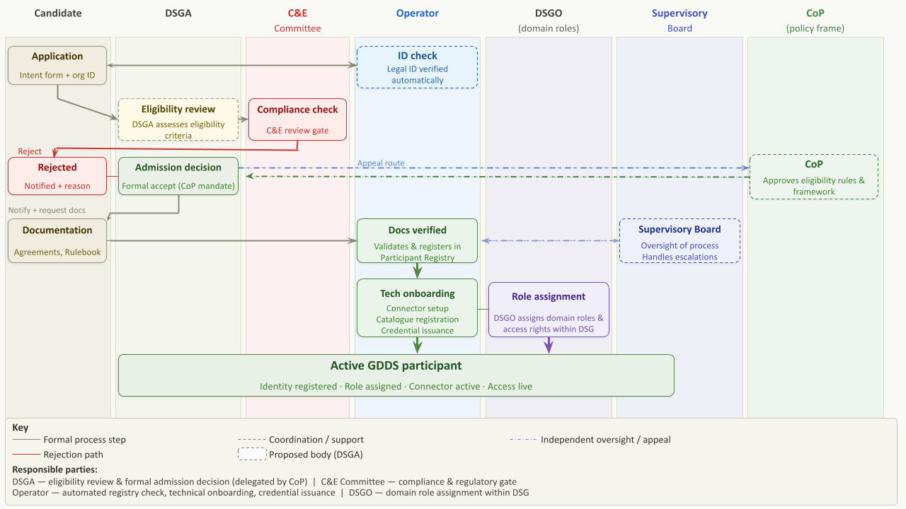

# Stage 2 — Eligibility assessment and admission

Admission depends on meeting the GDDS eligibility criteria. The eligibility model operates on two layers:&#x20;

* GDDS baseline layer: a lightweight set of minimum criteria applied uniformly to all applicants at the GDDS level. Designed to be low friction at the point of first entry. Focuses on verifiable legal identity and the signing of legal and governance agreements. This baseline does not include sector-specific or Green Deal relevance criteria as mandatory entry requirements — these were assessed and rejected as too restrictive for the initial phase.&#x20;
* Data Sharing Group (DSG) layer: additional or stricter eligibility requirements may be applied at the level of individual Data Sharing Groups, set by the relevant DSG orchestrator. These are not GDDS-wide requirements; they reflect domain-specific contexts and use case needs. [(Current UCs to become DSGs](#user-content-fn-1)[^1])

The following design principles govern the eligibility model:&#x20;

* Criteria must be objective, assessable, and — where possible — automated.&#x20;
* The applicable EU regulations (DGA, Data Act, GDPR) do not directly mandate a fixed list of onboarding requirements for data space participants. The eligibility requirements defined here are governance choices made by the GDDS consortium.&#x20;
* A phase-based approach applies: the initial phase is inclusive, with graduated quality and compliance checks added as the ecosystem matures.&#x20;

Stricter verification at the GDDS baseline level may be legally required in the following scenarios, regardless of DSG-level rules:&#x20;

* Sharing of personal data&#x20;
* Financial transactions&#x20;
* AI training scenarios&#x20;
* Official policy monitoring or reporting with legally binding obligations&#x20;


Green Deal alignment criteria were explicitly assessed and rejected as a mandatory entry requirement for the GDDS baseline. They may be applied at DSG level where relevant to a specific domain.&#x20;


***

## 2.1  Eligibility criteria (Initial proposal)&#x20;

Application requirements are classified into two tiers to minimise friction at initial entry while ensuring all necessary information is collected before admission is confirmed:&#x20;

* Primary requirements — collected at initial submission, sufficient to classify and begin assessing the candidate.&#x20;
* Secondary requirements — collected later, triggered by role selection or specific onboarding steps, with applicants informed of them upfront.&#x20;

The following design principles are suggested to be applied to the application process:&#x20;

* Infrastructure readiness questions (connector deployment readiness, cloud provider setup, technical implementation details) must be presented early in the application form — not at the end — to prevent applicants discovering blockers only after completing all other fields.&#x20;
* Applicants must be provided with upfront guidance material (a checklist or FAQ page, analogous to government guidance pages) listing all documents and information that will be required at each stage of the process. This avoids bottlenecks at advanced stages.&#x20;
* A lightweight initial application is the default. Stricter checks are applied progressively as the applicant advances through the admission workflow.&#x20;
* The feasibility of automating information retrieval via registration numbers and tax codes is to be investigated to reduce manual data entry burden for applicants.&#x20;

The table below sets out the proposed application form field structure, organised by category. Fields are a mix of primary and secondary requirements; the exact primary/secondary classification is subject to finalisation. The notes in brackets are directly received from the WP4 cocreation session 12 – which should be considered when finalising the list and/ or getting to execution.

| Legal                                                                                                                                                                                                                                                                                                                                                                                                                                                                                                                                                                                                                                                                                                                                                                                                                                                                                                                                                                                                                                                                                                                                                                                                                                                                                                                                                                                                                                                                                                                                                                                                                                                                                                                                                                                                                                                                                                                                                                                                                                                                                                                                                                                                                                                                           | Governance                                                                                                                                                                                                                                                                                                                                                                                                                                                                                                                                                                                                                                                                                                                                                                                                                                                                                                                                                                                                           | Technical                                                                                                                                                                                                                                                                                                                                                                                                                                                                                                                                       |
| ------------------------------------------------------------------------------------------------------------------------------------------------------------------------------------------------------------------------------------------------------------------------------------------------------------------------------------------------------------------------------------------------------------------------------------------------------------------------------------------------------------------------------------------------------------------------------------------------------------------------------------------------------------------------------------------------------------------------------------------------------------------------------------------------------------------------------------------------------------------------------------------------------------------------------------------------------------------------------------------------------------------------------------------------------------------------------------------------------------------------------------------------------------------------------------------------------------------------------------------------------------------------------------------------------------------------------------------------------------------------------------------------------------------------------------------------------------------------------------------------------------------------------------------------------------------------------------------------------------------------------------------------------------------------------------------------------------------------------------------------------------------------------------------------------------------------------------------------------------------------------------------------------------------------------------------------------------------------------------------------------------------------------------------------------------------------------------------------------------------------------------------------------------------------------------------------------------------------------------------------------------------------------- | -------------------------------------------------------------------------------------------------------------------------------------------------------------------------------------------------------------------------------------------------------------------------------------------------------------------------------------------------------------------------------------------------------------------------------------------------------------------------------------------------------------------------------------------------------------------------------------------------------------------------------------------------------------------------------------------------------------------------------------------------------------------------------------------------------------------------------------------------------------------------------------------------------------------------------------------------------------------------------------------------------------------- | ----------------------------------------------------------------------------------------------------------------------------------------------------------------------------------------------------------------------------------------------------------------------------------------------------------------------------------------------------------------------------------------------------------------------------------------------------------------------------------------------------------------------------------------------- |
| <ul><li>Legal Name of entity --> <em>Additionally:</em> <em>Whether a participant is a: 1) data intermediary or data altruism organisation under the DGA; 2) SME</em> </li><li>Trading name? </li><li>Legal status &#x26; legal form </li><li>Registration number(s) </li><li>Jurisdiction of incorporation </li><li>Ownership structure, including relevant subsidiaries (where applicable)(convert to questions about the possibility of internal data movement <em>(within participant orgniazation) outside of EU.  Ask separately for personal/non-personal data.) --> i) Regulatory question in case of personal data: compliance with Ch. 4 GDPR ii) Trust question in case of non personal data: need to know whether a participant intends to share data outside the EU</em> </li><li>Publicly accessible website </li><li>Designated contact person(s), email &#x26; address <em>(here we probably need (for organizations) different contacts --> business+admin, legal, security, technical)</em> </li><li>Technical &#x26; organisational measures (e.g.data security safeguards, access control mechanisms, tools for granting and withdrawing consent or permissions) <em>(Suggested to provide a pick list of known T&#x26;OMs)</em> </li><li>Estimated commencement date where different from admission date <em>(suggested to leave out as it is very low priority; except if it is a required for something specific)</em> </li><li>Self-declaration on integrity &#x26; past sanctions <em>(Suggested: should be specific questions, like: "Has your organization ever been sanctioned by XXX for something terrible?") (Additionally: To be more precise, in addition to the GDPR, it would be useful to include explicit reference to past convictions or sanctions related to financial and environmental crimes.)</em> </li><li>GDPR compliance statement / legal transfer mechanism <em>(Additionally: A self-declaration on GDPR compliance and intent to transfer data to third countries will be included to address trust and mixed-data scenarios (non-personal data transfers are not strictly prohibited, but accountability matters)</em></li><li>For natural persons: role-specific attestation &#x26; legal basis </li></ul>
 

 
 | <ul><li>Intended GDDS role(s): Data Provider / Recipient / Rights Holder / Intermediary / Service Provider (can be more than 1) </li><li>Description of GDDS activities intended <em>(ideally structure this as pick list or something -- perhaps structured against things like GD pillars of interest, types of data being provided, types of data desired, 1 sentence about what you want to do.)</em> </li><li>Nature &#x26; categories of data (incl. personal data)  </li><li>Data Sharing Group(s) to join <em>(and eligibility for those DSGs) (TBD — confirm scope with WP6 --> eventually this is a pick list of "joinable" DSGs, starting with UC list)</em> </li><li>Mandate/proxy if applying on behalf of another entity <em>(are there any standard formats for this -- or different in every jurisdiction/language)</em> </li><li>Confirmation of authority to enter binding agreements <em>(not needed if this is a clause in PA,  most likely all applicants will say yes to this)</em> </li></ul> | <ul><li>Organisation identifier: LEI · EORI · VAT · eIDAS Org ID  </li><li>Identity pathway: Org / Academic (eduGAIN) / Individual (eIDAS) </li><li>Minimum assurance level achieved (Low / Substantial / High) </li><li>PKI certificate / X.509 CSR (for M2M participants) </li><li>Conformance testing result (Intermediaries &#x26; Service Providers) (TBD — confirm scope with WP2/WP3) </li><li>Digital certificate from accredited CA (for certified roles) </li><li>Sector certifications (ISO 27001, CSRD, etc. — optional) </li></ul> |


_Further discussion points to consider from WP4 cocreation session 12 when finalising the list and arriving at the execution phase of the Application part:_  \
_- Implementation must be nuanced by participant type rather than applying a single, uniform questionnaire._ &#x20;

_- A participant flagged the risk of excluding non-EU participants (active in sectors such as forestry); consensus was to avoid a blanket prohibition and instead use optional clauses allowing differentiation based on standing._ &#x20;

_- A participant noted that requiring EU entities to formally declare GDPR compliance is redundant, since it is an automatic legal obligation; application tracks should differ for EU organisations, non-EU organisations, and natural persons._&#x20;

_- Design goal: balance accessibility with governance oversight. Core identification is collected first; detailed technical documentation and sector-specific evidence are requested only when necessary._ &#x20;

_- A self-declaration of integrity (past convictions, ongoing proceedings, administrative sanctions) should be included, kept up to date, with false information treated as a major breach of the agreement._ &#x20;

_- A participant cautioned that asking applicants to draft their own technical and organisational measures (TOMs) is too high-level and confusing; default TOMs by role were recommended._ &#x20;

_- A participant advised against requesting cap tables or ownership structures (sensitive and hard for the DSGA to assess), favouring a simple question on non-EU ownership plus a transparency philosophy that lets participants assess risk themselves._ &#x20;

_- A participant supported minimising burden via standardised selections – e.g. checkboxes for ISO compliance (27001) – instead of free-form text._&#x20;

_- A participant proposed a tiered strategy: only a minimum set of information is mandatory for basic admission; additional data or advanced functionality remains locked until further evidence is provided._ &#x20;

_- Automated checks (e.g. smart contracts, data usage policies) can manage access control, broadening the participant base without compromising security for sensitive datasets._&#x20;

-The participation agreement should include a clear confirmation that the applicant has reviewed and intends to sign the binding agreement, rather than repeating GDPR-compliance questions.

-Legal information to be presented via “legal design” – icons, navigable summaries, chatbots – to keep documentation human-readable and accessible.

-Commencement framed as whether the applicant is currently fully compliant or needs a defined timeframe to achieve compliance, allowing a realistic onboarding schedule.


### 2.1.1 Eligibility Criteria per Role&#x20;

The previously listed criteria per category are also suggested to be divided by role. So there is a clear distinction in the onboarding flows, and on who needs to fulfil what requirement. The table below represents a working proposal developed in Co-Creation Sessions 8 and 9 (28th of May, 2026), following the initial list of requirements that is showcased above per legal, governance and technical requirements.&#x20;


_Note: The eligibility-criteria table is a working proposal from Co-Creation Sessions 8 and 9 (28 May 2026), subject to review and formal approval by WP4. Conformance-testing scope for Intermediaries and Service Providers is to be confirmed with WP2 and WP3. Personal data collected via the application form requires an explicit lawful basis, and the GDDS Privacy Policy must cover data received from identity providers — coordinate with WP4 for legal review. The primary/secondary classification of application fields is subject to finalisation._&#x20;


| Criterion                                                                              | Data Provider  | Data Recipient | Data Rights Holder | Intermediary   | Service Provider |
| -------------------------------------------------------------------------------------- | -------------- | -------------- | ------------------ | -------------- | ---------------- |
| EU/EEA establishment OR legally authorised EU representative                           | ✓ Required     | ✓ Required     | ✓ Required         | ✓ Required     | ✓ Required       |
| Legal capacity to enter binding agreements                                             | ✓ Required     | ✓ Required     | ✓ Required         | ✓ Required     | ✓ Required       |
| Verifiable legal identity — LEI · VAT · eIDAS Org ID · iSHARE DID                      | ✓ Required     | ✓ Required     | ✓ Required         | ✓ Required     | ✓ Required       |
| Self-declaration: past sanctions, investigations, prior exclusions                     | ✓ Required     | ✓ Required     | ✓ Required         | ✓ Required     | ✓ Required       |
| GDPR compliance statement (non-EEA: adequacy decision / SCCs / BCRs)                   | ✓ Required     | ✓ Required     | ✓ Required         | ✓ Required     | ✓ Required       |
| Eligibility for requested Data Sharing Group(s) — per DSG-specific rules               | Per DSG rules  | Per DSG rules  | Per DSG rules      | Per DSG rules  | Per DSG rules    |
| PKI certificate / X.509 eSeal — M2M connector participants                             | ✓ Required     | ✓ Required     | N/A                | ✓ Required     | ✓ Required       |
| Conformance testing + digital cert from accredited CA (certified roles — TBC WP2/WP3)  | Optional       | Optional       | N/A                | ✓ Required     | ✓ Required       |
| Sector certification (ISO 27001, CSRD, domain accreditation) — optional / per DSG      | Optional       | Optional       | Optional           | Recommended    | Recommended      |

***

## 2.2 Admission and Governance oversight&#x20;

The admission workflow operates under the oversight of the GDDS governance structure. The following bodies are involved in the admission process:&#x20;

* Council of Participants sets the eligibility rules, policies, and frameworks within which the admission process operates. Admission criteria changes require Council approval.&#x20;
* Data Space Governance Authority (DSGA): manages the admission process and conducts compliance review. Holds the accept/reject authority.&#x20;
* Supervisory Board: provides independent oversight of the admission process and may review systemic issues or complaints.&#x20;
* Compliance and Ethics Committee: ensures ethical and compliance standards are met in admission decisions, particularly in cases involving sensitive data categories or high-risk roles.&#x20;
* GDDS Operator: handles  identity verification (Step 1.2) and technical onboarding (Step 5) under DSGA oversight.&#x20;

<figure><figcaption>
Figure 10: Participant Onboarding Flow. High-level Governance &#x26; Legal Point of View. 
</figcaption></figure>

Overarching design principle: despite the multi-body governance structure, the applicant-facing admission process must be lightweight and as frictionless as possible. Governance complexity is managed in the back end; it must not create unnecessary barriers for applicants.&#x20;

Where an applicant clearly satisfies the admission requirements and criteria established in the Rulebook, the DSGA may approve participation and initiate onboarding without further approval from higher governance bodies. Applications involving uncertainty, borderline eligibility, or governance concerns follow the principle-based assessment (see Section 2.3) and may be referred for additional review. This delegated approval capability ensures that participation can be managed efficiently and without unnecessary delays, in line with the overarching design principle of a lightweight, frictionless admission process.

When reviewing operational or executive governance decisions, the Supervisory Board may request further information, supporting evidence, corrective actions, or additional assessments before confirming, modifying, or reversing the decision under review. It may also review complaints, appeals, and cases of suspected non-compliance submitted by participants or identified through governance monitoring.


_Note: The differentiation between the Supervisory Board's review powers and the Compliance & Ethics Committee's binding compliance opinions is to be confirmed within the next iterative phase of the SAGE Project by WP4 group._


***

## 2.3 Rejection and Appeal Procedure&#x20;

This subsection defines what happens when an application for admission is not accepted, and the applicant’s right to contest that decision. It complements the onboarding and admission procedures and ensures that rejections are reasoned, consistent, and reviewable.&#x20;

### Grounds for rejection (hybrid model)&#x20;

Rejection follows a hybrid model that combines a closed list of hard disqualifiers with a principle-based assessment for borderline cases:&#x20;

* Hard disqualifiers (exhaustive) — for example, failure to pass identity verification; a legal or sanctions bar to participation; or refusal to sign the Rulebook, or DPA.&#x20;
* Principle-based assessment (soft cases) — eligibility judgements decided by the designated admission authority against documented criteria, with the reasons recorded.&#x20;

### The rejection decision&#x20;

A rejection must be issued in writing, stating the reasons and the basis for the decision (the specific disqualifier or criterion relied upon).&#x20;


_Note: Based on the cocreation session on 11th of June 2026, the WP4 group suggested to preserve independence, the appeal should be heard by a body other than the one that issued the rejection — proposed: the Supervisory Board (strategic oversight) or the Compliance & Ethics Committee (independent oversight). Open points remaining: Confirm also any re-application waiting period._&#x20;


### Right of appeal&#x20;

An applicant may appeal a rejection. Therefore, the contest mechanism is as follows:&#x20;

1. The rejection is issued with written reasons and its legal or criteria basis.&#x20;
2. The applicant may contest the decision within 5 working days.&#x20;
3. The reviewing body must respond within 5 working days. _(Note: consider having it at least a month since the reviewing body might meet on a monthly basis)_
4. The final decision is recorded, and any terms for re-application are stated.&#x20;

<figure><figcaption>
Figure 11: Rejection &#x26; Appeal Procedure of a Participant at Onboarding.
</figcaption></figure>

### Outcome&#x20;

If the appeal succeeds, the application proceeds through the normal admission procedure. If it is rejected, the applicant is informed of the final decision and of any conditions or waiting period before re-application. &#x20;

***

## 2.4 Final admission procedures&#x20;

In this step, the applicant should complete the final application steps to be admitted. &#x20;

The DSGA must notify the participant of the decision of the eligibility review. Upon Admission, the DSGA must request the participant to sign the Data Space Participant Agreement, to adhere to the GDDS Rulebook and accept the service level agreements depending on the role chosen. &#x20;

These agreements can be found in the Section of [Contractual Frameworks](../../../contractual-frameworks.md).


_Note: There might be additions in this section, or in the Contractual framework section about some rules on how long they have to sign, description of the suggested process, automated etc._  &#x20;


[^1]: TBD
