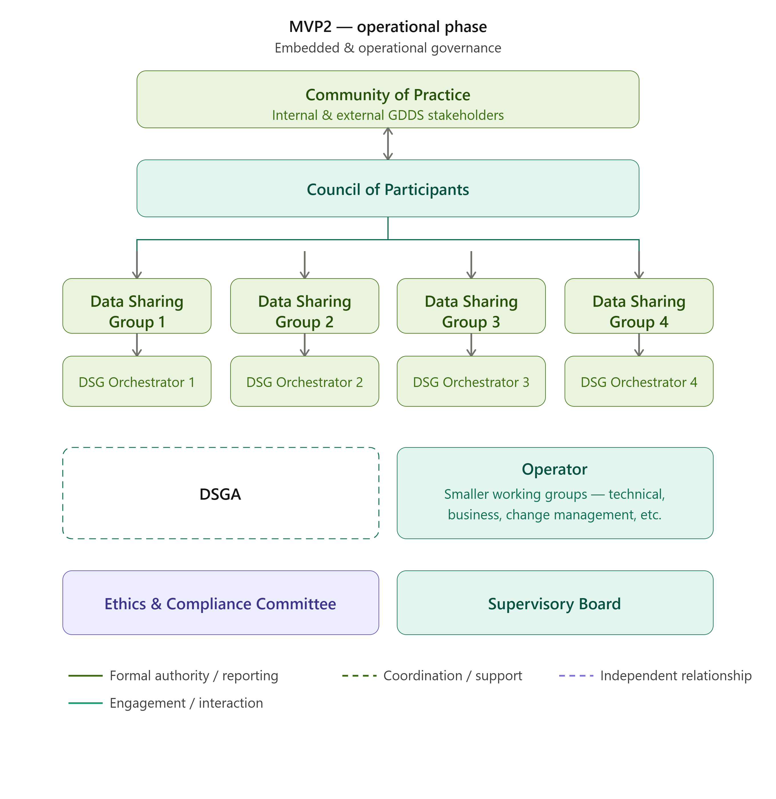

# Governance Model for the Operational GDDS (MVP2)

A future-oriented governance model (MVP2) has been outlined to describe how governance is recommended to function once the GDDS becomes fully operational.&#x20;

Upon completion of the project phase (March, 2028), the GDDS is expected to transition into an incorporated organisational form (e.g., foundation, association, cooperative, or other suitable entity). The exact legal form will be determined before operational launch and can be seen [here](../gdds-organisational-form.md).&#x20;

MVP2 governance builds upon the institutional foundations established during MVP1 and introduces:&#x20;

* a formal Council of Participants as governance authority,&#x20;
* domain-level governance through Data Sharing Groups (DSGs), and Orchestrators,&#x20;
* an operator responsible for infrastructure and services,&#x20;
* independent oversight bodies ensuring accountability and trust.&#x20;

The Figure below showcases the MVP2 governance model with the recommended structure of governance bodies.&#x20;

<figure><figcaption>
Figure 5: MVP2 Governance Model for GDDS Operational Phase
</figcaption></figure>

***

### Detailed Description of Each Governance Body (MVP2)

Below you can find the detailed description of each body, their responsibilities, limitations, and the resources they require. Click on each expandable tab below to read further.

<strong>Community of Practice (Advisory &#x26; Participation Layer)</strong>

### Role and Function &#x20;

In the operational phase, the Community of Practice (CoP) continues to function as the open\* ecosystem engagement layer of the GDDS.


\*"Open" refers to the voluntary and non-restricted nature of participation; "ecosystem engagement" refers to the structured dialogue the Community of Practice maintains between the GDDS and its wider stakeholder environment, including participants, other data spaces, public authorities, and domain experts.


While its basic function remains consistent with the project phase, the Community of Practice evolves into a broader forum supporting knowledge exchange, stakeholder engagement, and cross-domain collaboration across the operational data space ecosystem.&#x20;

The Community of Practice (CoP) supports the legitimacy and transparency of the GDDS by creating a structured forum for stakeholder participation and knowledge exchange. Through its feedback on GDDS offerings and its continuous monitoring of ecosystem developments, policy trends, and emerging needs, the CoP helps ensure that decisions are informed by diverse perspectives and reflect the concerns of relevant actors. By identifying risks, opportunities, and cross-sector synergies, it also contributes to a more evidence-based and accountable decision-making process. Moreover, by facilitating dialogue between the GDDS and related initiatives, the CoP promotes openness, mutual learning, and coordination across sectors. These functions strengthen the perceived legitimacy of the GDDS by increasing stakeholder involvement and trust, while enhancing transparency through greater information sharing and visibility of governance processes.

### Composition

Participation in the Community of Practice remains open and voluntary.&#x20;

Members may include:&#x20;

* GDDS participants and members,&#x20;
* data providers and data users,&#x20;
* service providers and technology vendors,&#x20;
* representatives of other data spaces and sector initiatives,&#x20;
* public authorities and regulators,&#x20;
* research institutions and domain experts,&#x20;
* organisations and experts interested in the development of the GDDS.&#x20;

As the ecosystem matures, the Community of Practice may expand to include a broader set of stakeholders participating in or interacting with the GDDS.&#x20;


_Note: No admission procedure applies because the Community of Practice holds no governance authority; participation is open by design, subject only to sign-up and acceptance of a basic code of conduct. However, the latter has not been decided and finalised. WP8 from the SAGE Consortium is currently working on further developments of the Community of Practice._


### Responsibilities & Limitations&#x20;

The Community of Practice continues to perform an advisory and consultative role, including:&#x20;

* providing feedback on GDDS developments and operational practices,&#x20;
* identifying emerging ecosystem needs, opportunities, and risks,&#x20;
* contributing sector knowledge and best practices,&#x20;
* facilitating collaboration with other initiatives and data spaces (creating cross-sector synergies).&#x20;

Through these activities, the Community of Practice strengthens coherence between GDDS and the needs of its wider ecosystem, and supports the continuous improvement of the Green Deal Data Space across all domains.

The Community of Practice does not exercise formal governance authority. It therefore cannot:&#x20;

* take binding governance decisions,&#x20;
* operate or manage GDDS services,&#x20;
* override decisions taken by formal governance bodies.&#x20;

Its influence is exercised through advisory contributions and structured consultation processes.

### Coordination and Information Flows&#x20;

The Community of Practice interacts with other governance bodies through consultation and information exchange.&#x20;

It may provide insights and recommendations to:&#x20;

* the Council of Participants, and&#x20;
* the Supervisory Board.&#x20;

It receives ecosystem updates from:&#x20;

* the GDDS Operator, and&#x20;
* The Council of Participants, where appropriate.&#x20;

### Resources &#x20;

To function effectively, the Community of Practice requires:&#x20;

* a collaborative platform or forum,&#x20;
* periodic engagement sessions such as workshops or consultations,&#x20;
* light coordination support,&#x20;
* transparent access to relevant documentation.&#x20;

<strong>Council of Participants (Primary Governance Authority)</strong>

### Function and Role&#x20;

Under MVP2 governance, the Council of Participants becomes the primary Governance Authority of the GDDS.&#x20;

It represents the collective interests of formally admitted participants and ensures that governance decisions reflect the needs and responsibilities of the ecosystem.&#x20;

The Council of Participants establishes the direction of the data space, proposes governance rules, and ensures that the GDDS operates in accordance with its Rulebook and guiding principles.&#x20;


_Note: As many stakeholders provided feedback on the title of the Council of the Participants, which perhaps can create confusion with the Community of Practice, it is noted and will be considered in the next iterative phase._&#x20;


### Composition&#x20;

The Council of Participants is composed of representatives of organisations formally admitted to the GDDS.&#x20;

Representation is designed to ensure balanced participation across stakeholder categories and domains of activity.&#x20;

Membership may include:&#x20;

* representatives of participating organisations in GDDS that also fulfil some of the ecosystem roles (data providers, data consumers, service providers, intermediaries, etc),&#x20;
* Data Sharing Group Orchestrators representing domain clusters,&#x20;

### Responsibilities & Limitations&#x20;

The Council of Participants performs strategic governance functions for the data space.&#x20;

Its responsibilities include:&#x20;

* approving and amending the GDDS Rulebook,&#x20;
* defining participant rights and obligations,&#x20;
* approving governance policies and cross-domain rules,&#x20;
* establishing onboarding and participation frameworks,&#x20;
* defining the strategic direction and priorities of the data space.&#x20;

The Council of Participants, therefore, acts as the highest governance authority of the operational GDDS.&#x20;

While the Council defines governance policies and strategic direction, it does not perform operational execution. Operational implementation of governance decisions is carried out by the GDDS Operator and by the DSGA.&#x20;

### Coordination and Governance Delegation&#x20;

The Council of Participants may delegate certain governance responsibilities to the DSGA, enabling efficient governance management between Council meetings.&#x20;

It also interacts with:&#x20;

* Data Sharing Groups —  through the Data Sharing Group Orchestrators, which provide domain-level input,&#x20;
* DSGA — delegated executive governance: admission and rejection decisions, application of the participation frameworks, compliance steering (classification and enforcement decisions), maintenance of governance-relevant registries and attestations at scheme level.&#x20;
* GDDS Operator — technical execution of those decisions (identity verification, onboarding tooling, registry status changes), acting under DSGA oversight &#x20;
* Supervisory Board — oversight of both, plus appeal/escalation functions, with no delegated decision powers.&#x20;

### Operational Support&#x20;

Effective functioning of the Council requires:&#x20;

* a structured operational framework,&#x20;
* [formal consultation and voting procedures, ](#user-content-fn-1)[^1]
* governance documentation systems,&#x20;
* secretariat support.&#x20;

This body evolves conceptually from the MVP1 General Assembly, ensuring continuity of governance principles across phases.&#x20;

<strong>Data Sharing Group Orchestrators (DSGOs)</strong>

## Domain-Level Governance (Subsidiarity Principle)&#x20;

Data Sharing Groups (DSGs) are domain-specific constituencies within the GDDS, each bringing together the participants active in a given sector or participants' roles (for example, data providers, data consumers, service providers, and relevant domain stakeholders). A DSG is not itself a governance body: it does not hold decision-making authority and does not exercise governance powers in its own right. Rather, it is the domain community whose needs, priorities, and proposed adaptations are surfaced, coordinated, and represented through its Data Sharing Group Orchestrator. Where this section describes the governance of domain-level activity, that governance is coordinated and represented by the Orchestrator (below) on the DSG’s behalf and within the framework defined by this Rulebook.&#x20;

### Use-case and Data Sharing Group autonomy within the common Governance framework&#x20;

The GDDS Governance framework is overarching and supports many use cases with differing objectives. Subsidiarity allows each use case, and the Data Sharing Group it forms, to operate under the common GDDS Rulebook and trust framework while defining the additional rules, agreements, and operational arrangements its own participants require, and combining relevant data products and services into use-case-specific configurations. This enables a use case to pursue its objectives and create value for its own stakeholders without requiring changes to the framework for all participants.&#x20;

Domain rules are of two kinds. A Data Sharing Group may add rules that are stricter or more detailed than the baseline. Such additions apply only within the group and are coordinated by its Orchestrator, which remains responsible for ensuring their compatibility with the common framework and with interoperability across the data space; because they do not lower any baseline guarantee, they do not require central approval. A Data Sharing Group may also request a relaxation of a baseline rule, where that rule would otherwise prevent the use case from achieving its objectives. Relaxations are the exception and are not granted by the group itself. A relaxation is raised through the group's Orchestrator, who escalates it to the Council of Participants; the Council reviews the request and decides. An approved relaxation is then implemented with the DSGA, without prejudice to the compliance and ethics escalation pathways, so that matters requiring oversight or independent review are referred to the Supervisory Board or the Ethics and Compliance Committee. Any such change is handled through the defined change management and governance processes.&#x20;

A relaxation is permitted only where it does not weaken the trust, security, legal, or data-protection guarantees on which other participants rely. Certain baseline obligations are therefore never subject to relaxation, including identity assurance, data-protection compliance, and the core trust conditions of the data space. Where a relaxation is approved, it is recorded and made transparent to the participants it affects.&#x20;

Use cases are the starting point for this domain-level governance. They are foreseen to develop into Data Sharing Groups, at which point the arrangements above are coordinated through the group's Orchestrator. These governance arrangements form part of the MVP2 governance model.&#x20;


_Note: It's important to clarify what a "use case/ data sharing specific decision" is and to what extent the decision is left to the UC. Are such decisions related to operations or to rules/roles (See also principle 5)? If we're uncertain, we risk jeopardising rules across UCs._&#x20;


## Data Sharing Group Orchestrators (DSGOs)&#x20;

### Function and Role&#x20;

The Data Sharing Group Orchestrator (DSGO) acts in a coordination and facilitation role for a Data Sharing Group.&#x20;

The DSGO ensures that the domain-level governance activities remain aligned with the broader GDDS governance framework and facilitates communication between the DSG and the key governance bodies, like the Council of Participants or the Supervisory Board.&#x20;

The DSGO’s mandate is bound to a single DSG and to domain-level coordination within the framework established by this Rulebook. Its authority is facilitative and representative rather than legislative: the DSGO operationalises and applies GDDS baseline governance rules within its domain and may propose domain-specific adaptations, but it does not set or amend those baseline rules. Cross-domain matters, and any decision with implications beyond the DSG’s domain, fall outside the DSGO’s scope and are escalated to the Council of Participants.&#x20;

### Composition&#x20;

A DSGO is typically a domain expert appointed or elected by the participants of the DSG.&#x20;

The role requires neutrality and the ability to coordinate across different stakeholders within the domain.&#x20;

### Responsibilities&#x20;

The DSGO performs several coordination and governance support functions, including:&#x20;

* coordinating participant onboarding within the DSG,&#x20;
* facilitating implementation of domain governance rules,&#x20;
* maintaining relevant domain registries and attestations,&#x20;
* supporting dispute resolution processes,&#x20;
* escalating systemic governance issues to higher governance bodies.&#x20;

### Limitations&#x20;

The DSGO operates within the governance framework of the GDDS and therefore cannot modify or override the GDDS baseline governance rules, nor override decisions taken by the Council of Participants or Supervisory Board. &#x20;

It holds no operational authority over shared infrastructure or registries, which remain the responsibility of the GDDS Operator, and its facilitative role does not extend to acting on behalf of individual participants in their own admission, certification, or contractual matters.&#x20;

### Coordination and Escalation&#x20;

The DSGO interacts with several governance actors, including:&#x20;

* The GDDS Operator for operational coordination,&#x20;
* The Council of Participants through representation and consultation processes,&#x20;
* The Supervisory Board in cases of governance escalation.&#x20;

### Operational Support&#x20;

To perform this role effectively, DSGOs require:&#x20;

* access to governance and administrative tools,&#x20;
* registry management capabilities,&#x20;
* structured dispute resolution mechanisms.&#x20;

<strong>Data Space Governance Authority (DSGA) (Executive governance body)</strong>

### **Function and Role**

The Data Space Governance Authority (DSGA) is the executive governance body of the operational GDDS. It exercises the governance responsibilities delegated to it by the Council of Participants and is responsible for the day-to-day application of the governance framework, in particular the participation lifecycle and compliance processes.

The DSGA occupies the position between rule-setting and execution: the Council of Participants defines the governance rules and frameworks, the DSGA applies them through individual governance decisions, and the GDDS Operator carries out the technical execution of those decisions under DSGA oversight.

### **Composition**

The DSGA is appointed by, and accountable to, the Council of Participants. It operates as a distinct body, separate from the GDDS Operator, in order to preserve the segregation between governance decision-making and operational execution.


_Note: The composition, appointment procedure, and legal positioning of the DSGA (e.g. as part of the incorporated GDDS Operating Entity) are to be defined as part of the MVP2 organisational design._


### **Responsibilities & Limitations**

The DSGA is responsible for:

* managing the admission process and holding the accept/reject authority for participant applications, within the eligibility rules and frameworks approved by the Council of Participants,
* acting as the designated compliance authority ("steering" function): assessing reported non-compliance, classifying it, and deciding on proportionate enforcement action,
* overseeing the GDDS Operator's execution of governance decisions, including identity verification, technical onboarding, and registry status changes,
* maintaining scheme-level governance records, registries, and attestations,
* reporting on its delegated activities to the Council of Participants.

The DSGA operates within the frameworks defined by the Council of Participants and therefore cannot:

* amend the GDDS Rulebook, the admission criteria, or other baseline governance rules,
* perform operational or technical execution, which remains the responsibility of the GDDS Operator,
* act outside the scope of its delegation instrument.

DSGA decisions are subject to the appeal and escalation procedures defined in this Rulebook, and its functioning is subject to oversight by the Supervisory Board.

### **Coordination**

The DSGA:

* receives its delegated mandate from, and reports to, the **Council of Participants**,
* oversees the **GDDS Operator** in the execution of governance decisions,
* escalates systemic governance issues to the **Supervisory Board**,
* interacts with the **Compliance & Ethics Committee** on escalation pathways and cases requiring independent compliance assessment,
* coordinates with **Data Sharing Group Orchestrators** on domain-level admission and compliance matters.

### **Operational Support**

Effective functioning of the DSGA requires:

* a delegation instrument defining the scope and limits of its mandate,
* access to admission tooling and governance registries,
* documented decision-making and record-keeping procedures,
* administrative and secretariat capacity.

<strong>Operator</strong>

The GDDS Operator is foreseen as the operating entity or entities responsible for:&#x20;

* running the federated, shared infrastructure,
* maintaining registries and trust services,&#x20;
* executing governance decisions, divided with the DSGA.&#x20;
* providing onboarding support and tooling.

The Operator(s) has/have operational authority but does not define governance rules.&#x20;

The Operator maintains records of operational decisions and provides periodic reports to the Supervisory Board to support governance oversight and transparency.

It is also foreseen that there are specific working groups under the Operator, such as Technical, Business, Legal, Change Management, etc. This could be derived from the working groups of MVP1. &#x20;

See more about the Operational Framework [here](https://app.gitbook.com/s/2Q8OXIfogkcLsEZE9xsb/operational-framework), where the Operators and Intermediaries and their functions are defined.

<strong>Supervisory Board (Internal Oversight)</strong>

### Function and Role&#x20;

It acts as an oversight body of the Council of Participants and ensures that the data space operates in accordance with its governance framework, principles, and strategic objectives.&#x20;

The Supervisory Board ensures accountability of the GDDS Operator and the DSGA and safeguards the fairness and transparency of governance processes.&#x20;


_Note: Currently, the Supervisory Board is considered an internal GDDS oversight body consisting of independent experts; however, this can be changed based on the final organisation form of the GDDS, as well as the final set-up of MVP2. It has been raised that the Ethics & Compliance Committee has similar oversight responsibilities; however, they are an external body acting independently from GDDS._&#x20;


### Composition&#x20;

The Supervisory Board consists of a limited number of members selected to ensure balanced expertise and preferably independence.&#x20;

Members may include:&#x20;

* independent experts in governance, data sharing, or technical infrastructure,&#x20;
* representatives of key stakeholder groups,&#x20;
* individuals with experience in regulatory, legal and business matters.&#x20;

Members do not hold operational roles within the GDDS to ensure independence of oversight.


&#x20;_Note: Further details of how the members are chosen will be added in the next phase of the Governance Framework development of SAGE._&#x20;

_For example: 'Members are appointed by the Council of Participants for a fixed, renewable term; may not simultaneously hold any role in the Council, DSGA, GDDS Operator, or Ethics & Compliance Committee nor have a material financial interest in a GDDS participant they may be called to assess; sign conflict-of-interest declarations with a recusal rule for individual cases; can be removed during their term only for cause, by Council decision.'_


### Responsibilities & Limitations&#x20;

The Supervisory Board is responsible for:&#x20;

* overseeing implementation of governance decisions,&#x20;
* supervising the activities of the GDDS Operator and DSGA as executive bodies,&#x20;
* monitoring fairness, inclusivity, and transparency of the data space together with the Ethics & Compliance Committee,&#x20;
* reviewing performance indicators, audits, and system evaluations,&#x20;
* assessing the continued fitness of governance mechanisms.&#x20;

The Supervisory Board provides oversight and governance supervision but does not perform operational management. Operational execution remains the responsibility of the GDDS Operator, and DSGA.&#x20;


_Note: Some questions to further clarify for the SB if established: 1. The division of responsibilities between the SB and E\&C Committee needs to be made clearer. 2. What are the likely repercussions of the evaluation carried out by the Supervisory Board?_


### Coordination&#x20;

The Supervisory Board:&#x20;

* oversees the GDDS Operator,&#x20;
* receives advice from the Council of Participants and ecosystem actors,&#x20;
* interacts with the Compliance & Ethics Committee on compliance matters. &#x20;

### Operational Requirements&#x20;

To ensure independence and effective oversight, the Supervisory Board requires:&#x20;

* access to governance and operational audit information,&#x20;
* an independent operating budget,&#x20;
* analytical and governance support capacity.&#x20;

<strong>Ethics &#x26; Compliance Committee (External Independent Oversight)</strong>

### Function and Role&#x20;

In the operational phase of the GDDS, ethical and legal oversight is provided through a Compliance & Ethics Committee, designed as a permanent independent body supporting the governance of the operational data space.&#x20;

This committee ensures that the functioning of the GDDS, its governance framework, and its operational activities remain aligned with applicable regulatory requirements, ethical standards, and responsible data sharing principles.

### Composition&#x20;

The Compliance & Ethics Committee is foreseen to consist of five independent experts, ensuring a balanced representation of relevant expertise.&#x20;

The committee is composed of:&#x20;

* one expert in European law, especially data law (e.g. GDPR, Open Data Directive, Data Governance Act and Data Act) and, more broadly, digital law (e.g. AI Act),&#x20;
* one expert in data spaces and data governance,&#x20;
* two experts in ethics and responsible data use.&#x20;

Members must be independent from other governing bodies of the GDDS to safeguard neutrality, credibility, and impartial oversight.&#x20;

Members are appointed by the Council of Participants for a fixed, renewable term; may not simultaneously hold any role in the Council, Supervisory Board, DSGA, or GDDS Operator, nor have a material financial interest in a GDDS participant they may be called to assess; sign conflict-of-interest declarations with a recusal rule for individual cases; can be removed during their term only for cause, by Council decision.&#x20;

### Responsibilities & Limitations

The Compliance & Ethics Committee acts as an independent advisory and escalation body responsible for:&#x20;

* safeguarding legal and ethical compliance within the operational data space,&#x20;
* issuing independent assessments and recommendations on legal and ethical matters,&#x20;
* reviewing governance decisions and operational practices for compliance risks,&#x20;
* supporting responsible data governance across the GDDS ecosystem.&#x20;

In cases of serious non-compliance or systemic ethical risk, the committee issues a formal compliance opinion addressed to a named body (DSGA, SB, or Council). The addressee must either implement it or provide written justification to the Council within a defined period. This preserves the advisory character, and creates real accountability.&#x20;

The Committee does not take strategic governance decisions and does not execute operational functions.&#x20;

The Committee performs the following functions:&#x20;

* conducting legal and regulatory compliance assessments,&#x20;
* reviewing governance and operational proposals for ethical and compliance implications,&#x20;
* issuing compliance reports and risk opinions,&#x20;
* recommending governance improvements to strengthen legal and ethical robustness,&#x20;
* supporting dispute resolution processes involving ethical or regulatory concerns,&#x20;
* managing escalation pathways in cases of systemic or unresolved compliance issues.&#x20;


_Note: To further define working principles like opinions and assessments are issued within a defined period from referral, set in the committee's rules of procedure (indicatively 20 working days, shorter for urgent escalations); if no opinion is issued within the deadline, the referring body may proceed, recording that the committee was consulted._&#x20;


### Coordination&#x20;

The Compliance & Ethics Committee receives input from:&#x20;

* the Council of Participants,&#x20;
* the Data Sharing Groups and their orchestration bodies through the Council of Participants&#x20;
* the GDDS Operator, and DSGA.&#x20;

The Committee may provide opinions or recommendations to:&#x20;

* the Council of Participants,&#x20;
* the Supervisory Board where issues concern systemic governance risks.&#x20;

Upon receiving an escalation concerning structural or systemic governance risk, the Supervisory Board may (a) require the DSGA or GDDS Operator to submit a corrective action plan within a set period, (b) suspend implementation of a contested decision pending review, and (c) refer the matter to the Council of Participants with a recommendation where it exceeds the Board's mandate. This keeps the SB in its oversight lane.

### Operational Requirements&#x20;

To ensure effective functioning and independence, the Committee requires:&#x20;

* full access to relevant governance, audit, and compliance documentation,&#x20;
* clearly defined escalation and arbitration procedures,&#x20;
* appropriate financial support ensuring independent professional operation.&#x20;

In more mature stages of the data space, the oversight framework may be strengthened through:&#x20;

* compliance monitoring tools,&#x20;
* dedicated compliance reporting and auditing systems.&#x20;


_This section might be updated based on the latest developments in the SAGE consortium, specifically considering the WP4 Governance working group. Since the project runs till 2028, the final GDDS deliverable is expected to have additional information on these sections.  For example, governance bodies appointment, suggested procedures for voting etc._&#x20;


[^1]: TBD
