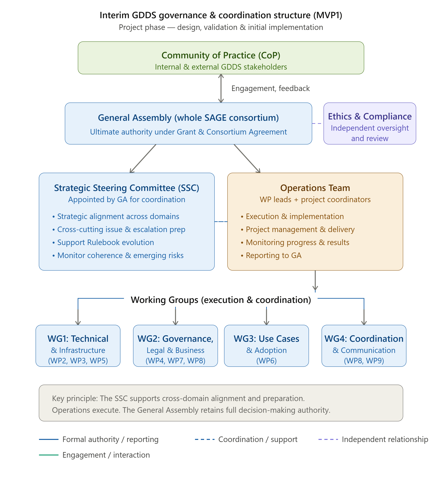

# Governance Model for the Project Phase (MVP1)

During the SAGE project phase, the GDDS operates as an unincorporated consortium under the Grant Agreement. The formal organisational form is therefore project-bound and contractual. &#x20;

The MVP1 governance model represents the current focus of the project and is tailored to the project phase, during which the GDDS is being designed, implemented, and prepared for operation.&#x20;

MVP1 governance is intentionally:&#x20;

* lightweight and pragmatic,&#x20;
* focused on coordination, rule definition, and co-creation,&#x20;
* supportive of technical and organisational experimentation,&#x20;
* and aligned with project delivery requirements.&#x20;

The purpose of MVP1 governance is to:&#x20;

* Establish a credible governance baseline&#x20;
* Design and validate the GDDS Rulebook&#x20;
* Test governance processes in a controlled project environment&#x20;
* Prepare institutional continuity toward MVP2&#x20;

The MVP1 phase, therefore, also serves as a testing environment for elements of the future governance model, allowing governance mechanisms to be validated before the full operational launch of the data space.&#x20;

The Figure below showcases the MVP1 governance structure, in line with the current project organisation and includes the governance bodies.

<figure><figcaption>
Figure XXX: MVP1 Governance Model for SAGE Project Phase
</figcaption></figure>

***

### Detailed Description of Each Governance Body (MVP1)

Below you can find the detailed description of each body, their responsibilities, limitations, and the resources they require. Click on each extendable tab below to read further.&#x20;

<strong>Community of Practice (Advisory &#x26; Participation Layer)</strong>

### Role and Function &#x20;

The Community of Practice (CoP) represents the broadest and most inclusive engagement layer of the GDDS during the project phase. It functions as an open ecosystem forum designed to support collaboration, knowledge exchange, and stakeholder feedback.&#x20;

The Community of Practice enables the project to remain closely connected to the broader data space ecosystem and helps ensure that the governance framework reflects the needs, expectations, and experiences of relevant stakeholders.&#x20;

While the Community of Practice plays an important consultative role, it does not exercise formal governance authority within the project.&#x20;

Participation in the Community of Practice is open and voluntary. It may include:&#x20;

* members of the SAGE consortium,&#x20;
* potential data providers and data users,&#x20;
* service providers and technology actors,&#x20;
* representatives of other European data spaces,&#x20;
* public authorities and policy actors,&#x20;
* organisations and experts interested in the development of the GDDS.&#x20;

Participation is non-restricted and may evolve throughout the project as the ecosystem grows.&#x20;

### Responsibilities & Limitations&#x20;

The Community of Practice contributes to the governance development process through:&#x20;

* providing feedback on GDDS components,&#x20;
* sharing insights on ecosystem developments, policy trends, and emerging needs,&#x20;
* identifying potential risks, opportunities, and cross-sector synergies,&#x20;
* facilitating dialogue between GDDS and related initiatives.&#x20;

Through these activities, the Community of Practice supports the legitimacy, transparency, and ecosystem relevance of the governance framework.&#x20;

The Community of Practice does not exercise binding decision-making authority, but its input informs governance deliberations within the GA and Steering Committee.&#x20;

### Resources &#x20;

To function effectively, the Community of Practice requires:&#x20;

* a collaborative engagement platform,&#x20;
* periodic engagement sessions such as workshops or consultations,&#x20;
* light coordination support,&#x20;
* transparent access to relevant documentation.&#x20;

<strong>General Assembly (Governance Authority)</strong>

### Role and Function&#x20;

The General Assembly (GA) is the formal governing body of the SAGE consortium during the project phase. It operates under the Grant Agreement and represents the collective authority of the consortium partners.&#x20;

The GA ensures that project activities remain aligned with contractual obligations, strategic objectives, and the overall mission of the GDDS initiative.&#x20;

Within the MVP1 governance framework, the General Assembly acts as the primary governance authority.&#x20;

### Composition&#x20;

The General Assembly consists of representatives of all funded consortium partners participating in the SAGE project.&#x20;

Members participate through the organisational structure of the project, including Work Packages and coordination bodies.&#x20;

The General Assembly meets:&#x20;

* monthly online, and&#x20;
* approximately every six months in person.&#x20;

### Responsibilities & Limitations&#x20;

The General Assembly performs both strategic oversight and project governance functions.&#x20;

Its responsibilities include:&#x20;

* monitoring overall project progress,&#x20;
* reviewing coordination challenges and risk factors,&#x20;
* aligning priorities across technical, governance, and use case domains,&#x20;
* endorsing governance proposals and Rulebook developments,&#x20;
* approving major project-level decisions and deliverables.&#x20;

The GA also ensures that governance development remains consistent with the Grant Agreement and Digital Europe Programme requirements.&#x20;

The GA may delegate structured strategic preparation tasks to a (GDDS Strategic) Steering Committee (if established), without transferring its contractual authority.&#x20;

The General Assembly does not:&#x20;

* perform day-to-day operational execution,&#x20;
* directly manage technical implementation tasks,&#x20;
* override contractual obligations defined in the Grant Agreement.&#x20;

### Resources&#x20;

The General Assembly requires:&#x20;

* administrative and secretarial support,&#x20;
* meeting infrastructure,&#x20;
* access to financial reporting and project management information,&#x20;
* access to legal&#x20;

<strong>GDDS Strategic Steering Committee (Delegated Strategic Body)</strong>

### Function and Role&#x20;

The SSC is established as an internal coordination and strategic alignment group within the SAGE project.&#x20;

It does not modify the formal governance structure defined in the Grant Agreement or Consortium Agreement, nor does it introduce a new decision-making body at project level.&#x20;

The SSC supports the design and development of the GDDS governance framework (MVP1) and operates under the authority of the General Assembly.&#x20;

Any formal decisions affecting the SAGE project, including those related to governance structures defined in Annex 1 of the Grant Agreement, remain under the exclusive competence of the General Assembly and, where required, the Granting Authority.&#x20;

The SSC therefore contributes to the development of GDDS governance without altering the legally binding governance of the SAGE project.&#x20;

### Composition&#x20;

The SSC is proposed to consist of approximately five to seven members, ensuring balanced representation across governance, technical, and use case perspectives.&#x20;

Membership may include:&#x20;

* Project Coordinators (ex officio)&#x20;
* Selected representatives across governance, technical, business, legal and use case domains&#x20;
* Optional: 1 external strategic advisor (non-voting), for example, a representative from the EU (DG ENV) who is seen as "owners" of GDDS.&#x20;

### Appointment Process of SSC &#x20;

Members of the GDDS Strategic Steering Committee shall be appointed by the General Assembly based on a proposal prepared by the Project Coordinator (or a designated small group), considering the composition principles defined in this document.&#x20;

The selection process shall aim to ensure:&#x20;

* Balanced representation across governance, technical, business, legal and use case domains &#x20;
* Diversity of perspectives across participating organisations &#x20;
* Inclusion of members with sufficient decision-making insight &#x20;

Consortium partners may express interest or nominate candidates.&#x20;

The final composition of the SSC shall be subject to approval by the General Assembly in accordance with the Consortium Agreement procedures.&#x20;

### Mandate and Scope&#x20;

#### Strategic Alignment (Cross-Domain)&#x20;

The SSC supports alignment between:&#x20;

* Governance framework (Rulebook and policies)&#x20;
* Technical architecture and implementation&#x20;
* Business model and sustainability design&#x20;
* Use case development and deployment&#x20;

The SCC identifies inconsistencies, dependencies, and misalignments and formulates recommendations for resolution.&#x20;

All alignment activities should be conducted in compliance with the applicable laws.&#x20;

#### Escalation Handling and Issue Preparation&#x20;

The SSC serves as the primary layer for analysing escalations that:&#x20;

* Span multiple domains (e.g. governance–technical–legal-business interactions)&#x20;
* Cannot be resolved at Work Package or operational level&#x20;
* May have system-wide implications&#x20;

The SSC evaluates such issues and prepares recommendations on whether they:&#x20;

* Can be resolved operationally&#x20;
* Should be escalated to the General Assembly&#x20;
* Should be referred to Ethics & Compliance review&#x20;

#### Governance & Rulebook Support&#x20;

The SSC supports the structured evolution of the GDDS Rulebook by:&#x20;

* Reviewing and pre-validating Rulebook drafts before submission to the GA&#x20;
* Ensuring consistency between governance and legal rules, and technical/operational implementation&#x20;
* Supporting governance change management processes&#x20;

This function is performed as part of a broader cross-domain mandate.&#x20;

#### System Coherence and Risk Monitoring&#x20;

The SSC monitors system-level coherence and risks, including:&#x20;

* Fragmentation between work streams&#x20;
* Misalignment between governance, technical, business, and legal components&#x20;
* Emerging legal, operational, or strategic risks&#x20;

It formulates recommendations to improve system integrity and alignment.&#x20;

#### Reporting & Transparency&#x20;

* SSC reports formally to the GA every 6 months.&#x20;
* Minutes documented and shared with the consortium.&#x20;
* Major decisions are subject to GA endorsement where required.&#x20;

#### MVP1 to MVP2 Transition Preparation&#x20;

The SSC contributes to preparing the transition toward operational governance by:&#x20;

* Identifying governance mechanisms that scale effectively&#x20;
* Highlighting structural gaps, inefficiencies, or situations of non-compliance&#x20;
* Supporting the conceptual design of future governance structures (MVP2)&#x20;

While it does not exercise formal supervisory authority, its functions anticipate aspects of a future Supervisory Board under MVP2.&#x20;

The SSC mandate will be reviewed at the end of MVP1.&#x20;

### Boundaries and Limitations&#x20;

To ensure clarity and avoid overlap, the SSC operates within clearly defined boundaries.&#x20;

**Relationship with the General Assembly**&#x20;

* The GA remains the formal governance authority under the Grant Agreement&#x20;
* The SSC supports, prepares, and formulates recommendations for GA consideration&#x20;
* The SSC does not take binding decisions requiring GA approval&#x20;

**Relationship with the Operations Team**&#x20;

* The SSC focuses on strategic alignment, coordination, and issue preparation&#x20;
* The Operations Team remains responsible for execution and implementation&#x20;

**Relationship with Ethics & Compliance**&#x20;

* The SSC may identify potential compliance or ethical risks&#x20;
* Formal assessment and enforcement remain the responsibility of Ethics & Compliance bodies&#x20;

**Non-Functions of the SSC**&#x20;

The SSC shall not:&#x20;

* Replace the GA as contractual authority&#x20;
* Execute operational tasks or manage Work Packages&#x20;
* Override consortium partner rights&#x20;
* Constitute a formal governance body under the Grant Agreement

<strong>Operations Team (Operational Layer)</strong>

### Function and Role&#x20;

The Operations Team constitutes the execution layer of the MVP1 governance model. It is responsible for implementing the tasks defined in the Grant Agreement and for developing the technical, operational and governance foundations of the GDDS.&#x20;

While for MVP2 the operational layer will have a structure and conduct activities typical for the operational area of a distributed system (run and enable functions of the GDDS like data exchange service delivery etc.), for MVP1, the operational layer will reflect the nature of a project-based delivery phase and mimic the structure and enable the functions of the project. Hence, through coordinated work across technical, governance, business, and use case domains, the Operations Team ensures the delivery of project outputs and supports the development of the future data space infrastructure.&#x20;

### Composition&#x20;

The Operations Team includes the key operational actors responsible for project implementation, including:&#x20;

* the project coordinators,&#x20;
* work package leaders,&#x20;
* domain experts contributing to specific domain tasks.&#x20;

Operational coordination is structured across several domains, including:&#x20;

* Technical development (WP2, WP3, WP5),&#x20;
* Governance, legal, and business model development (WP4, WP7, WP1),&#x20;
* Use case implementation and coordination (WP6),&#x20;
* project coordination, dissemination, and communication (WP8, WP9).&#x20;

This structure ensures alignment between governance development, technical implementation, and ecosystem engagement.&#x20;

### Responsibilities & Limitations&#x20;

The Operations Team is responsible for the day-to-day execution of project activities.&#x20;

Its responsibilities include:&#x20;

* delivering work package tasks defined in the Grant Agreement,&#x20;
* developing the technical and organisational components of the GDDS,&#x20;
* drafting governance documents, technical specifications, and supporting materials,&#x20;
* coordinating collaboration across work packages and project partners,&#x20;
* preparing proposals and documentation for governance decisions.&#x20;

The Operations Team reports to the General Assembly and, if established, may coordinate strategic matters with the Strategic Steering Committee.&#x20;

It may also:&#x20;

* receive ecosystem input from the Community of Practice, and&#x20;
* escalate ethical or compliance concerns to the Ethics & Compliance oversight mechanism.&#x20;

The Operations Team does not:&#x20;

* take final governance decisions reserved for the General Assembly,&#x20;
* deviate from the commitments defined in the Grant Agreement,&#x20;
* override governance decisions taken by the GA or other authorised bodies.&#x20;

<strong>Ethics &#x26; Compliance Committee (Independent Oversight)</strong>

### Function and Role&#x20;

During the project phase, ethical and legal oversight is provided through an Ethics & Compliance Committee acting as an independent advisory body supporting the governance framework of the GDDS.&#x20;

The committee safeguards legal and ethical compliance during the design and implementation of the data space and ensures that governance proposals and operational activities remain aligned with relevant regulatory and ethical standards.&#x20;

The committee does not exercise strategic governance authority and does not participate in operational execution.&#x20;

The committee’s responsibilities include:&#x20;

* conducting legal and compliance assessment&#x20;
* issuing compliance reports and risk assessment&#x20;
* providing policy recommendations to strengthen legal and ethical robustness,&#x20;
* managing escalation pathways in cases of non-compliance.&#x20;

### Operational Requirements&#x20;

To ensure effective and independent functioning, the committee requires:&#x20;

* access to relevant governance, compliance, and audit documentation,&#x20;
* clearly defined escalation and arbitration pathways,&#x20;
* basic financial and organisational support to maintain independence and professional operation.&#x20;

